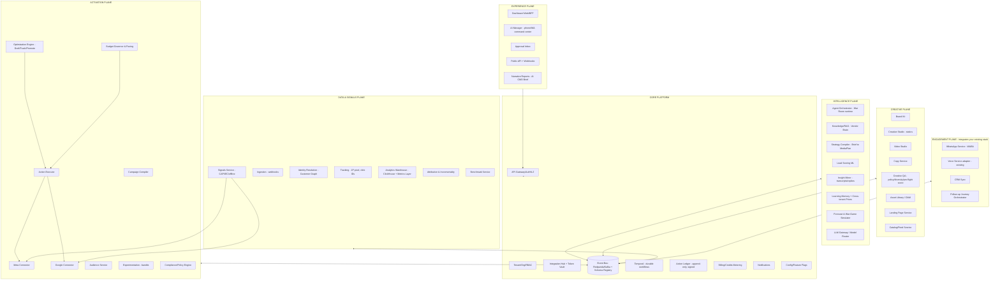

# GROWTH OS — Autonomous Ads & Marketing Automation
## Master Build Specification for Claude Code (Microservices Edition)

> **Version:** 1.0 · **Date:** June 2026
> **Audience:** Claude Code (primary builder) + founding engineers
> **Scope:** A standalone, multi-tenant, API-first "AI Marketing Department" product. Your existing platform (voice calling + WhatsApp follow-up + AI summary + campaign intake) is **Tenant Zero** — the first API consumer — not the host. Everything here is built to be sold as its own product later.

---

## 0. HOW TO USE THIS FILE WITH CLAUDE CODE

1. Create an empty monorepo. Put this file at the repo root as `GROWTH-OS-BUILD-SPEC.md` and create a thin `CLAUDE.md` that says: *"Read GROWTH-OS-BUILD-SPEC.md fully before any task. Follow §2 design principles as law. Build only the phase I name. Contracts-first: never write service code before its OpenAPI/AsyncAPI contract exists in /contracts."*
2. Drive Claude Code **one phase at a time** (§21). Never say "build everything." Say: *"Execute Phase 0 from the spec. Stop at the acceptance criteria and show me the demo script output."*
3. After each phase, run the phase's acceptance checklist, commit, then start the next phase in a **fresh session** (point it back to this file + the phase number).
4. Anything marked `⚠ VERIFY-LIVE` means the external platform changes fast — Claude Code must check current API docs/versions at build time rather than trusting this document.
5. Where this spec gives pseudocode, treat it as the **required algorithm**, not a suggestion. Where it gives schemas, treat field names as canonical.

---

## 1. PRODUCT THESIS — WHY THIS WINS (READ BEFORE CODING)

### 1.1 What the market already commoditized
Meta rebuilt its delivery stack (Andromeda retrieval → GEM creative-content embeddings → Lattice sequence ranking). Targeting, bidding, and placement are now done better by the platform than by any human media buyer. Google did the same with Performance Max / AI Max. Dozens of "AI marketing agent" tools exist (Albert, Hyper, Ryze, Optmyzr Auto-Pilot, Fluency, Madgicx, Smartly, AdCreative, Tofu, Agentforce…). **Creative generation and campaign setup are not a moat anymore.**

### 1.2 The four things that ARE still a moat (our entire product is built on these)
1. **Signal quality (the crown jewel).** The platforms optimize toward whatever conversion events you feed them. Almost every SMB feeds them junk ("lead form submitted", "conversation started"). We own the **voice call outcome + WhatsApp conversation outcome + booking + sale** — the ground truth of lead quality. We convert that truth into Conversions API events with **values = lead-quality scores**, so Meta/Google literally optimize for *our vendor's definition of a good customer*. No creative tool, no dashboard tool, no agency tool has this loop closed end-to-end. This is the flagship loop (§11).
2. **Attribute-level creative learning + genuine diversity.** In the Andromeda era, near-duplicate creatives get clustered (Entity-ID clustering) and retrieval-suppressed — 100 minor variants perform no better than 10 genuinely distinct concepts. We generate along an explicit **diversity matrix** (angle × format × visual × hook × headline-structure), tag every asset with **Creative DNA**, and learn at the *attribute* level ("question-hook + price-anchor offer wins for this vendor"), not the asset level.
3. **Cross-channel orchestration with explainable autonomy.** One brain across Meta + Google + WhatsApp + voice + landing pages + CRM, with a trust ladder (Autopilot Levels L0–L4), a signed Action Ledger, and a plain-language "why" for every action. Trust is the adoption bottleneck for autonomous spend; we engineer trust as a feature.
4. **Cross-tenant learning network.** Anonymized priors by industry × geo × objective mean a brand-new salon in Ahmedabad starts with the posterior of 500 salons, not from zero. Every vendor makes every other vendor's first campaign smarter. Classic data network effect.

### 1.3 One-sentence positioning
**"The platforms decide *who sees* the ad. We decide *what to say*, *how much to risk*, *whether the lead was real*, and *what to do next* — and we prove it with revenue, not clicks."**

### 1.4 What we deliberately do NOT build
- We do **not** fight Advantage+/PMax delivery automation — we feed it better signals and better creative diversity. (Don't rebuild bidding; rebuild *truth*.)
- We do **not** build a generic horizontal automation tool (n8n exists). Our workflow builder (§16) is revenue-domain-specific.
- We do **not** promise multi-touch attribution voodoo. We promise **deterministic journey truth** (click-ID → conversation → call → booking → sale) plus honest incrementality checks.

---

## 2. NON-NEGOTIABLE DESIGN PRINCIPLES (LAW FOR CLAUDE CODE)

P1. **Contracts-first.** Every service starts as an OpenAPI 3.1 (sync) + AsyncAPI 3 (events) contract in `/contracts` with JSON Schemas in `/contracts/schemas`. Code is generated/validated against contracts. CI fails on drift.
P2. **Event-sourced nervous system.** Every business fact is an immutable event on the bus (§6). Services own their write models; everything cross-service flows through events. No service reads another service's database. Ever.
P3. **Idempotency everywhere.** Every external mutation (ad create, budget change, message send, CAPI post) carries an idempotency key and is exactly-once *in effect*. Every consumer is replay-safe.
P4. **Money is sacred.** No code path may increase spend, launch ads, or broadcast messages without passing through Budget Governor (§13) + Approval Policy (§17). This is enforced structurally: connector services accept mutations **only** from the Action Executor, which only executes signed ActionPlans.
P5. **Every autonomous action emits an Explanation object** `{action, evidence[], expected_effect, confidence, reversible, approval_required, undo_plan}` to the Action Ledger *before* execution. No silent actions.
P6. **Tenant isolation is absolute.** `tenant_id` on every row, every event, every cache key, every queue message. Per-tenant envelope encryption for OAuth tokens/secrets. Cross-tenant learning only through the anonymization pipeline (§14.4).
P7. **Degrade gracefully.** Every connector has a circuit breaker + degraded mode (queue & retry, never drop). Token expiry is predicted and re-auth is requested via WhatsApp before failure.
P8. **LLM calls are routed, budgeted, evaluated.** All model calls go through the LLM Gateway (model routing by task tier, per-tenant token budgets, response caching, structured-output validation, eval traces). No raw SDK calls inside services.
P9. **Respect platform learning phases.** Never edit a live ad in place (resets learning). Decision cadence ≥ matches §10. Hard rule: no optimization edits while an ad set is in active learning unless a kill-guardrail fires.
P10. **Everything observable.** OpenTelemetry traces across HTTP + bus, RED metrics per service, per-tenant cost meters (LLM tokens, image/video gen, messages, API calls) feeding Billing.
P11. **India-first, world-ready.** INR + GST in billing, DPDP Act consent ledger, vernacular content as first-class (not translation bolt-on), WhatsApp as a primary surface — but all locale logic behind a locale service, no hardcoding.
P12. **Boring tech, exciting product.** Postgres before exotic DBs. Monorepo. Buy/managed where undifferentiated (auth UI, email). Build where differentiated (signals, optimization, creative DNA, agents).

---

## 3. SYSTEM ARCHITECTURE OVERVIEW

Seven planes, one event backbone. ~30 deployables at maturity, but **bounded contexts are designed now, extracted later** — Phase 0–1 ships as ~8 services + a modular core (§21).



### 3.1 The Core Loop as events (memorize this)
```
campaign.requested
 → research.completed (Campaign Intelligence Brief)
 → strategy.compiled (MediaPlan)
 → creative.batch.generated → creative.qa.passed → creative.approved
 → campaign.compiled (platform payloads) → action.plan.signed → campaign.launched
 → ad.metrics.snapshot (4h cadence) + lead.captured + wa.message.* + call.completed
 → lead.scored → signal.dispatched (CAPI w/ value)
 → experiment.evaluated → optimization.decision (draft|trash|promote) → action.plan.signed → action.executed
 → memory.updated (creative DNA posteriors, vendor playbook)
 → report.briefed (AI CMO daily)
 → next campaign.requested (now smarter)
```

---

## 4. TECH STACK (DECIDED — do not relitigate per service)

| Layer | Choice | Why |
|---|---|---|
| Monorepo | **Turborepo + pnpm** (TS) + **uv workspaces** (Py) | One repo, two language worlds, shared contracts |
| Product services | **TypeScript / NestJS (Fastify)** | Velocity, DI, OpenAPI-native |
| Agents/ML services | **Python 3.12 / FastAPI** | LLM + numeric ecosystem |
| Durable workflows | **Temporal** (self-host or cloud) | Campaign lifecycles, retries, human-in-loop waits, sagas |
| Event bus | **Redpanda** (Kafka API) + **Schema Registry** (JSON Schema) | Replayable log = learning dataset + audit |
| OLTP | **Postgres 16** (one logical DB per service, schema-per-service initially) | Boring, perfect |
| Analytics | **ClickHouse** | ad metrics snapshots, events, funnels at scale |
| Cache/queues-lite | **Redis** | rate-limit buckets, locks, hot counters |
| Object storage | **S3-compatible (MinIO dev / S3 prod)** | assets, renders, exports |
| Vector | **pgvector** (start) → Qdrant if needed | creative embeddings, RAG |
| LLM Gateway | thin internal service over provider SDKs (Anthropic primary; route tiers: `reasoning`, `bulk`, `cheap`) | P8 |
| Image gen | provider-agnostic `ImageGen` interface (Gemini/Imagen, FLUX, SDXL, gpt-image) ⚠ VERIFY-LIVE | swap freely |
| **Text-on-image** | **deterministic compositor**: HTML/CSS template → headless Chromium screenshot (or Satori/SVG→PNG) layered over gen background | gen models garble text; typography must be pixel-perfect + brand fonts |
| Video assembly | **Remotion** (programmatic) + FFmpeg; gen-video via gateway (Veo/Kling/Runway) ⚠ VERIFY-LIVE | scripts→scenes→render |
| Frontend | Next.js + shadcn/ui | dashboard + LP builder preview |
| Infra | Docker + K8s (or Fly/ECS to start), Terraform, GitHub Actions | standard |
| Observability | OpenTelemetry → Grafana/Tempo/Loki + ClickHouse for cost meters | P10 |
| AuthN | OIDC (managed: Auth0/Clerk/Keycloak) + service-to-service mTLS/JWT | don't build login |


---

## 5. MULTI-TENANCY, SECURITY, COMPLIANCE FOUNDATIONS

### 5.1 Tenancy model
- `org → workspace (vendor/brand) → members(role)`. All domain rows: `(tenant_id uuid, workspace_id uuid)`.
- Row-Level Security in Postgres ON from day one. ClickHouse: tenant_id in every sorting key.
- Per-tenant **data residency tag** (future-proof; v1 single region ap-south-1/Mumbai).

### 5.2 Token Vault (inside Integration Hub)
- OAuth tokens (Meta system-user, Google refresh, WABA) stored with **envelope encryption**: per-tenant DEK wrapped by KMS master key. Decrypt only inside connector pods; never logged; never returned by any API.
- **Token health monitor**: predicts expiry/scopes-drift; emits `integration.health.degraded` → WhatsApp re-auth nudge to owner with magic link.
- Meta specifics: use **Facebook Login for Business** → per-tenant Business Integration System User tokens; request only needed scopes (`ads_management, ads_read, leads_retrieval, pages_manage_metadata, whatsapp_business_management, whatsapp_business_messaging, catalog_management, business_management`) ⚠ VERIFY-LIVE scope names against current Meta docs.

### 5.3 App-level rate-limit governor (CRITICAL for multi-tenant SaaS)
Meta Marketing API limits are enforced per ad account (BUC) **and per app**. One noisy tenant can starve all tenants.
- Global token-bucket per app + per-ad-account buckets in Redis.
- Priority queue: `user_initiated > optimization_action > scheduled_sync > backfill`.
- Insights pulled via **async report jobs + batch endpoints**; webhooks preferred over polling everywhere they exist.
- Backoff on Meta error codes 17/4/613 and `X-Business-Use-Case-Usage` headers; Google: respect `RESOURCE_EXHAUSTED` + operations-per-request batching. ⚠ VERIFY-LIVE current quotas.

### 5.4 Privacy & consent (India-first)
- **DPDP Act 2023 consent ledger**: per-person, per-purpose (marketing_msgs, remarketing_audience, voice_call, analytics) with source, timestamp, proof; every WhatsApp send and audience upload checks it. Erasure API (right to erasure) cascades through Identity Graph.
- PII hashing (SHA-256, normalized) for all platform uploads (CAPI `em/ph/fn/ln/ct/st/zp/external_id`, Customer Match). Raw PII never leaves our boundary unhashed.
- WABA hygiene: respect per-user marketing frequency caps and template pacing (Meta now throttles/limits marketing templates per user in some markets ⚠ VERIFY-LIVE); auto-throttle sends if WABA **quality rating** drops to protect the number; this is a Budget-Governor-style guardrail for messaging.
- Voice: call-recording consent line per Indian telecom norms; configurable per tenant.

### 5.5 Audit
- **Action Ledger** (§7 core): append-only Postgres table + hash-chained entries (`prev_hash`) so history is tamper-evident; doubles as the training log for the Learning service.

---

## 6. EVENT BACKBONE — TAXONOMY & ENVELOPE (the nervous system)

### 6.1 Envelope (every event, no exceptions)
```json
{
  "event_id": "uuidv7",
  "type": "lead.scored",
  "version": 1,
  "occurred_at": "2026-06-11T07:42:11Z",
  "tenant_id": "…", "workspace_id": "…",
  "correlation_id": "journey-uuid (one customer journey)",
  "causation_id": "event_id that caused this",
  "actor": {"kind":"agent|user|system|webhook","id":"optimizer-v3"},
  "idempotency_key": "deterministic-hash",
  "payload": { }
}
```
Topics are `plane.entity.verb` (e.g. `signals.lead.scored`). Retention: 30d hot on bus; everything mirrored to ClickHouse `events_raw` forever (replay + learning).

### 6.2 Canonical event catalog (v1 — extend, never mutate; version on change)
**Campaign lifecycle:** `campaign.requested | research.started | research.agent.completed | research.completed | strategy.compiled | campaign.compiled | campaign.launched | campaign.paused | campaign.completed`
**Creative:** `creative.requested | creative.generated | creative.qa.evaluated | creative.approved | creative.rejected | creative.fatigued | creative.retired`
**Activation:** `action.plan.created | action.plan.signed | action.executed | action.failed | action.rolled_back | budget.threshold.crossed | budget.anomaly.detected | spend.snapshot`
**Metrics:** `ad.metrics.snapshot (4h) | adset.learning_phase.changed | experiment.evaluated | optimization.decision`
**Leads & engagement:** `lead.captured | lead.identity.resolved | lead.scored | lead.qualified | lead.disqualified | wa.message.sent | wa.message.received | wa.template.status | call.initiated | call.completed | call.outcome | booking.created | booking.attended | sale.recorded | payment.received | refund.recorded`
**Signals:** `signal.dispatched | signal.acknowledged | signal.match_quality.report`
**Learning:** `memory.updated | playbook.updated | benchmark.updated | insight.discovered`
**Platform:** `integration.connected | integration.health.degraded | approval.requested | approval.granted | approval.denied | report.briefed | credit.consumed`

### 6.3 The Journey (correlation) rule
`correlation_id` is minted at first touch (ad click / form / inbound message) and **propagated through every event of that person's journey** (wa, call, booking, sale, signal). This single rule is what makes deterministic ROI reporting possible. Identity Graph (§8.3) is the authority for merging journeys when the same human appears twice.

---

## 7. SERVICE CATALOG — PART 1: CORE PLATFORM

> Format per service: **Purpose · Owns (data) · API (sketch) · Emits/Consumes · Build notes**

### 7.1 `gateway` (API Gateway + BFF)
Purpose: edge auth (OIDC), tenant resolution, rate limits, request-scoped trace IDs; GraphQL/REST BFF for dashboard.
Build: thin; no business logic. WebSocket/SSE fan-out for live campaign feed.

### 7.2 `tenants`
Owns: orgs, workspaces, members, roles (Owner, Admin, Marketer, Analyst, Approver), invitations, plan entitlements.
API: CRUD + `GET /me/permissions`. Emits `tenant.*`.

### 7.3 `integration-hub`
Purpose: connector lifecycle for Meta, Google, WABA, your-existing-platform, CRMs (HubSpot/Zoho/sheets), Shopify/WooCommerce, GA4.
Owns: connections, scopes, token vault (§5.2), health states, webhook subscriptions registry.
API: `POST /connections/{provider}/oauth-start`, `GET /connections`, `POST /connections/{id}/test`.
Emits: `integration.connected|health.degraded`.
Build notes: **Origin Platform Connector** = first-class provider `origin` with inbound REST + webhook contract so the existing app can push `campaign.requested`, `call.completed`, `wa.*` events and pull reports. This is how the product stays standalone.

### 7.4 `ledger` (Action Ledger)
Owns: hash-chained `actions` table: `{id, tenant, actor, action_type, target_ref, explanation jsonb, plan jsonb, status(proposed|signed|executed|failed|rolled_back), signatures[], prev_hash, hash}`.
API: `POST /actions` (propose), `POST /actions/{id}/sign` (Approval/Governor), `GET /actions?journey=…`.
Rule: connectors verify `status=signed` + signature before any mutation (P4).

### 7.5 `billing`
Owns: credit wallets, meters (LLM tokens, images, video-seconds, WA messages by category, voice minutes, managed ad-spend), pricing plans, invoices (INR + GST), Razorpay/Stripe webhooks.
Consumes: `credit.consumed` from every plane via metering middleware.
Pricing model to implement: base subscription + usage credits + optional % of managed ad spend (configurable per plan).

### 7.6 `notify`
Channels: in-app, email, **WhatsApp utility templates** (system messages to vendor: approvals, alerts, briefs). Template registry + quiet hours + locale.

### 7.7 `flags` / `policy-config`
Per-tenant config: autopilot level, approval thresholds, budget caps, kill-rule multipliers, industry pack id, locales. Versioned; changes are events.

### 7.8 Temporal usage map (shared infra, not a service)
Workflows: `CampaignLifecycle`, `ResearchWarRoom`, `CreativeBatch`, `LaunchSaga` (compensating rollback if any platform step fails), `OptimizationTick` (per ad set), `LeadJourney`, `DailyBrief`, `TokenRenewal`, `WeeklyCompetitorScan`. All human approvals = Temporal signals with timeouts → escalation.

---

## 8. SERVICE CATALOG — PART 2: DATA & SIGNALS PLANE

### 8.1 `tracking`
Purpose: first-party measurement on our landing pages + vendor sites (snippet).
Owns: pixel endpoint (`/t.gif`/POST), click-ID capture (**fbclid→fbp/fbc, gclid, wbraid/gbraid, ttclid future**), UTM canon (`utm_campaign=cmp_{id}__ag_{angle}__cr_{creative}`), session stitching, server-side tag endpoint.
Emits: `page.view, lp.cta.click, form.submitted` (→ lead.captured), each carrying click IDs + correlation_id minted here.
Build: edge-friendly (Hono on the LP host), cookie + localStorage first-party IDs, bot filtering (UA + behavior heuristics).

### 8.2 `ingestion`
Purpose: one hardened front door for all external webhooks.
Handles: Meta **leadgen** webhooks (page subscription, verify token, signed payload), WABA message webhooks (statuses, inbound, **CTWA referral object with `ctwa_clid` + source ad id**), Meta ad account webhooks where available, Google lead form webhooks, Razorpay/Stripe, origin-platform events, CRM webhooks.
Pattern: verify signature → persist raw to ClickHouse `webhooks_raw` → normalize → emit canonical event. Retry-safe, replayable. **Never process inline; always via bus.**
⚠ VERIFY-LIVE: leadgen webhook permissions & app review requirements; CTWA referral payload shape.

### 8.3 `identity` (Identity Resolution / Customer Graph)
Purpose: one `person_id` per human across phone, wa_id, email, fbclid/fbp, gclid, CRM id, call ids.
Owns: `persons`, `identifiers(kind,value_hash,confidence)`, `merges` (with audit), journey↔person map.
Algorithm v1: deterministic keys (E.164 phone is king in India; then email; then click-ID within 7d window + LP session). Probabilistic later. Merge emits `lead.identity.resolved` and re-keys correlation.
This service is the **erasure cascade** entry point (DPDP).

### 8.4 `signals` ★★ FLAGSHIP — see §11 for full algorithm
Purpose: convert ground-truth outcomes into platform optimization fuel.
Owns: event mapping config per tenant (which internal events → which platform events + values), dispatch log, dedup keys, EMQ/match-quality reports.
Dispatches: **Meta CAPI** (web, CRM, and business-messaging events incl. CTWA `ctwa_clid` path), **Google Enhanced Conversions for Leads + offline conversion adjustments** (gclid/wbraid + hashed PII), future TikTok Events API.
Emits: `signal.dispatched|acknowledged|match_quality.report`.
KPIs it must surface: dedup rate ≥90%, Meta EMQ target ≥8 on primary event, signal latency p95 < 15min from source event.

### 8.5 `warehouse` (Analytics + Metrics Layer)
ClickHouse schemas: `events_raw`, `ad_metrics_4h` (account/campaign/adset/ad × metrics), `journeys`, `spend_daily`, `creative_dna_perf`, `wa_messages`, `calls`.
**Semantic metrics layer** (one definition, used by dashboard, optimizer, reports — never compute KPIs ad hoc):
`CPL = spend/leads`, **`CPqL = spend/qualified_leads` (north star)**, `qual_rate`, `answer_rate`, `booking_rate`, `show_rate`, `close_rate`, `ROAS = revenue/spend`, `MER`, `payback_days`, `wasted_spend = spend on ads later trashed`, `signal_health`.
Ingest: 4h insights snapshots (async jobs) + daily finalize (attribution windows settle) — store both `as_reported_at` and final.

### 8.6 `attribution`
v1 (ship): **Deterministic journey attribution** — last platform touch with full journey table visible (because we own the funnel, we don't need probabilistic MTA for the core promise). Compare vs platform-reported to show over/under-reporting.
v2: **Incrementality**: geo-split holdouts (city/pincode lists India-aware) + scheduled pause-tests ("ghost weeks") → lift estimates; **MMM-lite** (Bayesian regression on weekly spend/revenue per channel) for vendors > ₹3L/mo spend.
Never present platform ROAS as truth; always label source of each number.

### 8.7 `benchmarks`
Purpose: anonymized cross-tenant aggregates: CPL/CPqL/CTR/CVR distributions by `industry × geo × objective × platform`.
Privacy: k-anonymity (publish only cells with ≥8 tenants), differential noise on small cells, opt-out flag.
Used by: War-Game simulator priors, vendor "you vs market" cards, cold-start priors (§14.4).

---

## 9. SERVICE CATALOG — PART 3: INTELLIGENCE PLANE (Research War Room + Brains)

### 9.1 `llm-gateway`
Routing tiers: `reasoning` (war-room synthesis, strategy, compliance critic) | `bulk` (copy variants, summaries, translations) | `cheap` (classification, extraction, intent tags).
Features: structured outputs validated against `/contracts/schemas`, response cache (hash of prompt+tenant-context), per-tenant token budgets → `credit.consumed`, prompt registry with versions, **eval traces** stored for the eval harness (§22). Fallback chains per tier.

### 9.2 `agent-orchestrator` (Research War Room runtime)
Implementation: a **Temporal workflow** `ResearchWarRoom(campaign_request)` that fans out agent activities (parallel where independent), with per-agent timeout, retry, cost cap, and a final **Synthesizer** step.
Agents are *not* free-form chat loops; each is a typed activity: `inputs → tools → structured output schema`. Tools available to agents (via tool registry): `web.search`, `web.fetch`, `meta.ad_library.search`, `serp.keywords`, `maps.local`, `site.audit (LP fetch + CWV via PSI)`, `warehouse.query (read-only metrics)`, `memory.read`, `benchmarks.read`, `catalog.read`.

**Agent roster & output contracts (all outputs are JSON, schema-enforced):**
| Agent | Output (key fields) |
|---|---|
| BusinessUnderstanding | offer_map, margins?, constraints, proof_assets, seasonality |
| MarketResearch | demand_signals, category_maturity, buying_triggers, objections[] |
| CompetitorResearch | competitors[]{positioning, offers, claims, weaknesses}, gap_map |
| AdLibraryRecon | competitor_creatives[]{hook, angle, format, longevity_days}, pattern_summary (longevity = proxy for what's working) |
| SearchIntent | keyword_clusters[]{intent, volume_band, terms}, negative_terms |
| TrendRadar | trends[], **festival_calendar hits (India regional)**, urgency_windows |
| PersonaBuilder | personas[]{pains, desires, objections, language_register, locale} |
| OfferStrategist | offer_scorecard, improved_offers[] (anchor, bundle, guarantee, plan) |
| CreativeIntel | recommended diversity_matrix (angles×formats×visual treatments) seeded from memory + recon |
| LPAuditor | message_match score, friction_list, cwv, fix_plan |
| ComplianceScout | category_risk, special_ad_category?, banned_claims[], required_disclosures (e.g. **RERA no. for real estate**, health/finance norms) |
| BudgetStrategist | test_budget, min_viable_budget (from War-Game §14.5), kill/scale thresholds proposal |

### 9.3 Synthesizer → **Campaign Intelligence Brief (CIB)** — canonical schema (Appendix B)
The CIB is the single artifact downstream planes consume. Core shape:
```json
{
  "cib_id":"…","campaign_request_ref":"…",
  "business":{...},"offer":{"chosen":...,"alternates":[...]},
  "personas":[...],
  "angles":[{"id":"A1","name":"pain-point","pain":"…","promise":"…","proof":"…",
             "hooks":["…x5"],"objection_counters":["…"],"locales":["en","hi","gu"]}],
  "diversity_matrix":{"angles":["A1","A2","A3"],"formats":["static","video","carousel"],
                      "visual_treatments":["product-hero","ugc","lifestyle"],"min_distinct_concepts":8},
  "channel_plan":[{"platform":"meta","objective":"leads","destination":"ctwa|leadform|lp", "split":0.7}, {"platform":"google","type":"search|pmax","split":0.3}],
  "budget_plan":{"currency":"INR","test_daily":1500,"max_daily":5000,"min_viable_test":12000,
                 "kill_rules_ref":"§10","scale_rules_ref":"§10","approval_thresholds":{...}},
  "followup_plan":{"wa_journey_id":"…","voice_qualify":true,"sla_seconds":60},
  "kpi":{"north_star":"CPqL","target_CPqL":450,"derivation":"margin×close_rate (see §13.4)"},
  "measurement":{"events_map":{...},"utm_scheme":"…","capi_value_source":"lead_score"},
  "compliance":{"risk":"low|med|high","requires_review":false,"notes":[...]},
  "evidence":[{"claim":"…","source":"url|memory|benchmark","confidence":0.8}]
}
```
Rules: every CIB claim carries evidence + confidence; the Brief is **versioned & diffable**; vendor sees a human-readable rendering with "challenge this" buttons that re-run a single agent.

### 9.4 `knowledge` (Vendor Brain / RAG)
Owns: per-tenant corpus — website crawl, brochures, price lists, past creatives, transcripts summaries, FAQs, brand kit text. Chunked + embedded (pgvector), with source + freshness. Serves grounding to all agents and WA/voice answer bots. Magic onboarding (§19-I1) seeds this.

### 9.5 `lead-scoring` ★ (feeds the flagship loop)
Inputs per lead (joined by identity): form validity (phone carrier/format check, disposable email), source meta, **WA behavior** (reply latency, depth, question types, intent phrases), **call outcome** (answered, duration, intent extraction from transcript via cheap-tier LLM: budget_mentioned, timeline, decision_authority, booking), historical conversion of similar leads.
Output: `lead.scored {score 0-100, tier hot|warm|cold|junk, reasons[]}` within ≤15 min of any new signal; re-score on every journey event.
Model path: v1 transparent weighted heuristic (editable per industry pack) → v2 gradient-boosted model trained per-industry on cross-tenant outcomes, calibrated per tenant. **Always store features with the score** (training data).

### 9.6 `insight-miner` (Conversation→Creative loop) ★ differentiator
Nightly per tenant: cluster WA inbound + call-transcript snippets → `insight.discovered {type: objection|question|desire|price_resistance|location_ask, frequency, examples_anonymized, suggested_actions[]}`.
Auto-actions (autopilot-gated): draft counter-objection creative briefs → Creative Studio; patch LP FAQ; propose offer test (e.g., many price objections → EMI/plan angle). This closes the loop *no ads tool has*: the ad budget literally learns from what humans say on calls.

### 9.7 `memory` (Learning Memory) — schema in §14
### 9.8 `forecast` (+ War-Game Simulator) — §14.5
### 9.9 `strategy-compiler`
Turns CIB → **MediaPlan**: concrete campaign/adset/ad tree per platform with budgets, audiences, destination types, creative slots referencing DAM asset ids, tracking params, and the experiment design (arms, success metric, min runtime). Pure function + LLM-assisted naming; deterministic given CIB + config. Output validated against `media_plan.schema.json`.

---

## 10. SERVICE CATALOG — PART 4: ACTIVATION PLANE

### 10.1 `campaign-compiler`
Compiles MediaPlan → exact platform payloads. **Meta 2026 rules baked in:**
- MAPI **v25+**: legacy ASC/AAC endpoints deprecated — use **Sales/Leads/App objectives where Advantage+ behavior is the default**; preserve catalog link, existing-customer cap (set 10–25% for Sales), Advantage+ audience ON by default (manual stacks only for restricted categories), Advantage+ placements ON (includes Threads, GA since Jan 2026). ⚠ VERIFY-LIVE current MAPI version at build time; pin + quarterly upgrade job.
- Structure: **1–3 campaigns, few consolidated ad sets** (consolidation > fragmentation); ABO for the test phase → consolidate winners under Advantage+/CBO budget.
- Budget floor per ad set: ≥5× target CPA/CPqL daily (learning-phase exit feasibility); if vendor budget can't meet this → compiler returns `insufficient_budget` with the War-Game's minimum (never silently launch an untestable campaign).
- Destinations: **CTWA (click-to-WhatsApp)** with per-ad prefilled message + ad-ref token (so first inbound maps to creative); Instant/Lead Forms (higher-intent settings, conditional questions) with leadgen webhook; LP destinations with full UTM + click-ID capture. CTWA conversations open a **free 72h customer-service window** — the journey orchestrator must front-load value inside it before any paid template is needed.
- Google: Search (intent clusters from CIB) + PMax/Demand Gen asset groups fed by the same diversity matrix; lead form assets; offline-conversion-ready (gclid capture mandatory on LPs).
- Output: `campaign.compiled` + a **dry-run diff** artifact (exact JSON payloads) attached to the approval request — engineers and power users can inspect precisely what will hit the platform.

### 10.2 `executor` (Action Executor)
The ONLY component allowed to call connector mutation endpoints. Consumes **signed** ActionPlans from Ledger; executes via Temporal `LaunchSaga` with compensation (e.g., created campaign but adset failed → pause+tag orphan, never leave half-live spend); writes back platform ids; emits `action.executed|failed|rolled_back`.

### 10.3 `connector-meta` / 10.4 `connector-google`
Read side: insights async jobs (4h cadence), entity sync, learning-phase status, delivery diagnostics, Ad Library proxy for recon.
Write side: only executor-invoked. Both expose a **sandbox mode** (Meta sandbox ad accounts / Google test accounts) used by CI and Shadow Mode. ⚠ VERIFY-LIVE API versions, OAuth scopes, quota headers.

### 10.5 `audiences`
Builds & syncs: customer-list audiences (hashed, consent-checked), engagement audiences, **conversation-outcome audiences** (★ unique: "answered call ≥60s", "WA-qualified", "no-show", "purchased") for exclusion/retargeting/LAL seeds; manages exclusion hygiene (purchasers out of prospecting). Emits audience health (size, match rate).

### 10.6 `budget-governor` — see §13 for algorithms
### 10.7 `experiments` + 10.8 `optimizer` — see §12 for the Draft/Trash/Promote brain
### 10.9 `compliance-engine`
Two layers: (a) deterministic rule packs per platform/category/geo (special ad categories; India: RERA disclosure for real estate, financial-services norms, health claim restrictions, alcohol/gambling state rules); (b) LLM policy critic (reasoning tier) scoring creative+copy+LP against current platform policy summaries with cited rule ids. Output: `pass | fix_suggested | block` + machine-readable reasons. Runs pre-QA (creative), pre-launch (campaign), and on LP publish. Also predicts **WA template approval likelihood** before submission.

---

## 11. ★ FLAGSHIP: THE REVENUE-TRUTH SIGNAL LOOP (build this perfectly)

Why: platforms can only optimize toward events they receive. Industry default = "Lead submitted" or "conversation started" → algorithms maximize *cheap junk*. We send **quality-weighted truth**, so Andromeda/PMax hunt for people who *answer calls and buy*. External best practice confirms the direction (optimize CTWA for conversions via CAPI, not conversations) — we industrialize it.

### 11.1 Event ladder per journey (Meta naming; Google mirrored)
```
1. Lead              — on capture (pixel+CAPI, dedup by event_id)
2. QualifiedLead*    — custom event when lead_score ≥ T_hot OR call_outcome=qualified
3. Schedule          — booking.created
4. Attended*         — booking.attended (custom)
5. Purchase          — sale.recorded {value: order_value} (web/CRM/offline)
```
Value strategy: on `Lead`, send `value = lead_score` (predicted-value proxy, currency INR) → enables value optimization where volume allows; on Purchase, send true value. Optimization event selection rule: **choose deepest event with ≥~30–50 conv/week**; below that, optimize the shallower event but keep sending deep events for learning.

### 11.2 CTWA path specifics
Inbound WA webhook carries the CTWA referral (source ad id + `ctwa_clid`). Signals service sends business-messaging CAPI events keyed on `ctwa_clid` so conversions are attributed to the exact ad even with zero pixels. ⚠ VERIFY-LIVE payload + endpoint shape in current Meta docs. This makes the WA-first funnel fully optimizable — most India competitors stop at "conversation started."

### 11.3 Implementation invariants
- `event_id = hash(journey_id + ladder_step)` → idempotent re-sends, browser/server dedup ≥90%.
- Always attach max matching keys (hashed em/ph/fn/ln/ct/st/zp/external_id + fbp/fbc/fbclid or gclid/wbraid). Monitor **EMQ ≥8** on the optimization event; alert + remediation checklist below 6.
- Latency budget: source event → dispatched ≤15 min p95 (qualification speed is an India edge: AI calls within 60s).
- Google: Enhanced Conversions for Leads on capture; **offline conversion adjustments** as the lead climbs the ladder (gclid + hashed identifiers).
- Per-tenant **Signal Health card** in dashboard: EMQ, dedup, latency, % journeys with click-ID, ladder coverage. Optimizer refuses to grade "lead quality" claims when signal health is red (honesty rule).

---

## 12. THE DRAFT / TRASH / PROMOTE BRAIN (Experimentation + Optimizer)

### 12.1 Objects
`Arm` = creative × audience-cell × destination. `Cell` = ad set. Reward = **qualified leads (value-weighted by lead_score; Purchase overrides)**. Cost = spend. Posterior per arm: Gamma–Poisson on qualified-lead rate per ₹ (conjugate, cheap, interpretable). Hierarchical priors: arm ← creative-DNA attributes ← vendor memory ← industry benchmark (shrinkage gives sane day-1 behavior).

### 12.2 Cadence & learning-phase respect (hard rules)
- Evaluate every 4h; **act ≤1×/24h per ad set** (except kill-guardrails).
- Never in-place edit creative/targeting of a live ad (resets learning) — changes ship as **new ads**.
- While ad set is in learning: only guardrail kills allowed; no budget tweaks.
- Significant-edit awareness: any executor change that would re-enter learning must be flagged in the Explanation.

### 12.3 TRASH (kill) — guardrails first, statistics second
```
G1 runaway:  spend_today > 3× daily_cap_share          → pause NOW + alert (any time)
G2 zero-q:   spend ≥ 2.5× target_CPqL AND q_leads=0    → pause CREATIVE (ad), keep set
G3 set-fail: spend ≥ 4× target_CPqL AND P(CPqL > target | posterior) > 0.85 → pause AD SET
G4 junk:     leads ≥ 8 AND junk_rate > 60% (scores<25) → pause + flag "lead-quality trap"
G5 fatigue:  frequency_7d > 2.5 (cold) OR CTR ≤ 0.7×7d-peak for 3 consecutive days → rotate creative (request siblings from Studio, retire ad)
G6 policy:   delivery error / rejection                → quarantine + compliance ticket
```
Every kill emits an Explanation in plain language + vernacular, e.g. *“Paused ‘Diwali-Offer-Static-2’: spent ₹1,840 (2.6× your ₹700 target per qualified lead) with 0 qualified leads; 11 clicks but no WhatsApp replies. Budget moved to ‘Question-Hook-Video-1’.”*

### 12.4 PROMOTE (scale)
Winner test: `n_q ≥ 5 AND CPqL ≤ 0.8× target AND stable over ≥3 days AND signal_health=green`.
Actions (in order):
1. Budget +20% per 48–72h while marginal CPqL ≤ target (track marginal, not average).
2. Graduate: clone winning arm into the consolidated Advantage+ campaign (don't disturb the original until clone exits learning).
3. **Creative mitosis:** ask Studio for 3 siblings sharing the winning DNA genes (same angle+hook-type) but distinct execution (visual/format) — feeds diversity, dodges Entity-ID clustering.
4. Audience expansion only after creative expansion (creative is the targeting now).
Budget split across arms each tick = Thompson sample of posteriors, bounded by `min_explore_share=10%` (always exploring) and `max_arm_share=40%` (never all-in).

### 12.5 DRAFT
Maintain a standing pool: when live distinct-concept count < `min_distinct_concepts` (CIB) or fatigue predicted within 7d → auto-draft new briefs from (a) unexploited diversity-matrix cells, (b) insight-miner discoveries, (c) competitor-watchtower gaps. Drafts are free; spend is gated.

### 12.6 Honesty layer
Optimizer must label decisions `confidence: high|medium|low` and refuses "winner" claims when sample is below the War-Game's minimum-detectable threshold — instead says "needs ₹X more / Y more days for a real answer." This is a product feature (trust), not a footnote.

---

## 13. BUDGET GOVERNOR & PACING (money safety as architecture)

### 13.1 Budget tree
`workspace_monthly → campaign_lifetime → daily_cap → per-adset share`. Governor owns the tree; every ActionPlan that changes spend must carry a Governor stamp or it cannot be signed.

### 13.2 Hard guarantees (tested in CI with simulated streams)
- Sum of platform daily budgets ≤ daily_cap, always (reconcile every tick against *platform-reported* budgets, not our intent — drift alarm if mismatch).
- Anomaly sentinel: spend velocity > 3× trailing-7d hourly norm, CPM > 4× norm, CTR < 0.2× norm with spend, or EMQ collapse → `budget.anomaly.detected` → auto-pause (this guardrail may act even during learning) + WhatsApp alert with one-tap resume.
- Month-end forecast: if projected monthly spend > cap → graduated throttle, never cliff-stop mid-learning if avoidable.
- Messaging governor twin: WA template spend + per-user frequency caps + quality-rating circuit breaker (treat WABA quality like a budget).

### 13.3 Pacing & portfolio (Phase 3+)
Marginal-CPqL-based reallocation across campaigns & platforms: shift the next ₹100 to the arm with best *marginal* posterior, subject to min-test floors; weekly rebalance proposal requires approval at autopilot < L3.

### 13.4 Margin-aware targets (refuse bad-unit-economics campaigns)
`target_CPqL = gross_margin_per_sale × close_rate_from_qualified × safety(0.7)`; if vendor can't provide margin, derive from industry pack defaults and *say so*. If `min_viable_test > stated budget` → return a respectful "this budget cannot produce a statistically meaningful answer; here are the 3 options" (smaller scope / WA-only funnel / save up). **The product that refuses to waste money earns the right to spend it.**

---

## 14. LEARNING MEMORY & CROSS-TENANT BRAIN

### 14.1 Per-tenant memory (Postgres + pgvector)
```
vendor_profile        (business facts, margins, constraints, tone)
playbooks             (what worked: angle/hook/format/audience/offer × outcome posteriors)
creative_dna_perf     (gene-level aggregates: hook_type, angle, format, visual_treatment,
                       color_family, copy_framework, language → CPqL posterior, fatigue half-life)
audience_truths       (segment → quality patterns, e.g. "9-11pm leads answer 2× more")
objection_map         (from insight-miner, with counters that worked)
negative_memory       (what failed + why — agents must check before re-proposing)
seasonal_curves       (per-vendor demand by week/festival)
```
Write path: ONLY via `memory.updated` events from optimizer/miner (no agent free-writes). Read path: memory.read tool with recency+confidence weighting. Every CIB must cite which memories it used.

### 14.2 Memory → behavior contract
Next campaign's diversity matrix is seeded: ≥50% cells from proven genes, ≥30% novel exploration, ≤20% wildcards. (Exploit/explore is a config, not vibes.)

### 14.3 The replay asset
Because every decision (Ledger) + outcome (events) is stored, we can **counterfactually replay** optimizer versions on history ("v4 would have saved ₹38k across tenants last month") — this is both our internal eval harness and a marketing weapon.

### 14.4 Cross-tenant priors (network effect, privacy-clean)
Nightly job aggregates `creative_dna_perf` per industry×geo×objective into the Benchmark store under k-anonymity (≥8 tenants/cell, noise on small cells, no creative text/assets cross tenant — only gene-level stats). New tenant cold-start: posterior priors injected from their cohort. **Moat compounds monthly.**

### 14.5 `forecast` + War-Game Simulator
Monte-Carlo campaign simulation pre-launch: sample CPM/CTR/lead-rate/qual-rate from cohort posteriors → distributions of leads & CPqL for the proposed budget → outputs `min_viable_test`, P(hit target), expected range. Shown in the approval card ("₹10k → likely 14–26 qualified leads; 72% chance CPqL ≤ ₹500"). Also powers the reverse planner: *"I need 100 site visits in 30 days"* → required budget bands.

---

## 15. CREATIVE PLANE (Studio, Video, QA, DAM, LP, Catalog)

### 15.1 `brand-kit`
Logo(s), palette, fonts (self-host licensed files), tone axes, do/don't list, watermark rules, locale variants. Extracted automatically at onboarding (site crawl) then editable. Every render references a brand-kit version.

### 15.2 `creative-studio` (statics) — pipeline, not prompt
```
brief(from CIB cell) → layout select (platform-spec safe zones; feed/story/banner sizes)
→ background: ImageGen OR product-cutout compositing (vendor photos > gen for authenticity)
→ typography layer: deterministic HTML/CSS template render (hook, offer, proof, CTA hierarchy)
→ brand layer (logo, colors, disclosure line if compliance requires)
→ variants per locale (en/hi/gu/+; transcreation via bulk tier, native-reviewed templates)
→ register in DAM with full Creative DNA tags + embedding
```
Platform specs per `meta-creative-specs`-style references (safe zones for Reels/Stories overlays). Output always includes a 2-second-glance test: hook legible at thumbnail size (automated contrast+size check).

### 15.3 `video-studio`
LLM script (hook ≤3s, 15s/30s cuts) → storyboard JSON → scene sourcing (gen-video gateway | stock | vendor footage | animated text scenes) → TTS voiceover (multi-lingual, cloned brand voice optional) → Remotion render (captions burned, safe zones) → DAM. Formats: UGC-style, founder, demo, before/after, testimonial-style (real testimonials only — never fabricate people/claims), offer countdown. Hook-first economics: generate 5 hooks × 1 body before 1 hook × 5 bodies.

### 15.4 `creative-qa` (gate before any asset is launchable)
Checks: spec compliance (dims, duration, file size, text legibility), brand score, compliance-engine verdict, **pre-flight performance score** (model trained on DNA-perf history → predicted CTR/CPqL band), and **Entity-ID cluster risk**: pairwise embedding + fingerprint heuristics (same first-4-tokens headline, same hero/backdrop, same 0–3s hook) → predicted clusters; block launch sets scoring <8/10 on the 5-axis diversity rubric (concept/format/visual/hook/headline). Emits `creative.qa.evaluated` with a fix-list the Studio can auto-apply.

### 15.5 `dam`
Asset + metadata: `{dna:{angle,hook_type,format,visual_treatment,color_family,copy_framework,language}, campaign_refs, platform_ids, perf rollup, fatigue_state, rights{source, license, model/voice consent}, approval_state, embedding}`. Reuse score surfaces evergreen winners.

### 15.6 `landing-pages`
Block-based SSR pages (Next.js) on our subdomain or vendor CNAME; **message-match engine**: page hero auto-adapts to the arriving ad's angle (utm angle id) — headline/proof/CTA per angle variant; forms with enrichment + instant `lead.captured`; WhatsApp deep-link CTA with prefilled context token; click-ID capture mandatory; CWV budget enforced (LCP < 2.5s on 4G mid-range Android — India reality); per-variant stats flow into the same experiment engine. GTM-free by default (we are the pixel).

### 15.7 `catalog`
E-comm vertical: ingest Shopify/WooCommerce → normalized product feed → Meta catalog + Google Merchant Center sync; feed diagnostics; powers Advantage+ catalog/DPA and PMax shopping. (Shopify connector reuses Integration Hub provider model.)

---

## 16. ENGAGEMENT PLANE (bridging your existing product)

### 16.1 `whatsapp` (WABA service)
Template lifecycle (draft → compliance predict → submit → status webhook), category-aware cost meter (post-Jan-2026 **per-template-message pricing**; India ballpark: marketing ≈ ₹0.78–0.88 Meta rate before BSP markup/GST, utility/auth ≈ ₹0.115–0.15 ⚠ VERIFY-LIVE current rate card), journey-aware sends honoring service windows (24h, **72h free window from CTWA**), per-user marketing frequency caps, quality-rating breaker, inbound normalization → bus. If your existing WA stack stays, this service becomes an adapter over it — same contract either way.

### 16.2 `voice-adapter`
Wraps your existing AI calling: outbound trigger contract `{person_id, journey_id, objective(qualify|remind|reactivate), context_pack}`; consumes `call.completed` + transcript → emits `call.outcome {answered, duration, intents, qualification, booking}`. SLA: hot lead → call attempt ≤60s (Temporal-timed).

### 16.3 `journeys` (follow-up orchestrator)
Declarative journey DSL (versioned JSON, visual editor later):
```
trigger lead.captured(source=ctwa)
→ wa.send(welcome_ctx) within 10s
→ wait reply 5m
→ if no_reply → voice.call(qualify)
→ if hot → booking.offer → owner.notify
→ if price_objection → wa.send(emi_plan) + insight.emit
→ d+1 no-booking → wa.send(social_proof) [cap-checked]
```
Every step consent-checked, cap-checked, logged; outcomes feed lead-scoring + signals automatically (the journey IS the signal factory).

### 16.4 `crm-sync`
Bi-directional field mapping to HubSpot/Zoho/Sheets/origin CRM; ours is the journey source of truth; conflict policy: last-write-wins per field + audit.

---

## 17. EXPERIENCE PLANE (trust surfaces)

### 17.1 Autopilot Levels (per action-class matrix, per tenant)
```
L0 Observe   – AI proposes only (Shadow Mode default for week 1–2)
L1 Assist    – auto: research, drafts, reports; everything else 1-tap approve
L2 Co-pilot  – auto: pause losers (guardrails), small tests ≤ ₹X/day, WA journeys
L3 Pilot     – auto: scale ≤ +20%/48h within caps, rotate creatives, reallocate within campaign
L4 Autonomous– auto within monthly cap incl. new campaigns; human gets brief + veto window (e.g. 2h)
```
Promotion between levels is **earned**: shown as "AI track record" (decisions, win-rate, ₹ saved vs L0 counterfactual).

### 17.2 `approval-inbox`
Unified queue (dashboard + **WhatsApp interactive messages**: Approve / Reject / Ask-why buttons). Approval cards always show: what, why (Explanation), cost, risk, War-Game forecast, undo plan, expiry. Temporal signal on response; auto-escalate to owner after timeout.

### 17.3 `ai-manager` (phone/WA command center — extends your existing asset)
Command grammar over the platform API: create/pause/scale/report/call-leads/broadcast, all mapped to the SAME ActionPlan path (no side door): voice/WA in → NLU intent+slots → ActionPlan → policy gate → execute or queue approval. Verify caller (number+PIN/OTP) before sensitive intents; read-back confirmation for money actions ("Scaling Weekend-Sale by 20% to ₹3,600/day — say 'confirm'").

### 17.4 `narrative-reports` (AI CMO Brief)
Daily 7:30am tenant-local: 60-second WhatsApp voice note + card: spend, CPqL vs target, best/worst creative *with why*, today's planned actions, 1 decision needed. Weekly deep dive with cohort comparison ("you vs 412 similar businesses"). Language per tenant locale. All numbers from the metrics layer only.

### 17.5 `public-api` + webhooks
Everything the dashboard can do, the API can do (the dashboard uses it). Signed webhooks for `lead.*, optimization.decision, report.*`. This is what makes GROWTH OS sellable standalone and lets the origin platform embed it.

---

## 18. INDUSTRY PACKS (config, not code)
Pack = `{persona templates, offer patterns, compliance overlays, journey templates, KPI defaults, target derivations, creative angle library, vernacular phrasebook, festival hooks}` for: real-estate, clinic, salon, restaurant, coaching/edtech, D2C, tourism, finance/legal(high-compliance mode). Stored as versioned JSON in `policy-config`; selected at onboarding; everything overridable. Adding industry #9 must require **zero code**.

---

## 19. INNOVATION LAYER — THE 20 UPGRADES THAT MAKE THIS A CATEGORY, NOT A TOOL

I1. **Magic Onboarding (10-minute wow).** Input = website/Instagram handle + phone. Output in <10 min: brand kit, knowledge base, 3 personas, first CIB, 6 draft creatives, simulated forecast — *before* asking for an ad account. Time-to-first-value is the funnel.
I2. **Shadow Mode / Ghost Buyer.** Weeks 1–2 on a connected account: optimizer runs in observe-only, logging "what I would have done" + counterfactual ₹ saved. Converts skeptics into L2/L3 autonomy. (Ledger makes this free to build.)
I3. **War-Game Simulator** (§14.5) as a *pre-purchase* tool too: public "campaign simulator" lead magnet.
I4. **Revenue-Truth Bidding** (§11). The flagship. Market it as: *"Your ads learn from your phone calls."*
I5. **Creative Gladiator Arena.** Attribute-level credit assignment (hierarchical model over DNA genes) → verdicts like "question-hooks beat discount-hooks for you by 31% on CPqL" — knowledge that survives creative fatigue.
I6. **Conversation→Creative loop** (§9.6). Objection heatmap auto-drafts next week's angles + LP FAQ patches.
I7. **Cross-tenant Benchmark Brain + cold-start priors** (§14.4). Day-1 smart; compounding moat.
I8. **Offer Lab.** Offers (anchor/bundle/guarantee/EMI/urgency) are first-class experiment arms, not copy details — the single highest-leverage variable SMBs never test systematically.
I9. **Margin-aware refusal** (§13.4). The platform that says "don't spend yet" earns trust no agency does.
I10. **AI CMO daily voice brief** (§17.4) + one-tap WhatsApp approvals — runs a business from a phone.
I11. **Spend Sentinel** (§13.2) incl. junk-click/bot-lead detection (carrier checks, behavior velocity) and "lead-quality trap" alerts (cheap leads ≠ good leads, proven by call outcomes).
I12. **Festival Radar (India).** Regional festival/event calendar auto-proposes campaigns T-21 days with pack-specific hooks (Diwali, Navratri, Rakhi, EOSS, local fairs), pre-rendered previews.
I13. **Vernacular Engine.** Transcreation (not translation) into hi/gu/mr/ta/te/bn… with per-language performance posteriors; vernacular is a measurable CPqL lever, not a checkbox.
I14. **Competitor Watchtower.** Weekly Ad Library diff per tracked competitor: new angles, dropped angles, longevity-weighted "what's working," counter-brief auto-drafted. (Ethical line: pattern learning, never copy.)
I15. **Self-healing integrations** (§5.2 health monitor + degraded modes + WhatsApp re-auth).
I16. **Action Ledger as a product**: client-visible "every rupee decision, explained" audit page — kills the agency black-box objection; also our internal RL-style dataset.
I17. **Message-match LPs** (§15.6): page morphs to the ad angle that brought the click — CVR lever nobody at SMB scale ships.
I18. **Reverse Planner.** "I need 50 site visits this month" → budget bands + channel split + required creative count, from cohort posteriors.
I19. **Autopilot trust ladder with earned promotion** (§17.1) — autonomy as a progression system (gamified trust).
I20. **Counterfactual Replay Marketing** (§14.3): publishable proof — "optimizer vX would have saved our tenants ₹Y last month" with methodology.

---

## 20. REPOSITORY LAYOUT (monorepo)

```
growth-os/
├── CLAUDE.md                      # points here; phase discipline; principles P1–P12
├── GROWTH-OS-BUILD-SPEC.md        # this file
├── contracts/
│   ├── openapi/  (one yaml per service)
│   ├── asyncapi/ (bus topics)
│   └── schemas/  (json-schema: events, CIB, MediaPlan, ActionPlan, CreativeDNA…)
├── packages/                      # TS shared
│   ├── events/ (typed emitters/consumers, envelope, idempotency)
│   ├── sdk/    (generated clients from contracts)
│   ├── auth/  metering/  config/  ui/
├── services/                      # NestJS
│   ├── gateway tenants integration-hub ledger billing notify flags
│   ├── ingestion tracking identity signals warehouse-api attribution benchmarks
│   ├── campaign-compiler executor connector-meta connector-google audiences
│   ├── budget-governor experiments optimizer compliance-engine
│   ├── brand-kit creative-studio video-studio copy creative-qa dam landing-pages catalog
│   ├── whatsapp voice-adapter journeys crm-sync
│   └── approval-inbox ai-manager narrative-reports public-api
├── agents/                        # Python/FastAPI
│   ├── llm-gateway agent-orchestrator knowledge lead-scoring insight-miner memory forecast strategy-compiler
├── apps/
│   ├── dashboard (Next.js)  lp-runtime (Next.js SSR)
├── infra/   (terraform, helm, docker-compose.dev.yml: postgres, redpanda, redis, clickhouse, temporal, minio)
├── evals/   (agent evals, optimizer replay, golden CIBs)
└── tools/   (codegen from contracts, seed, sandbox-fixtures)
```
Phase 0–1 deploys `core` (gateway+tenants+hub+ledger+flags+notify as one modular NestJS app), `data` (ingestion+tracking+identity+signals), `activation` (compiler+executor+connector-meta+governor+optimizer), `creative` (studio+qa+dam), `agents-core` (gateway+orchestrator+knowledge+scoring), `dashboard`. Split further only when scaling demands (the bounded contexts above are the split lines).

---

## 21. BUILD PHASES FOR CLAUDE CODE (each = separate session(s); ship the loop, then deepen)

### Phase 0 — Skeleton & Rails (foundation, ~no product yet)
Build: monorepo scaffold; docker-compose dev stack; contracts for envelope + 15 core events + CIB + MediaPlan + ActionPlan; `core` modular app (auth stub, tenants, flags, ledger w/ hash chain, notify console driver); bus wiring + schema registry + typed events package; Temporal up with `HelloSaga`; OTel everywhere; CI (lint, typecheck, contract-drift, unit).
**Accept:** `pnpm dev` boots stack; demo script publishes `campaign.requested` → consumed → ledger entry written → trace visible; contract-drift test fails on an intentional schema edit.

### Phase 1 — The Thin Closed Loop (ONE platform, real money, training wheels)
Scope: Meta only; destinations = CTWA + Instant Forms; statics only; L0–L2 autopilot.
Build: integration-hub (Meta OAuth + token vault + sandbox mode); origin-platform connector contract; tracking-lite + ingestion (leadgen + WABA webhooks incl. CTWA referral); identity v1 (phone-deterministic); **signals v1 (CAPI Lead + QualifiedLead with value=score, dedup, EMQ report)**; lead-scoring v1 (heuristic, consumes your existing call/WA outcome events via origin connector); mini war room (Business+Persona+Offer+Compliance agents → CIB-lite); creative-studio statics (compositor pipeline) + QA (specs+policy+diversity rubric) + DAM; strategy-compiler-lite → campaign-compiler (Leads objective, ASC-default era rules, ABO test cells, budget floor check) → executor + connector-meta (sandbox first); budget-governor caps + anomaly sentinel; optimizer guardrails G1–G4 + promote step 1 + Explanations; approval-inbox (dashboard + WA buttons); warehouse 4h snapshots + metrics layer (CPL/CPqL/spend); narrative daily text brief; minimal dashboard (connect → campaign wizard → live feed → approvals → report).
**Accept (the demo that matters):** with a sandbox-or-₹500 live account: wizard → CIB-lite → 6 diverse statics → approval → live CTWA campaign → test lead → WA webhook → score → **CAPI QualifiedLead visible in Events Manager with EMQ report** → simulated bad-arm triggers G2 pause with plain-language Explanation in ledger + WhatsApp alert → daily brief delivered. Every mutation traceable to a signed ActionPlan.

### Phase 2 — Full Brain & Creative Depth
Full 12-agent war room + evidence/confidence; video-studio v1 (script→Remotion, TTS, captions); landing-pages with message-match + pixel; experiments service (Gamma–Poisson posteriors, Thompson allocation, learning-phase state machine); optimizer full Draft/Trash/Promote incl. mitosis + fatigue; memory v1 + playbooks; insight-miner v1; forecast/War-Game v1 (cohort priors from seed benchmarks); journeys DSL v1 executing WA + voice-adapter; Shadow Mode; autopilot L3.
**Accept:** end-to-end on a real ₹5–10k campaign for 1 pilot vendor: optimizer makes ≥3 autonomous correct-by-review decisions; CIB cites memory; brief includes counterfactual line.

### Phase 3 — Second Platform & Network Effects
connector-google (Search + lead forms + Enhanced Conversions + offline adjustments; PMax basic); audiences service (conversation-outcome audiences ★); benchmarks + cross-tenant priors pipeline (k-anon); pacing/portfolio reallocation proposals; AI-manager command grammar on ActionPlan path; vernacular engine v1 (hi/gu); festival radar v1; billing/credits live (INR+GST, Razorpay); public-api + webhooks v1.
**Accept:** one CIB compiles to Meta+Google with unified CPqL reporting; new tenant in a seeded industry receives non-flat priors; an AI-manager phone command produces a signed, gated ActionPlan.

### Phase 4 — Trust, Scale, Standalone
Attribution v2 (geo-holdout incrementality runner, MMM-lite); catalog/e-comm vertical (Shopify→Meta/GMC, DPA); competitor watchtower weekly; offer-lab experiment type; autopilot L4 with veto-window; replay harness powering optimizer A/B (vN vs vN+1 on history); SOC2-track hardening; multi-region readiness; marketplace-grade public API docs.

### Phase 5 — Category expansion (post-PMF)
TikTok/Microsoft connectors (geo-dependent), GEO/AI-search presence module, agency multi-client mode, white-label.

---

## 22. TESTING & EVAL STRATEGY (autonomous spend demands paranoia)
- **Connector CI** runs against Meta/Google sandbox accounts nightly; golden payload snapshots; version-bump canary job.
- **Optimizer replay evals**: historical event streams (synthetic at first, real later) → assert guardrails fire, learning-phase respected, no over-trash (kill precision/recall targets), counterfactual ₹ metric.
- **Agent evals** (`/evals`): 20+ golden campaign requests per industry → CIB graded by rubric (evidence present, schema-valid, offer quality, compliance catches planted violations). Run on every prompt/model change via LLM-gateway traces.
- **Money chaos tests**: simulated runaway-CPM stream must trigger sentinel < 1 tick; duplicate webhooks must not double-signal (idempotency proofs).
- **Compliance fixtures**: a planted RERA-less real-estate ad, a health overclaim, a finance promise → engine must block all three.
- Load: 4h snapshot ingest at 1k ad accounts; webhook burst 100/s.

## 23. INTEGRATION CHEAT-SHEET (verify-live summary)
- **Meta**: MAPI v25+ era — ASC behavior default under Sales/Leads/App; Advantage+ audience/placements default-on; Threads placement live; creative similarity >~60% risks retrieval suppression (diversity rubric §15.4); EMQ ≥8 / dedup ≥90% / Learning-Limited <30% / budget ≥5×CPA as health bars; insights via async jobs; BUC + app-level limits (§5.3).
- **WhatsApp Cloud API**: per-template-message billing since Jan 2026 (on-prem API dead); India Meta rates ≈ ₹0.86 marketing / ≈₹0.115 utility-auth before BSP markup + 18% GST; CTWA → free 72h window; per-user marketing caps; quality-rating protection mandatory.
- **CTWA loop**: choose Leads/Sales objective + CAPI qualified/purchase events (never optimize for "conversation started"); `ctwa_clid` from inbound referral keys business-messaging events.
- **Google**: Enhanced Conversions for Leads + offline conversion adjustments are the quality loop; PMax/AI-Max consumes asset diversity like Meta; lead form webhooks supported.
- All four bullets: ⚠ VERIFY-LIVE at build time; docs drift quarterly.

## 24. TOP RISKS & MITIGATIONS
| Risk | Mitigation |
|---|---|
| Platform API/policy shifts break us | pinned versions + canary CI + connector abstraction + VERIFY-LIVE discipline |
| Autonomy incident (runaway spend) | P4 structural gating, sentinel, L-levels, insurance-style daily caps, kill-switch drills |
| Junk signals poison optimization | Signal-health gating (§11.3): optimizer downgrades autonomy when EMQ/dedup red |
| Meta builds this natively | They optimize *their* spend with *their* events; our truth layer (calls+WA outcomes), cross-platform brain, and refusal-to-waste positioning live outside their incentive set — and we feed their AI, not fight it |
| LLM cost blowout | tiered routing, caching, per-tenant budgets, evals before model swaps |
| WABA bans | quality-rating breaker, caps, consent ledger, template pre-checks |
| SMB churn | Magic onboarding TTFV <10min, Shadow-Mode proof, AI-CMO daily ritual = habit |

## 25. NAMING NOTE
"GROWTH OS" is a working title — pick your brand; keep service names as specified (they're load-bearing in contracts).

---

## APPENDIX A — Sample event payloads
```json
// lead.captured
{"lead_id":"l_01","person_hint":{"phone":"+91…","name":"…"},
 "source":{"platform":"meta","ad_id":"…","ctwa_clid":"…","fbclid":null,"utm":{...}},
 "destination":"ctwa","journey_id":"j_…"}

// lead.scored
{"lead_id":"l_01","score":78,"tier":"hot",
 "reasons":["call_answered_142s","budget_mentioned","asked_location"],
 "model":"heuristic_v1","features_ref":"s3://…"}

// optimization.decision
{"scope":"ad","platform_ref":"meta:ad:123","decision":"trash","rule":"G2",
 "explanation":{"summary_en":"…","summary_hi":"…","evidence":[{"metric":"spend","value":1840},{"metric":"q_leads","value":0}],
 "expected_effect":"reallocate ₹620/day","confidence":"high","reversible":true,"undo_plan":"unpause ad 123"},
 "action_plan_id":"ap_…"}

// signal.dispatched
{"platform":"meta","endpoint":"capi","event_name":"QualifiedLead",
 "event_id":"sha256(j_…+step2)","match_keys":["ph","fbc","ctwa_clid"],"value":78,"currency":"INR"}
```

## APPENDIX B — CIB JSON-Schema location
`/contracts/schemas/campaign_intelligence_brief.schema.json` — §9.3 is normative; Claude Code generates the schema from it in Phase 1 and treats it as frozen-after-merge (new fields ⇒ version bump).

## APPENDIX C — Key OLTP tables (sketch; per-service migrations own the truth)
`tenants(workspaces, members)` · `connections(provider, scopes, vault_ref, health)` · `actions(ledger §7.4)` · `persons/identifiers/merges` · `journeys(journey_id, person_id, first_touch, status)` · `leads(score, tier, …)` · `campaigns/media_plans/cib_versions` · `assets(dna jsonb, embedding vector, rights)` · `experiments(arms, posteriors)` · `budgets(tree, caps, stamps)` · `consents(person, purpose, proof)` · `wa_templates(status, category, quality)` · `signals_log(event_id, dedup, ack, emq)`

## APPENDIX D — Source references used to ground 2026 platform facts
Meta Andromeda engineering note (Dec 2024); Andromeda-era creative-diversity analyses (Confect, 2026); Meta CAPI for business-messaging docs; respond.io / go4whatsup CTWA optimization guides (2026); WhatsApp per-message pricing guides & India rate cards (AiSensy, Whautomate, SetSmart, Engagelab — Jan–May 2026); installed `ads`/`ads-meta` audit skill references (50-check Meta audit, EMQ/learning-phase thresholds, Entity-ID clustering rubric). All marked ⚠ VERIFY-LIVE at implementation time.

— END OF SPEC —
