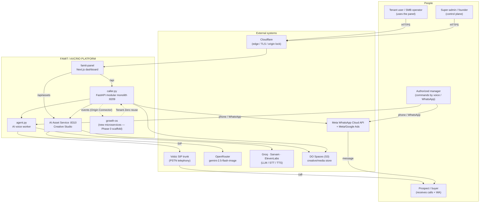
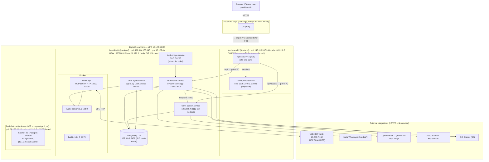
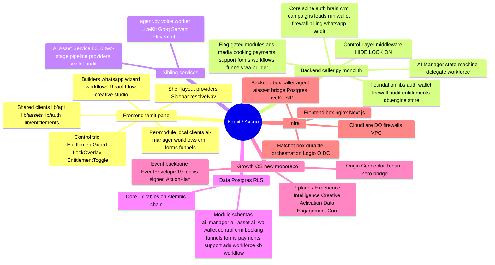
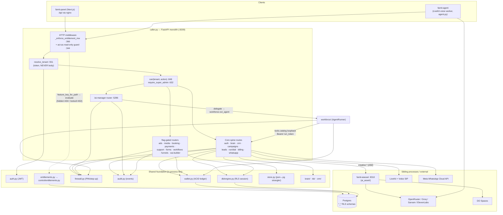
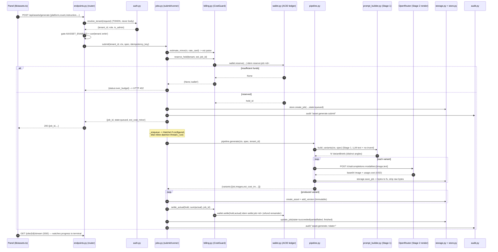
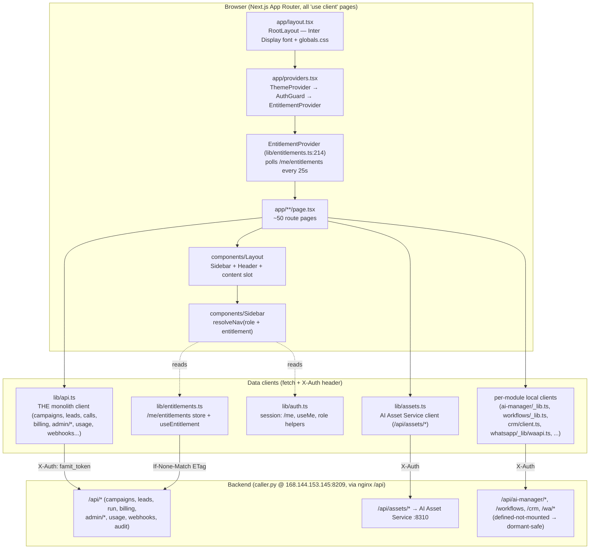
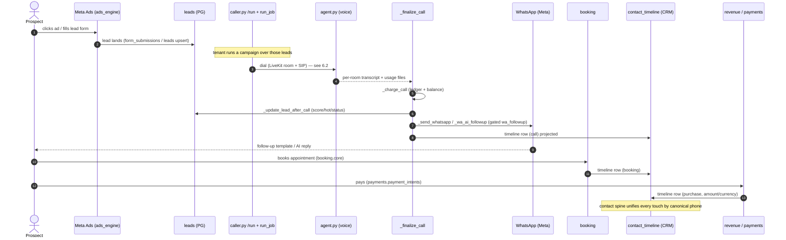
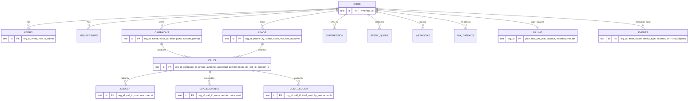
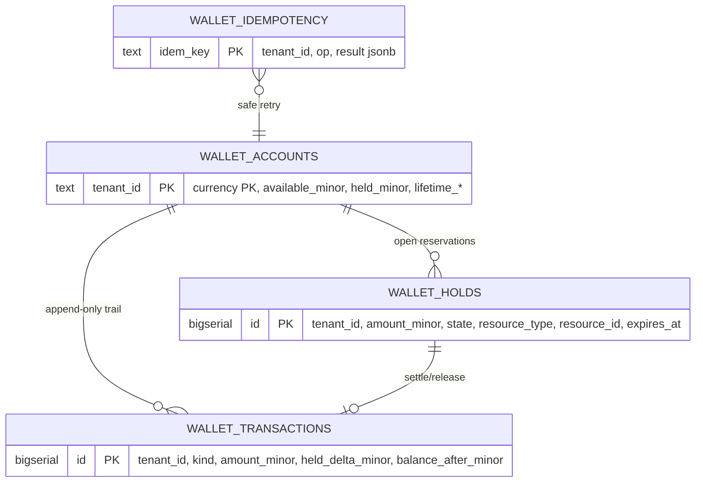
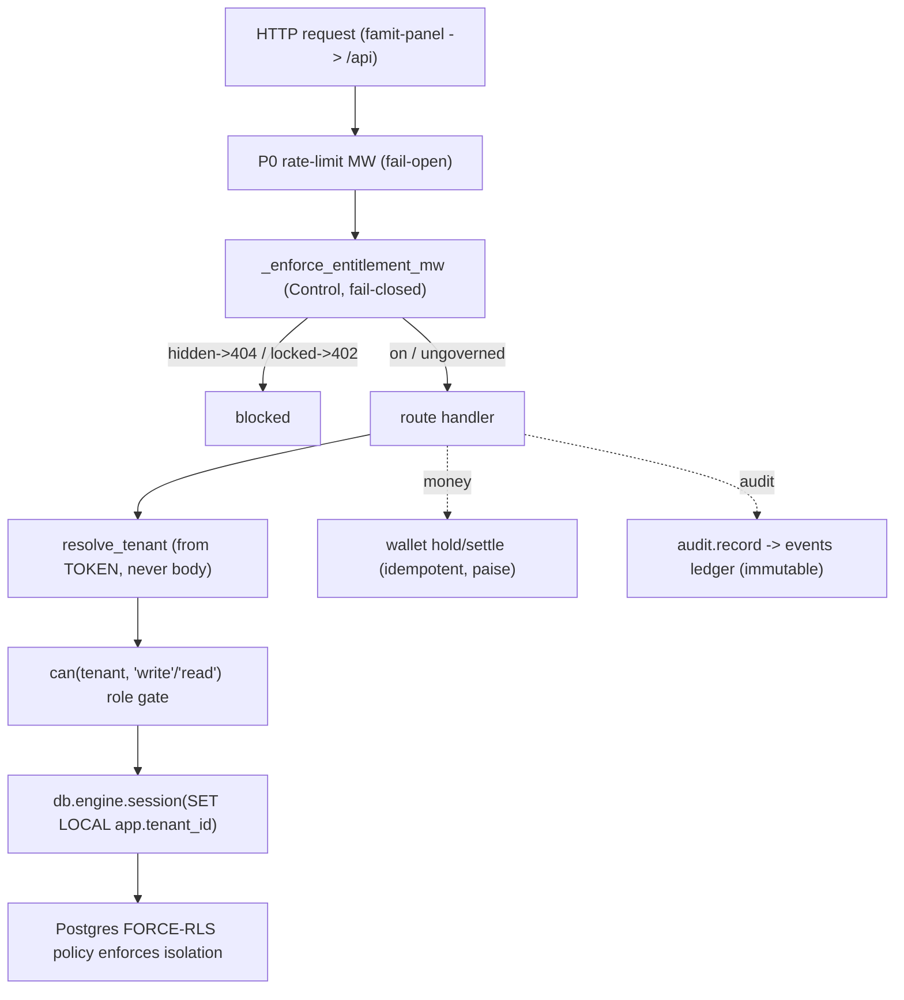

# Famit / Axcrio — AI Revenue OS (monorepo)

Strangler monorepo for the live AI tele-calling SaaS at **https://panel.famit.in**.
The verdict is **STRANGLE & EVOLVE** — the live system keeps earning; every change is
additive, flag-gated, and non-breaking. See `EXECUTION_PLAN.md` and `design/*.md`.

## Intended layout (target — curation is phased, NOT yet performed)

```
caps/                      # this repo root
├─ backend/                # uv-managed FastAPI /api + LiveKit voice agent (FLAT modules,
│                          #   mirrors /opt/famit-agent exactly). NOT YET POPULATED — the
│                          #   live source lives in droplet_work/ and is git-mv'd in later,
│                          #   serialized with the Phase-1 Postgres work (see EXECUTION_PLAN).
├─ frontend/               # pnpm-managed Next.js panel. NOT YET POPULATED — current app is
│                          #   famit-panel/ ; moved under frontend/ in a later curation unit.
├─ infra/                  # (DROPPED for P0) DigitalOcean is managed via the DO API directly,
│                          #   not Terraform. No infra/ dir or terraform in this phase.
├─ design/                 # execution-ready design specs (one per subsystem)
├─ .github/workflows/      # CI: backend.yml + frontend.yml (dormant until curation) + secrets.yml
├─ .githooks/pre-commit    # gitleaks staged-scan gate (core.hooksPath=.githooks)
├─ droplet_work/           # LIVE backend source (gitignored until curated — local scratch)
├─ famit-panel/            # LIVE frontend source (current Next.js app)
└─ .gitignore .gitleaks.toml .gitattributes .worktreeinclude  # the secrets-gate
```

> Current state: this commit establishes the **git foundation + secrets-gate + CI scaffolding
> + branch model**. It does NOT restructure `droplet_work/` → `backend/` or `famit-panel/` →
> `frontend/`; that curation is a later, P1-coordinated unit (it serializes on the 3,422-line
> `caller.py`). `backend/` and `frontend/` therefore do not exist yet, and the `backend.yml` /
> `frontend.yml` CI jobs are dormant scaffolding (their `paths:` filters won't trigger until
> those directories appear).

## 🔒 THE SECRETS RULE (read before any commit)

This box was compromised once. **A committed secret is an irreversible production incident.**
- `.gitignore` is line 1 (`.env*`, `fortress/`, `droplet_work/`, `*.bak.*`, `*.tgz`, `.next/`,
  `.venv/`, `.claude/`, SSH keys, `**/cred.md`, `**/ALL_CREDENTIALS.md`).
- **`gitleaks` is the net** — `.githooks/pre-commit` runs `gitleaks git --staged` on every commit
  and `.github/workflows/secrets.yml` runs it on every push/PR (full history). Both block on any
  finding. If unsure whether something is a secret, treat it as one and ignore it.
- Secrets live OUTSIDE the repo (`fortress/cred.md` is gitignored; `lead/ALL_CREDENTIALS.md` is
  outside the tree). Founder must ROTATE the burned `.env.local` keys (Groq/ElevenLabs/Sarvam/Vobiz).

## Contributing / branch model

See `CONTRIBUTING.md`: worktree → `feat/*` → PR → green CI → squash-merge → protected `main`.

---

# LiveKit Agent Capsy (legacy standalone skeleton — NOT the deployed backend)

> The section below documents the older standalone LiveKit skeleton under `src/`, `selfhost/`,
> `scripts/` + the root `pyproject.toml`. It is **not** what runs in production (the live backend
> is `droplet_work/`, deployed flat at `/opt/famit-agent`). Kept for reference; left in place.

Realtime Hinglish voice agent using:

- LiveKit Agents for realtime rooms and SIP calls
- Vobiz SIP trunking for phone connectivity
- ElevenLabs realtime STT (`scribe_v2_realtime`) or Sarvam STT (`saarika:v2.5`)
- Groq Llama LLM (`llama-3.1-8b-instant` by default)
- Sarvam Bulbul TTS (`bulbul:v3`) or ElevenLabs TTS (`eleven_flash_v2_5`)

## Setup

1. Copy `.env.example` to `.env.local` and fill in the keys.
2. Install dependencies:

```bash
uv sync
```

3. Download local LiveKit model assets:

```bash
uv run python -m livekit.agents download-files
```

4. Start local LiveKit in another terminal:

```bash
livekit-server --dev
```

The local defaults in `.env.local` are:

```bash
LIVEKIT_URL=ws://localhost:7880
LIVEKIT_API_KEY=devkey
LIVEKIT_API_SECRET=secret
```

5. Run the agent for development:

```bash
uv run python src/agent.py dev
```

For latency testing and production-like calls, use `start` mode instead. It
prewarms worker processes and avoids file-watch reloads during calls:

```bash
uv run python src/agent.py start --log-level info
```

`livekit-server --dev` is enough for local room/agent testing, but not enough for SIP phone calls. Self-hosted SIP also requires Redis and the `livekit-sip` service connected to the same LiveKit server. Without those, SIP trunk setup fails with `sip not connected (redis required)`.

To run the full self-hosted SIP stack instead:

```bash
docker compose -f selfhost/docker-compose.yaml up -d
```

See `selfhost/README.md` for SIP port and Vobiz notes.

## Vobiz Connection

Create a Vobiz SIP trunk in the Vobiz console and add these values to `.env.local`:

- `VOBIZ_SIP_DOMAIN`
- `VOBIZ_SIP_TRANSPORT` (`udp`, `tcp`, `tls`, or `auto`)
- `VOBIZ_USERNAME`
- `VOBIZ_PASSWORD`
- `VOBIZ_PHONE_NUMBER`

Then create the LiveKit outbound trunk:

```bash
uv run python scripts/setup_vobiz_trunk.py
```

Add the printed `LIVEKIT_SIP_TRUNK_ID` to `.env.local`.

Make an outbound call:

```bash
uv run python scripts/make_call.py +91XXXXXXXXXX
```

The call script waits up to `CALL_RINGING_TIMEOUT_SECONDS` for the PSTN leg to answer or fail.

For inbound calls with local LiveKit, you also need a local LiveKit SIP service and a public reachable address/tunnel for Vobiz. Route the Vobiz trunk inbound destination to that SIP address, then create a LiveKit inbound trunk and dispatch rule with agent name `voice-assistant`.

## Knowledge / RAG

The agent can ground answers in local files from `knowledge/`. Add `.md`,
`.txt`, or `.csv` files there and restart the worker. Files beginning with `_`
are ignored.

Search is local and runs before every LLM turn, so it avoids a second API call
and keeps latency predictable. Tune it with:

```bash
KNOWLEDGE_ENABLED=true
KNOWLEDGE_DIR=knowledge
KNOWLEDGE_TOP_K=2
KNOWLEDGE_MAX_CHARS=500
KNOWLEDGE_CHUNK_CHARS=650
KNOWLEDGE_MIN_SCORE=0.45
SALES_BRAIN_ENABLED=false
SALES_BRAIN_FILE=knowledge/groq_real_estate_sales_brain.md
```

Test retrieval before a call:

```bash
uv run python scripts/search_knowledge.py "Mumbai flat budget"
```

## Required Environment

The agent requires:

- `LIVEKIT_URL`
- `LIVEKIT_API_KEY`
- `LIVEKIT_API_SECRET`
- `GROQ_API_KEY`
- `ELEVEN_API_KEY` if `STT_PROVIDER=elevenlabs` or `TTS_PROVIDER=elevenlabs`
- `SARVAM_API_KEY` if `STT_PROVIDER=sarvam` or `TTS_PROVIDER=sarvam`

Provider switches:

```bash
STT_PROVIDER=elevenlabs
TTS_PROVIDER=elevenlabs
```

For the lowest-latency stable default, use ElevenLabs realtime STT, Groq Llama
8B Instant, short replies, and ElevenLabs Flash TTS:

```bash
STT_PROVIDER=elevenlabs
GROQ_LLM_MODEL=llama-3.1-8b-instant
TTS_PROVIDER=elevenlabs
ELEVEN_STT_SERVER_VAD=true
ELEVEN_STT_MIN_SILENCE_DURATION_MS=350
ELEVEN_TTS_MODEL=eleven_flash_v2_5
ELEVEN_TTS_VOICE_ID=your_api_enabled_voice_id
ELEVEN_TTS_AUTO_MODE=true
ELEVEN_TTS_STREAMING_LATENCY=1
ELEVEN_TTS_SYNC_ALIGNMENT=false
GROQ_LLM_MAX_COMPLETION_TOKENS=64
AGENT_MAX_ENDPOINTING_DELAY=0.4
```

Vobiz outbound calling also requiresDD

- `VOBIZ_SIP_DOMAIN`
- `VOBIZ_SIP_TRANSPORT`
- `VOBIZ_USERNAME`
- `VOBIZ_PASSWORD`
- `VOBIZ_PHONE_NUMBER`
- `LIVEKIT_SIP_TRUNK_ID`
---


# Famit / Axcrio — Master Architecture

> **New here? Read this file top-to-bottom.** It is the single source of truth that lets a new
> teammate (also on Claude Code) understand *what everything is* and *what connects to what*. Every
> box, edge, and claim is grounded in real code at `file:line`. The detailed per-area docs live under
> [`docs/architecture/`](docs/architecture/) — this file synthesizes them and links out.
>
> | Deep-dive | File |
> |---|---|
> | Backend monolith (`caller.py`) | [`docs/architecture/01-backend.md`](docs/architecture/01-backend.md) |
> | AI Asset / Creative Studio service (`:8310`) | [`docs/architecture/02-ai-asset-service.md`](docs/architecture/02-ai-asset-service.md) |
> | Frontend panel (`famit-panel`) | [`docs/architecture/03-frontend.md`](docs/architecture/03-frontend.md) |
> | Deployment & infra topology | [`docs/architecture/04-deployment.md`](docs/architecture/04-deployment.md) |
> | Growth OS (new microservices monorepo) | [`docs/architecture/05-growth-os.md`](docs/architecture/05-growth-os.md) |
> | End-to-end flows + data model | [`docs/architecture/06-flows-data.md`](docs/architecture/06-flows-data.md) |

---

## 1. What is this?

**Famit / Axcrio is a multi-tenant AI sales-and-marketing platform for Indian SMBs.** A tenant uploads
leads, and the platform autonomously runs the closed revenue loop: it dials prospects with a **human-grade
AI voice agent** (LiveKit + Vobiz SIP, Groq/Sarvam/ElevenLabs), follows up over **WhatsApp** (Meta Cloud
API), generates **on-brand banner creative** (OpenRouter `gemini-2.5-flash-image`), books appointments,
takes payments, and unifies every touch in a CRM person-spine — all metered against an ACID money wallet
and gated by a per-tenant **Control Layer** (HIDE / LOCK / ON). It is operated by voice or chat through the
**AI Manager** command brain. Today the product is a **strangler modular monolith** (`caller.py`, the live
`famit-caller` `:8209`) plus two sibling services on the same box (voice worker `agent.py`, Creative Studio
`:8310`); a parallel **Growth OS** monorepo (`growth-os/`) is the contracts-first event-sourced
microservices successor that treats the live platform as **Tenant Zero**.

---

## 2. System context (the whole platform + users + external systems)



**The five external systems that matter most:** Cloudflare (the only thing the browser talks to), Vobiz
(the SIP trunk that reaches the real phone network), Meta (WhatsApp + the Ads surface), OpenRouter (the
image renderer), and the voice vendor trio Groq/Sarvam/ElevenLabs (the LLM/STT/TTS loop). DO Spaces is the
object store for creatives and media.

---

## 3. Container / topology (the boxes + services + how they connect)



**Read this first:** visitors never touch the origin directly — `panel.famit.in` is Cloudflare-fronted
(Full Strict), Cloudflare → nginx on the frontend box → over the **private VPC** to the backend services.
The browser's API base is the relative path `/api` (`NEXT_PUBLIC_API_BASE=/api`), so the backend IP is never
exposed client-side. Voice runs **entirely out-of-band of nginx/Cloudflare** (Vobiz SIP ⇄ livekit-sip ⇄
livekit-server ⇄ `famit-agent`), so a panel/Cloudflare outage does not stop in-progress calls. The
`famit-hatchet` box exists but is not yet in the request path. Full detail:
[`04-deployment.md`](docs/architecture/04-deployment.md).

---

## 4. Codebase mind-map (planes / modules / services at a glance)



---

## 5. The pieces in detail

### 5.1 Backend monolith — `caller.py` (the live earner)

`caller.py` is a **~5,400-line FastAPI modular monolith** (`caller.py:27`), the single live API process
(`famit-caller` `:8209`). It owns the **core spine directly** as `@app.<verb>` routes (auth, tenants,
brain/KB, CRM contacts, campaigns, leads, the dial runner, wallet, firewall, billing, WhatsApp, audit, the
admin control plane) and **mounts feature modules as routers behind per-feature flags** (ads, media,
booking, payments, support, forms, workflows, AI-Manager, funnels, WhatsApp-builder). It is a **strangler
monolith**: new capability is a self-contained package with its own `build_router(...)` and its own `*_*`
RLS Postgres schema, mounted additively and flag-gated so the resting (all-flags-off) process is
byte-identical to legacy. **Tenant is always derived from the auth token, never the body** (`caller.py:551`).



**Three edges a newcomer must internalize:**

1. **`ai_manager → workforce → tools/catalog → the live `/api`.`** The AI-Manager does *not* re-implement
   business logic. `ai_manager/delegate.py` calls `workforce.run_agent` (`ai_manager/delegate.py:11`); the
   workforce `AgentRunner` executes tools whose live catalog maps **1:1 onto existing `caller.py` routes**
   over an authenticated localhost loopback (`workforce/tools/catalog.py`), RLS-scoped by a minted
   `run_token`.
2. **`wallet`/`firewall`/`audit` are shared, not owned by any one module.** The spine, the mounted modules,
   the workforce runner, and the AI-Manager all import them directly.
3. **The Control Layer middleware wraps `resolve_tenant`.** `_enforce_entitlement_mw` (`caller.py:366`) maps
   path→feature_key→`evaluate(tenant, key)` and returns **404 for `hidden`, 402 for `locked`** — but only
   when `CONTROL_ENABLED` is on; else byte-identical passthrough.

The **AI-Manager command pipeline** is a deterministic state machine S0→S9 (`ai_manager/state_machine.py`):
the LLM only fills slots; a deterministic table decides authority. Two distinct PIN gates — **S2 login**
proves *who*, **S6 step-up** authorizes *this specific* risky action (fresh, scoped, 300s). The workforce
runner is the **second enforcement wall** (`workforce/runner.py:73`): policy → kill-switch → plan-validate →
single-use amount-bound approval → **wallet reserve before side effect** → settle actual.

Full detail incl. the route table, the AI-Manager sequence, and the auth/control gating diagram:
[`01-backend.md`](docs/architecture/01-backend.md).

### 5.2 AI Asset / Creative Studio service (`:8310`)

A **standalone FastAPI process** (own venv, own port `127.0.0.1:8310`, own PG schema `ai_asset_*`) that
turns a **campaign + a one-line instruction** into **on-brand banner images** through a **two-stage
pipeline** (an LLM writes the briefs → OpenRouter renders the pixels), metering every render against the
platform wallet and recording it in the immutable audit ledger. It ships **dormant** (`AIASSET_ENABLED=0`)
— mounted but inert, byte-identical to the live system until a flag flips. The panel never talks to it
directly; nginx on the frontend box reverse-proxies `/api/assets/` across the VPC to it.



**Key facts:** Stage 1 (`prompt_builder.py`) writes N **angle-diverse** briefs and enforces a **NO-INVENT,
fail-closed** validator that strips any price/discount/location/claim not present verbatim in the campaign
facts — the LLM is an input, never the authority on facts. Stage 2 reuses the built-but-undeployed
`creative/image_banner_studio` engine — a Provider plugin system (7 adapters; OpenRouter is the live
default, `fake` keeps the pipeline runnable at zero spend). Money is a thin `billing.py` CostGuard over the
proven `wallet.py` ACID paise ledger (estimate → reserve → settle ACTUAL → release; INTEGER paise, ceil,
idempotent). Versions are **immutable** (regen/edit appends a new version). Tenant is always token-derived;
a body `tenant_id` is ignored. Full detail incl. the provider-routing and `ai_asset_*` ER diagrams:
[`02-ai-asset-service.md`](docs/architecture/02-ai-asset-service.md).

### 5.3 Frontend — `famit-panel`

A **Core_2 dashboard kit** (`package.json:2` → `"name":"core-2"`) with the data layer rewired to the Famit
backend. Next.js 15 App Router (React 19, Tailwind v4), ~50 `"use client"` page routes, deployed at
`panel.famit.in` (`:3001` behind nginx). Boot chain: `app/layout.tsx` (Inter Display font) →
`app/providers.tsx` (`ThemeProvider`→`AuthGuard`→`EntitlementProvider`) → `components/Layout`
(Sidebar+Header+content). Auth is a localStorage bearer token (`famit_token`) sent as the `X-Auth` header;
a `401` on the monolith client clears the token and redirects to `/login`.



**The control layer on the client is cosmetic.** `lib/entitlements.ts` is a single module store + pub/sub;
`EntitlementProvider` polls `/me/entitlements` (25s + focus + route) with an ETag; `useEntitlement(key)`
returns ON/LOCK/HIDE; an unknown key → ON, a `404` → all-ON parity. `resolveNav` filters the sidebar by role
**and** entitlement (HIDE drops, LOCK dims). The real boundary is always the backend (404 hidden / 402
locked). Two client patterns: the shared `lib/api.ts` + `lib/assets.ts` cover the **live** surfaces, while
**per-module local clients** (`ai-manager/_lib.ts`, `workflows/_lib.ts`, `crm/client.ts`, etc.) mirror the
auth convention but map non-200 → a **dormant** "coming soon" state, because those backend routers are
defined-not-mounted. Full page tree + page-to-API map: [`03-frontend.md`](docs/architecture/03-frontend.md).

### 5.4 Deployment & infrastructure

Two production droplets in DO **blr1** on one VPC `10.122.0.0/20`: the **frontend** box `famit-panel-2`
(pub `143.110.247.249`, priv `10.122.0.2`) running nginx + Next.js, and the **backend** box `famit-livekit`
(pub `168.144.153.145`, priv `10.122.0.4`) running the monolith API, voice worker, dial bridge, AI-Asset
service, Postgres 16, and LiveKit+SIP+Redis (Docker). A third box `famit-hatchet` (priv `10.122.0.3`) hosts
the Hatchet spine + Logto OIDC but is **not yet in the request path** (`:7077` filtered; caller.py cutover
deferred). See the topology diagram in §3 and the nginx routing, firewalls, and integration tables in
[`04-deployment.md`](docs/architecture/04-deployment.md).

**Two firewall layers.** Layer 1 = the DO Cloud Firewall `fortress-panel-fw` on the frontend (inbound
22/80/443 with 80/443 locked to 15 Cloudflare CIDRs; egress allow-list — the anti-DDoS-conscription lesson
from the June-2026 compromise). Layer 2 = host UFW on the backend (SSH 22; Vobiz SIP IP-locked to
`13.203.7.132`; `:8209` and `:8310` accept **only** from `10.122.0.2`). Honest caveat: egress 80/443 is
allowed to any host — the real protection is that arbitrary UDP/random TCP ports are dropped.

### 5.5 Growth OS — the new microservices monorepo

`growth-os/` is a **NEW, standalone, contracts-first, event-sourced microservices "AI Marketing Department"
product**, separate from the live monolith. The live platform is **Tenant Zero**, reached only over the
**Origin Connector**. **Ground-truth status:** it's a **Phase-0 scaffold** — only `services/core` (a modular
NestJS app) and `services/temporal-worker` (HelloSaga) have real code; the other ~30 services are
directory/README stubs and the agents are `__init__.py` stubs. The contracts (`/contracts`) and the typed
`packages/events` are real and frozen.

```mermaid
sequenceDiagram
    autonumber
    participant U as Vendor / AI-Manager
    participant ORCH as agent-orchestrator<br/>(Research War Room)
    participant STR as strategy-compiler
    participant STU as creative-studio
    participant QA as creative-qa
    participant CMP as campaign-compiler
    participant LED as ledger (sign gate · P4)
    participant EXE as action-executor
    participant META as connector-meta
    participant DATA as tracking / ingestion / identity
    participant ENG as ENGAGEMENT (WA + voice, Tenant Zero)
    participant SCORE as lead-scoring ★
    participant SIG as signals ★★ (CAPI)
    participant OPT as experiments + optimizer
    participant MEM as memory
    participant REP as narrative-reports

    U->>ORCH: campaign.requested  (journey correlation_id minted)
    ORCH->>ORCH: research.completed → CIB (Campaign Intelligence Brief)
    ORCH->>STR: strategy.compiled → MediaPlan
    STR->>STU: creative.batch.generated (diversity matrix)
    STU->>QA: creative.qa.passed (policy + ≥8/10 diversity)
    QA->>CMP: creative.approved
    CMP->>LED: campaign.compiled (exact platform payloads + dry-run diff)
    LED->>LED: action.plan.signed  (signed + governor stamp + step-up)
    LED->>EXE: signed ActionPlan
    EXE->>META: action.executed → campaign.launched (live ads)
    META-->>DATA: ad.metrics.snapshot (every 4h)
    ENG-->>DATA: lead.captured + wa.message.* + call.completed/outcome
    DATA->>SCORE: lead.scored (quality 0-100, ≤15 min)
    SCORE->>SIG: signal.dispatched (CAPI w/ value = lead-quality-score)
    SIG->>OPT: experiment.evaluated
    OPT->>LED: optimization.decision (draft | trash | promote) → action.plan.signed
    LED->>EXE: action.executed
    OPT->>MEM: memory.updated (gene-level posteriors)
    MEM->>REP: report.briefed
    REP->>U: next campaign.requested (smarter)
```

**Why it's a moat:** competitors stop at "lead submitted / conversation started". Growth OS feeds Meta/Google
the **ground-truth outcome** of every voice call + WhatsApp chat + booking + sale, with `value =
lead-quality score`, via CAPI — so the platforms optimize for *the vendor's definition of a good customer*.
**Money is sacred (P4):** no path increases spend without a **signed ActionPlan** (`ledger.service.ts`
`propose()`/`sign()` enforce step-up + `confirm_money` + a Budget Governor stamp + hash-chain
tamper-evidence — mirroring the live `wallet.py`/`firewall.py` discipline). Famit and Growth OS meet **only
at the event envelope** — never a shared DB or workflow engine. Full detail incl. the 7-plane diagram and
the Origin Connector bridge: [`05-growth-os.md`](docs/architecture/05-growth-os.md).

---

## 6. End-to-end flows + the data model

### 6.1 The closed revenue loop (Ad → Lead → AI voice call → WhatsApp → appointment → revenue)



`_finalize_call` (`caller.py:1872`) orchestrates the post-call fan-out: charge, lead update, WhatsApp
follow-up (gated by per-campaign `wa_followup`), suppression on opt-out, callback retry enqueue, and
`call.completed`/`lead.qualified` webhooks. The CRM contact spine (`crm/schema.sql`) is a read-model
projection stitching calls/WA/bookings/payments by canonical phone — the loop's single pane of glass.

### 6.2 Run-a-Campaign → dial → `agent.py` voice → transcript / billing

```mermaid
sequenceDiagram
    autonumber
    actor User as Tenant (famit-panel)
    participant API as caller.py POST /run
    participant Job as run_job (asyncio task)
    participant LK as LiveKit API
    participant SIP as Vobiz SIP trunk
    participant Agent as agent.py entrypoint
    participant Vend as Groq/Sarvam/ElevenLabs
    participant Files as var/transcripts + usage_events_raw
    participant Fin as _finalize_call
    participant PG as PG (calls, ledger, usage_events)

    User->>API: POST /run (campaign_id, leads/CSV/XLSX, RC2 selectors)
    API->>API: resolve_tenant + can(write)
    API->>API: caps gate — monthly minutes, prepaid balance, concurrency clamp
    API->>Job: JOBS[job_id]=queued; asyncio.create_task(run_job)
    API-->>User: {job_id, count, suppressed_count, breakdown}
    loop dial loop (per lead, honouring window/caps/suppression)
        Job->>LK: create_room(name=famit-<num>-<rand>)
        Job->>LK: create_dispatch(agent_name="capsy", metadata={campaign_id,lead_name,variant})
        Job->>SIP: create_sip_participant(trunk, sip_call_to=num)
        Job->>PG: record_call(status="calling", sip_call_id)
        SIP-->>Agent: call answered -> job assigned to room
        Agent->>Agent: load campaign brain (build_system_prompt) + recap (cross-call memory)
        loop conversation turns
            Vend-->>Agent: STT (Sarvam) -> LLM (Groq) -> TTS (ElevenLabs)
        end
        Agent->>Files: write var/transcripts/<room>.json + usage_events_raw/<room>.json
        Job->>LK: _phone_present(room)? -> false when hung up
        Job->>Fin: _finalize_call(it, tenant, campaign)
        Fin->>PG: _charge_call (ledger + balance), record_call(done), usage fold
        Fin->>PG: _update_lead_after_call (score/hot/status)
        Fin-->>User: WhatsApp follow-up + webhooks (6.1)
    end
```

`POST /run` (`caller.py:3071`) gates: monthly-minutes cap, prepaid balance (402), RC2 composable audience
selectors, concurrency clamp. The `run_job` dial loop (`caller.py:1971`) creates the room + dispatch + SIP
participant; `agent.py entrypoint` (`agent.py:419`) parses metadata, builds the system prompt from the
campaign brain, and runs the STT→LLM→TTS loop with per-call Groq(6)/Sarvam(5) key round-robin. The agent
writes per-room transcript+usage files that `caller.py` folds into `usage_events.json` by joining on `room`,
then joins the Vobiz CDR into `cost_ledger.json`.

### 6.3 AI Manager command → NLU → PIN → execute → result

```mermaid
sequenceDiagram
    autonumber
    actor Mgr as Authorized manager (voice/WA/dashboard)
    participant SM as CommandMachine (state_machine.py)
    participant ID as identity (caller-ID -> authorized_users)
    participant NLU as nlu / intent (slot fill)
    participant FW as firewall (PIN/OTP step-up)
    participant Del as delegate.execute
    participant Mod as target module (campaigns/ads/leads/wa/workflows)
    participant DB as ai_manager_* (PG, immutable audit)

    Mgr->>SM: S0 connect (channel=phone|whatsapp|dashboard)
    SM->>ID: S1 verify caller-ID (HINT only)
    SM->>FW: S2 authenticate human — fresh PIN/OTP (anti-spoof)
    FW-->>SM: ok (lockout after N fails, per number)
    SM->>Del: S3 read_context (read-only business state)
    loop S4..S9 command loop
        Mgr->>NLU: utterance
        NLU-->>SM: intent + slots (match)
        SM->>SM: S5 map_intent_to_action -> tool + risk; permits(role,grants,tool)?
        alt not permitted
            SM->>DB: command status=denied + audit(permission_denied)
        else permitted
            SM->>DB: create_command (vendor_id, idempotency_key UNIQUE)
            opt risky action (S6 STEP-UP, fresh + scoped)
                SM->>FW: per-action PIN; on fail -> cancel this command
            end
            SM->>Mgr: S7 CONFIRM (amount read back)
            Mgr-->>SM: "yes"
            SM->>DB: status=executing; create_action_run
            SM->>Del: S8 execute(action, step_up_token) — runner re-enforces caps/kill-switch
            Del->>Mod: side effect (campaigns.run / ads.set_budget / ...)
            Mod-->>Del: status="done" (ground truth)
            SM->>DB: finish_action_run + command succeeded/failed + immutable audit_log
            SM->>Mgr: S9 report result
        end
    end
```

The state machine is **code-decided** (`ai_manager/state_machine.py`); the LLM only fills slots, it never
authorizes. `(vendor_id, idempotency_key)` UNIQUE = **no double-execute**; `ai_manager_audit_logs` is
IMMUTABLE (REVOKE UPDATE/DELETE); per-user PINs are Argon2id.

### 6.4 The Postgres data model (RLS-isolated)

**Tenancy invariant.** `resolve_tenant` (`caller.py:551`) resolves the tenant from the **auth token, never
the body**. Every per-op DB session does `SET LOCAL app.tenant_id = <tenant>` (and `app.is_admin='1'` for
admin ops) via `db/engine.py session()`. Every tenant-scoped table has the same admin-GUC FORCE-RLS policy;
`famit_app` is `NOBYPASSRLS` so FORCE binds even the owner.



The 17 RLS tables on the Alembic chain (`db/models.py`): `orgs, users, memberships, campaigns, leads, calls,
suppression, retry_queue, webhooks, webhook_log, wa_log, wa_threads, billing, ledger, usage_events,
cost_ledger, events`. `events` is the **immutable cross-module audit ledger** (PG leg, not JSONL).

**Money — the wallet** (integer paise, ACID; `db/ddl_wallet.sql`):



Money is **BIGINT minor units (paise), never float**. Proven invariant: `available_minor + held_minor ==
SUM(amount_minor)`. This is the single wallet the AI-Asset job hold, WhatsApp-AI bundle hold, and ads-engine
hold all reserve against (note: legacy prepaid `billing.balance` ≠ `wallet_accounts` — separate balances by
plan). The full set of module ER diagrams — `ai_manager_*` (7), `ai_asset_*` (8), `ai_wa_*` (4), control
tables, CRM spine, and the per-module schema table — is in [`06-flows-data.md`](docs/architecture/06-flows-data.md).

### 6.5 The request choke-point spine (every module rides this)



**rate-limit → entitlement → tenant-from-token → role → RLS session → (wallet + immutable audit).** A new
module plugs in by registering a `feature_registry` key, exposing a `build_router(...)`, applying a
standalone `ensure_schema()`, and **reusing** `wallet.py`/`audit.py`/`firewall.py` rather than
re-implementing money, audit, or step-up.

---

## 7. File map — where every major thing lives

> Roots: `caps/famit-panel` (frontend), `caps/droplet_work` (backend monolith + modules + sibling
> services), `caps/growth-os` (new microservices monorepo).

### 7.1 Backend (`droplet_work/`)

| What it owns | File / dir | Notes |
|---|---|---|
| The monolith (core spine + module mounts) | `caller.py` | `@app.*` spine + mounts at `:4953`–`5386` |
| Voice worker (separate process) | `agent.py` | LiveKit + Groq/Sarvam/ElevenLabs |
| Tenant resolution | `caller.py:551` `resolve_tenant` | token, never body |
| Permissions / super-admin | `caller.py:849` `can`, `:632` `require_super_admin` | legacy pw excluded from `/admin/*` |
| Control middleware | `caller.py:366` `_enforce_entitlement_mw` | 404 hidden / 402 locked |
| JWT auth | `auth.py` | issue/refresh/revoke, act-as |
| Money ledger (ACID paise) | `wallet.py` + `db/ddl_wallet.sql` | reserve/settle/release |
| PIN + step-up | `firewall.py` | salted-sha256 PIN, HS256 step-up 300s |
| Immutable audit | `audit.py` + PG `events` | JSONL + PG leg |
| Control Layer engine | `entitlements.py` → `control/entitlements.py` + `control/db/ddl_control.sql` | evaluate / set_override |
| RLS DB session | `db/engine.py` `session()`, models `db/models.py` | `SET LOCAL app.tenant_id` |
| JSON→PG strangler | `store.py` | per-store `json`/`dual`/`pg` |
| AI Manager command brain | `ai_manager/` (`state_machine.py`, `delegate.py`, `identity.py`, `endpoints.py`, `schema.sql`) | mounted at `/ai-manager` |
| Workforce runner + tool catalog | `workforce/runner.py`, `workforce/tools/catalog.py` | 2nd enforcement wall; loopback to `/api` |
| Brain / KB / CRM projections | `brain/core.py`, `kb/core.py`, `crm/core.py` + `crm/schema.sql` | in-proc PG-native |
| WhatsApp sender | `whatsapp.py` (`wa_mod`) | Meta Cloud API |
| Flag-gated modules | `ads_engine/`, `media_gen/`, `booking/`, `payments/`, `support/`, `forms-surveys/`, `workflow-studio/`, `funnels/`, `whatsapp_builder/` | each `build_router` + own `*_*` schema |

### 7.2 AI Asset / Creative Studio (`droplet_work/ai_asset/` + `droplet_work/creative/`)

| What it owns | File |
|---|---|
| Service shell / boot | `ai_asset/app/main.py` |
| Config / flags / keys | `ai_asset/config.py` (`AIASSET_ENABLED`, OpenRouter key, caps, mode) |
| API surface (`/api/assets/*`) | `ai_asset/endpoints.py` |
| Job state machine + submit/run | `ai_asset/jobs.py` |
| Money (CostGuard over wallet) | `ai_asset/billing.py` |
| DB store + schema (RLS by `vendor_id`) | `ai_asset/store.py` + `ai_asset/schema.sql` |
| Auth seam (tenant-from-token) | `ai_asset/auth.py` |
| Stage 1 — brief writer (no-invent) | `ai_asset/prompt_builder.py` |
| Stage 2 — render pipeline | `ai_asset/pipeline.py` |
| Provider engine (7 adapters + router) | `creative/image_banner_studio/providers/`, `router.py`, `storage.py` |

### 7.3 Frontend (`famit-panel/`)

| What it owns | File |
|---|---|
| Root layout + font | `app/layout.tsx` |
| Providers (theme / auth / entitlements) | `app/providers.tsx` |
| Shell (Sidebar/Header/content) | `components/Layout/`, `components/Sidebar/` |
| Nav IA (data) + role×ent filter | `contstants/navigation.tsx`, `Sidebar/resolveNav` |
| Monolith client (~60 fns) | `lib/api.ts` |
| AI Asset client | `lib/assets.ts` |
| Session / role helpers | `lib/auth.ts` |
| Entitlement store + hooks | `lib/entitlements.ts` |
| Control trio | `components/EntitlementGuard`, `LockOverlay`, `EntitlementToggle` |
| Per-module local clients | `app/{ai-manager,workflows,funnels}/_lib.ts`, `app/{crm,forms}/client.ts`, `app/{support,booking}/api.ts`, `app/payments/_api.ts`, `app/whatsapp/_lib/waapi.ts` |
| Builders | `app/whatsapp/_steps/*` (wizard), `app/workflows/_nodes`+`_editor` (React-Flow), `app/creative/_components` |
| Pages | `app/**/page.tsx` (~50 routes) |

### 7.4 Growth OS (`growth-os/`)

| What it owns | File |
|---|---|
| The bible (§-numbered spec) | `GROWTH-OS-BUILD-SPEC.md` |
| Phase-0 design + Origin Connector | `docs/architecture-phase0.md` |
| What's actually built | `SCAFFOLD_STATE.md` |
| Frozen contracts | `contracts/schemas/event-envelope.schema.json`, `contracts/asyncapi/bus.yaml`, `contracts/openapi/integration-hub.yaml`, `contracts/registry/event-backbone.index.json` |
| Typed event backbone | `packages/events/src/{topics,create-envelope,index}.ts` |
| Only running code | `services/core/src/app.module.ts`, `services/core/src/modules/ledger/ledger.service.ts`, `services/temporal-worker/src/workflows.ts` |
| Phase-0 demo (proves the loop) | `tools/demo-phase0/run.ts`, `infra/docker-compose.dev.yml` |

---

## 8. Tech stack

| Layer | Tech |
|---|---|
| Frontend | Next.js 15 (App Router), React 19, Tailwind v4, Core_2 kit, `@xyflow/react` (React Flow), `recharts`, TipTap, Inter Display font |
| Backend monolith | Python, FastAPI, uvicorn, SQLAlchemy, asyncio |
| Voice | LiveKit (server v1.8 + SIP gateway), Vobiz SIP trunk, plugins: Groq (LLM), Sarvam (Indic STT/TTS), ElevenLabs (TTS), Silero (VAD) |
| Creative | OpenRouter `google/gemini-2.5-flash-image` (render) + `gemini-2.5-flash` (briefs); provider plugins recraft/gpt_image/ideogram/flux |
| Data | PostgreSQL 16 (multi-tenant FORCE-RLS, admin-GUC), integer-paise money, immutable `events` ledger |
| Auth | HS256 JWT (`auth.py`), localStorage bearer on the client; Logto OIDC deployed (not yet live) |
| Orchestration | Hatchet-lite (Postgres broker) — built, not yet in request path; inline asyncio/threads today |
| Messaging | Meta WhatsApp Cloud API (`graph.facebook.com`) |
| Object store | DO Spaces (S3) |
| Edge / infra | Cloudflare (Full Strict), nginx, systemd, Docker, DigitalOcean (droplets + Cloud Firewall + VPC) |
| Growth OS | NestJS (core), Temporal (durable workflows), Redpanda/Kafka (event bus), ClickHouse (warehouse), pnpm monorepo, contracts-first (OpenAPI/AsyncAPI/JSON-Schema), Python/uv agents |

---

## 9. How to run / deploy + boxes & services quick reference

### 9.1 Run locally

- **Frontend:** `cd famit-panel && npm run dev` (Next 15, port 3000 locally; prod `:3001`). Set
  `NEXT_PUBLIC_API_BASE` to point at the backend; default is the nginx-proxied `/api`.
- **Backend monolith:** `uvicorn caller:app` (the live unit runs `--host 0.0.0.0 --port 8209`). All feature
  flags default OFF; the resting process is byte-identical to legacy.
- **AI Asset service:** `uvicorn ai_asset.app.main:app --host 127.0.0.1 --port 8310`; dormant until
  `AIASSET_ENABLED=1`; `fake` provider lets the whole pipeline run at zero spend with no keys.
- **Growth OS:** `pnpm dev` boots the dev stack (needs Docker; the 7-container infra requires a real box).
  `tools/demo-phase0/run.ts` runs the loop in-memory with no infra.

### 9.2 Boxes

| Box | DO id | Public IP | VPC priv | Role | SSH user |
|---|---|---|---|---|---|
| **famit-panel-2** | 576010005 | `143.110.247.249` | `10.122.0.2` | Frontend: nginx + Next.js (egress-locked) | `root` |
| **famit-livekit** | 574914961 | `168.144.153.145` | `10.122.0.4` | Backend API + voice + DB + LiveKit | `famit` |
| **famit-hatchet** | 576483610 | `68.183.94.38` | `10.122.0.3` | Hatchet spine + Logto OIDC (not in request path) | — |

SSH key: `C:\Users\kunal\.ssh\do-blr-test\id_ed25519`. (Note: a recent doc author found the backend box
rejected this key for the AI-Asset live probe — verify access before relying on it.)

### 9.3 Services / ports

| Box | Service | Bind | Reached by |
|---|---|---|---|
| frontend | `nginx.service` | `0.0.0.0:80/:443` | Public (via Cloudflare) |
| frontend | `famit-panel.service` | `127.0.0.1:3001` | nginx only (loopback) |
| backend | `famit-caller.service` (monolith) | `0.0.0.0:8209` | nginx `/api/` from `10.122.0.2` (UFW-locked) |
| backend | `famit-aiasset.service` (Creative) | `10.122.0.4:8310` | nginx `/api/assets/` + caller loopback |
| backend | `famit-agent.service` (voice) | no inbound port | LiveKit dispatch |
| backend | `famit-bridge.service` | `0.0.0.0:8208` | scheduler → dial (legacy rule) |
| backend | `postgresql@16-main` | `127.0.0.1:5432` | local app processes |
| backend | Docker `livekit-server` v1.8 | `127.0.0.1:7880` | agent + SIP |
| backend | Docker `livekit-sip` | UDP 5060 + RTP 10000-10200 | Vobiz trunk |
| backend | Docker `livekit-redis` 7 | `127.0.0.1:6379` | livekit-server |

### 9.4 nginx routing (precedence — most specific first)

- `/api/assets/` → `http://10.122.0.4:8310/` (SSE: buffering off, 3600s) — **must stay above** `/api/`.
- `/api/` → `http://10.122.0.4:8209/` (120s) — both `/api*` proxies have a trailing slash so nginx **strips
  the `/api` prefix**.
- `/` → `http://127.0.0.1:3001` (Next.js, WebSocket upgrade).

Secrets live on the backend box in `/opt/famit-agent/.env` and `/opt/famit-aiasset/.env`; the frontend box
holds ~none.

---

## 10. Glossary

- **The moat.** Growth OS's defensibility: feeding Meta/Google the **ground-truth revenue outcome** of every
  call/WhatsApp/booking/sale (with `value = lead-quality score`) via CAPI, so the ad platforms optimize for
  the vendor's *real* good customer — not the shallow "lead submitted" event competitors stop at. Four
  sub-moats: signal quality, attribute-level creative learning, cross-channel explainable autonomy,
  cross-tenant learning.
- **The closed (revenue) loop.** The macro journey Ad → Lead → AI voice call → WhatsApp follow-up →
  appointment → revenue, unified in the CRM contact spine. See §6.1.
- **The Revenue-Truth Signal Loop.** The Growth OS self-improving cycle (§5.5): `campaign.requested → … →
  signal.dispatched → optimization.decision → memory.updated → report.briefed → smarter next`. Each cycle
  ends smarter because the optimizer wrote to memory and the platforms got a better signal than "conversation
  started".
- **Strangler (monolith / pattern).** Evolving the live system by adding each new capability as a
  self-contained, flag-gated package (own router + own RLS schema) mounted additively, so the resting process
  is byte-identical to legacy and old code is gradually "strangled" out. `store.py` is the JSON→Postgres
  strangler seam.
- **RLS (Row-Level Security).** Postgres-enforced tenant isolation. Every per-op session does `SET LOCAL
  app.tenant_id`; every tenant table carries the admin-GUC FORCE-RLS policy `USING (current_setting(
  'app.is_admin')='1' OR <key> = current_setting('app.tenant_id'))`; `famit_app` is `NOBYPASSRLS` so FORCE
  binds even the owner. **Tenant always comes from the token, never the body.**
- **Control Layer (HIDE / LOCK / ON).** Per-tenant feature gating. The client gate (`resolveNav`,
  `EntitlementGuard`) is **cosmetic**; the real boundary is the backend middleware
  `_enforce_entitlement_mw` returning **404 for hidden, 402 for locked**, fail-closed, gated by
  `CONTROL_ENABLED`. Resolution layering: per-tenant override > plan > global default.
- **Tenant Zero.** The live Famit/Axcrio platform as seen by Growth OS — its first API consumer + reused
  Engagement/Creative planes, reached only over the **Origin Connector**, never as a shared host/DB.
- **Origin Connector.** A first-class `provider: origin` inside Growth OS `integration-hub` that bridges to
  the live platform (PUSH `/v1/origin/events`, webhooks, PULL `/v1/origin/{campaigns,reports,leads,signals}`)
  — Bearer service token, tenant-from-token, idempotency-keyed, HMAC reverse webhooks.
- **Signed ActionPlan (the money gate).** In Growth OS, no path increases spend or launches ads without a
  step-up-signed, Budget-Governor-stamped, hash-chained ActionPlan in the Ledger — mirroring the live
  `wallet.py` + `firewall.py` discipline.
- **Step-up (PIN).** A fresh, scoped, short-TTL (300s) re-authentication required for a *specific* risky
  action (money/destructive/bulk) — distinct from login auth which only proves *who* you are.
- **The two enforcement walls (AI Manager).** Wall 1 = the deterministic state machine (LLM fills slots, code
  decides risk/permission). Wall 2 = the workforce `AgentRunner`, which re-enforces policy/caps/kill-switch
  and reserves a wallet hold **before** any side effect.
- **Tenant Zero / Hatchet / Logto.** Hatchet = the durable-orchestration spine (built, not yet in the request
  path). Logto = self-hosted OIDC IdP (deployed on the hatchet box; `auth.famit.in` DNS not live yet —
  legacy JWT auth is still the live path).

---

*Generated as the synthesis of the six `docs/architecture/*.md` deep-dives. Every box/edge/claim is grounded
in real code at `file:line` in those docs. READ-ONLY architecture documentation — no app code was changed.*
