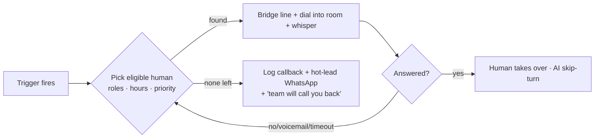
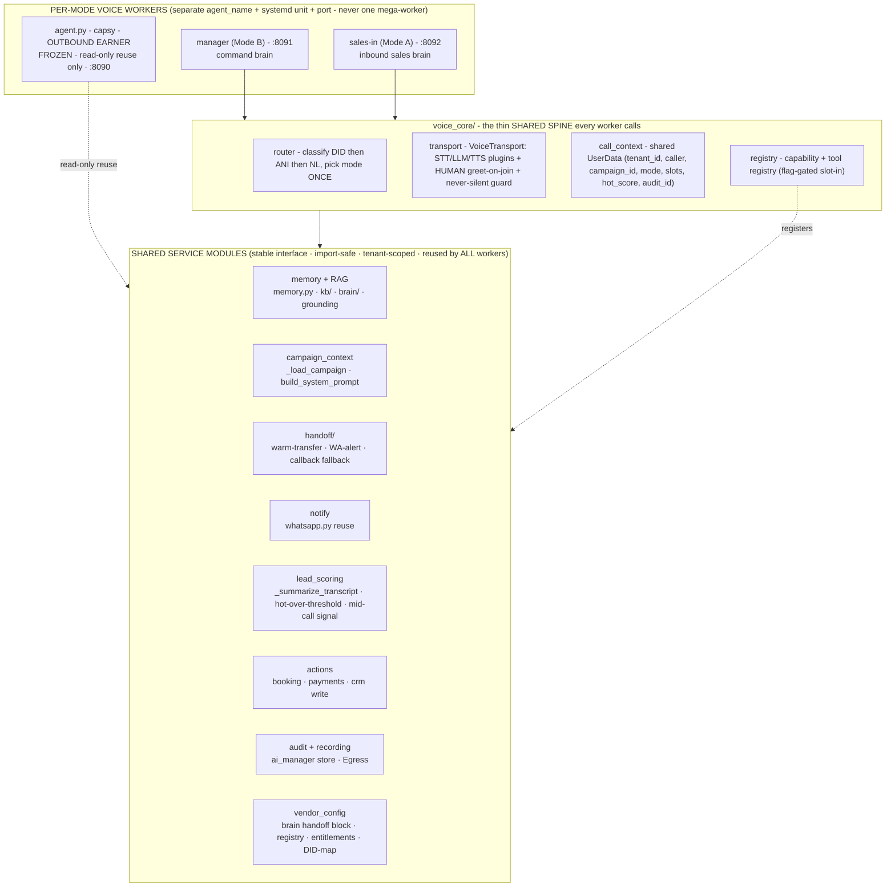

# INBOUND PIPELINE — MASTER PLAN **V2** (full-automation AI brain · human-handoff · hot-lead WhatsApp · RAG · modular-for-ever)

> **Status:** READ-ONLY architecture + plan. No code, no deploy, no git. This is the **single decision-ready
> plan** the founder + builders follow. It **extends** `INBOUND-PIPELINE-MASTER-PLAN.md` (v1) and folds in the
> six grounded explores authored 2026-06-12: `plan-rag-context.md`, `plan-handoff-hotlead.md`,
> `plan-vendor-modules.md`, `plan-modular-arch.md`, `plan-research-transfer.md`, `plan-feature-inventory.md`
> (on top of v1's `plan-{existing-inbound,lead-history,campaign-context,aim-brain,inbound-research}.md`).
> **Read v1 for the SIP recipe, security model detail, and Mode-B command spine — V2 does not repeat them; it
> adds the new founder features and the module structure, and re-sequences the phases.**
>
> **Box (read-only):** `famit@168.144.153.145` (key `C:\Users\kunal\.ssh\do-blr-test\id_ed25519`).
> Voice venv `/opt/capsy-agent/.venv` (livekit-api **1.1.0**, livekit-agents **1.5.17**); API venv `/opt/famit-agent/.venv`.
>
> ## 🟥 THE #1 RULE — NEVER BREAK THE OUTBOUND EARNER (unchanged, absolute)
> The live outbound earner — `agent.py` / worker `agent_name="capsy"` / `famit-agent.service` / port 8090 /
> outbound trunks `ST_fmtVmNJmpzKa`+`ST_LH8ighJJtHSi` — **was just restored after an infra mistake.** Every
> capability in this plan is **ADDITIVE + ISOLATED**: separate workers, separate systemd units/ports, a separate
> inbound trunk + dispatch, and **read-only reuse** of shared campaign/lead/memory/KB/booking/payment stores.
> **No step edits `agent.py`, the outbound trunks, the outbound dispatch, `build_system_prompt`, or any shared
> setting on the outbound media/signaling path.** The **green outbound regression gate `G`** (`famit-agent`
> `is-active` **AND** one real test outbound call → Riya answers) runs **BEFORE and AFTER every single step**.
> Any regression → STOP, roll back that one step (restore the dated `.bak`, restart only the inbound unit), nothing else.

---

## 1. THE VISION — **full-automation first** (updated for the founder)

You want your inbound phone line(s) answered by AI that **handles the entire sales call end-to-end with no
human needed** — that is the **core goal: FULL AUTOMATION**. The AI greets like a real person, recognises
returning leads, sells from the right campaign, answers product questions from real knowledge, books the
site-visit, and logs everything. A **human is the exception, not the default.**

**The AI sounds like a real human, not a robot.** It opens *"Hey, main Riya from {company}…"* — warm, named,
natural — and gives the **legally-required AI disclosure phrased conversationally** (TRAI mandate kept, but
spoken like a person, never the robotic *"I am an AI assistant from…"*). The outbound earner already greets this
way (`prompt.py:228`); inbound reuses that warm opener verbatim.

**Two brains, chosen the instant the phone rings:**

- **MODE A — CUSTOMER calls in (sales, fully automated).** Returning lead → AI recognises the number, recalls
  the last conversation, and **continues selling**. Brand-new caller → AI figures out which campaign/property
  (or knows it from the banner's dedicated number), loads that knowledge, runs the pitch like an outbound call,
  and **creates the lead** so the sale is never invisible.
- **MODE B — the MANAGER (you) calls in (command).** Private number, **PIN-gated**; you talk to it like a
  colleague (*"Run a campaign"*), it asks the missing details, reads back, you confirm, it executes. Money/bulk/
  destructive actions demand a fresh PIN.

**The two NEW exception paths layered onto Mode A (this is what V2 adds):**
1. **HUMAN HANDOFF (warm transfer).** If the lead gets **HOT**, or the caller explicitly asks *"I want to talk
   to a human,"* (or repeated confusion / sentiment-escalation) the AI **seamlessly and fast** transfers the
   **live call** to a real person from the **vendor's handoff list** (a vendor can add **multiple** numbers),
   **with full context preserved** — a spoken whisper to the human + the lead's details. If no human answers →
   never a dead drop: ring the next number, then fall back to a logged callback + the hot-lead WhatsApp.
2. **HOT-LEAD → WHATSAPP.** After **every** call, if the lead is **hot**, the AI auto-creates a hot-lead entry
   and **auto-sends the lead's phone + the call summary to the handoff-team's WhatsApp numbers** — within
   seconds of hangup (speed-to-lead: a lead contacted within 5 min is **21× more likely to qualify**).

**Plus the context engine the founder asked about:** a **RAG (pgvector) knowledge system IS already built** on
the box — it just isn't populated or wired into voice yet. V2 wires it in so the AI answers product/price/FAQ/
objection questions from **real grounded knowledge**, not a fixed prompt blob.

**The honest status today (V2 audit, the good news):** the box is **~70% of a world-class inbound brain
already** — booking, payments, CRM-360, RAG, eval/QA, scheduler, WhatsApp, lead-scoring, langdetect, rate-limit
are all built as flag-gated, import-safe, tenant-scoped modules. **Most of the "missing" work is WIRING the
inbound voice path to engines that already exist** — additive, low-risk, never touching the earner.

---

## 2. THE INBOUND CALL FLOW — V2 (with handoff + hot-lead + RAG)

```mermaid
flowchart TD
    START([Inbound call via Vobiz over SIP]) --> ANSWER[Answer; read SIP attrs:<br/>caller_id, dialed_did]
    ANSWER --> GREET["Human greeting on join:<br/>'Hey, main Riya from {company}...'<br/>+ natural AI disclosure · NEVER silent"]
    GREET --> CLASSIFY{Classify ONCE<br/>DID then ANI then NL}

    CLASSIFY -->|manager DID + registry| MGR[MODE B - MANAGER<br/>PIN-gated command brain]
    CLASSIFY -->|customer DID| CUST[MODE A - CUSTOMER sales]

    MGR --> MGRFLOW["PIN gate then slot-fill then risk/step-up<br/>then confirm then execute (see v1 §2)"]
    MGRFLOW --> ENDB([Hang up - session logged])

    CUST --> RESOLVE[norm caller_id then resolve_contact_by_phone]
    RESOLVE --> KNOWN{Known lead?}
    KNOWN -->|yes| RECAP[Load campaign + inject prior summary<br/>'Pichhli baat...']
    KNOWN -->|no| DIDMAP{DID maps to one campaign?}
    DIDMAP -->|banner DID| LOADC[Load that campaign]
    DIDMAP -->|shared DID| ASKC[Ask 'which property?' then NLU-match]
    ASKC --> LOADC
    RECAP --> GROUND
    LOADC --> CAPTURE_NEW[If brand-new: create the lead]
    CAPTURE_NEW --> GROUND[RAG Tier-1 precompute:<br/>fold grounding chunks into prompt OFF hot path]
    GROUND --> SELL[Run the SALES conversation<br/>RAG Tier-2 tool for deep asks · booking tool · etc.]

    SELL --> TRIG{Handoff trigger?<br/>explicit ask · hot-score · sentiment · repeated confusion}
    TRIG -->|no| CONTINUE[Keep selling / book / capture]
    TRIG -->|yes| PICK[Pick next eligible handoff number<br/>roles warm_transfer · hours-open · ring_strategy]
    PICK --> BRIDGE["Speak bridge line + dial human INTO room<br/>(conference, no carrier REFER) + whisper summary"]
    BRIDGE --> HUMANANS{Human answers?}
    HUMANANS -->|yes| HANDED[AI skip-turn / leave · human takes over]
    HUMANANS -->|no - timeout/voicemail| NEXT{More numbers / attempts?}
    NEXT -->|yes| PICK
    NEXT -->|no| FALLBACK[Never dead-drop: log callback task<br/>+ fire hot-lead WhatsApp + 'team will call you back']

    CONTINUE --> HANGUP[Hangup]
    HANDED --> HANGUP
    FALLBACK --> HANGUP
    HANGUP --> SCORE["Post-call: summarize + interest 0-100<br/>update lead · hot = score over threshold"]
    SCORE --> HOT{Hot?}
    HOT -->|yes| WA[Create hot-lead entry +<br/>send phone+summary to handoff-team WhatsApp<br/>roles hot_lead_wa · template hot_lead_alert]
    HOT -->|no| LOGA
    WA --> LOGA[Save memory merge + call record + transcript + QA score<br/>emit call.completed event]
    LOGA --> ENDA([Hang up - fully logged + viewable in panel])
```



**Why this is safe:** classify decides **once** (DID ▸ ANI ▸ NL); a customer call has **no structural path** to
Mode-B command execution; the human-transfer leg dials over the trunk as **read-only reuse** (never edits the
trunk/dispatch/earner); RAG and all engines are **import-safe-degrade** (an outage returns `[]`/no-op and the
call runs exactly as today). Every heavy step (RAG precompute, scoring, WhatsApp, recording) runs **off the
voice turn-loop** so the ~1.1 s/turn latency moat is preserved.

---

## 3. HUMAN HANDOFF — warm transfer of the live call (founder ask #1)

**Goal:** full automation by default; when the lead is hot or asks for a human, transfer the **live call** to a
real person, **fast + seamless + context-preserved.** Grounded in `plan-handoff-hotlead.md` (box primitives) +
`plan-research-transfer.md` (the proven external patterns).

### 3.1 The transfer mechanism — three patterns, the Famit decision
The whole industry (Vapi / Retell / Telnyx) converges on three shapes:

| Pattern | Mechanism | Context to human | Famit verdict |
|---|---|---|---|
| **A — Blind/cold** | **SIP REFER** — AI drops, carrier re-INVITEs caller to the human | **None** (human picks up cold) | **FALLBACK ONLY** — one API call, but loses context **and depends on Vobiz honouring REFER (UNVERIFIED — GAP-A1).** |
| **B — Private warm** | AI dials the human first, **privately** whispers a summary, then bridges the caller | Spoken brief before caller joins | The sales gold standard; mapped into C below. |
| **C — Conferenced warm** | **`CreateSIPParticipant` dials the human INTO the same room** over the trunk; 3-way; AI can skip-turn | Full live spoken intro; AI stays available | **★ PRIMARY for Famit** — needs **no carrier REFER**, reuses the outbound dial path (read-only), gives a genuine warm intro. |

**DECISION: Pattern C (dial-human-into-room conference) with a B-style private whisper where possible.** It
sidesteps the unverified Vobiz-REFER gap entirely, reuses the exact outbound dial path as **read-only reuse of
the trunk ID** (never editing the trunk or earner), and lets the AI **skip-turn** and stay on as a safety net.
Keep **Pattern A (SIP REFER)** as a lighter fallback **only if Vobiz confirms REFER support.**

The primitive is **present and verified, but un-wired**: `transfer_sip_participant`
(`/opt/capsy-agent/.venv/.../livekit/api/sip_service.py:804`, livekit-api 1.1.0) + `lk sip participant transfer
--to tel:<num>` exist in the live voice venv; **zero code calls them, and no handoff-number list exists**
(grep `handoff_number|human_number|transfer_number|warm_transfer` = 0 hits). The build is a `transfer_to_human`
voice tool + the per-vendor handoff list (§6) + the trigger logic — all additive.

### 3.2 The triggers (copy this list — NOT "the AI got confused")
Research is unanimous: trigger on **intent / score / sentiment**, never on AI confusion. Five legitimate triggers:

| # | Trigger | Famit wiring |
|---|---|---|
| 1 | **Explicit ask** — "talk to a human/manager" | LLM tool-call `transfer_to_human(reason="explicit_ask")` on the phrase — honour **immediately**. |
| 2 | **Hot / buying-signal** (the sales one) | **Mid-call hot signal** (GAP-B1): LLM emits `lead_is_hot` when buying-intent phrases hit (reuse `_CLOSE_*` banks `agent.py:280-312`); if `score ≥ rules.transfer_on.hot_score_gte` (per-vendor, default **80**) → transfer. |
| 3 | **Sentiment escalation** | Lightweight running-frustration guard; sustained negative → offer a human **before** they scream for one. Secondary to the sales path; ~40% escalation reduction in research. |
| 4 | **Policy / expertise / licensing gap** | Per-vendor `escalation_rules` on the Business Brain (already a field). |
| 5 | **Repeated confusion (bounded)** | After `MAX_CLARIFY≈3` failed clarifications → **offer** a human, never loop or dead-air. |

### 3.3 Context preservation (the defining best-practice)
On **every** trigger, pass **intent history + extracted entities + the call summary** to the human — both as a
**spoken whisper** ("Riya: this is Mr. Sharma, hot on the 2BHK, budget ~80L, wants a site visit Saturday — over
to you, Rohan") **AND** as the **hot-lead WhatsApp** dropped into the human's chat **simultaneously**
(belt-and-braces — even a noisy verbal brief is backed by text). Famit already produces this payload:
`_summarize_transcript → {summary, interest, next_action}` + `_wa_draft_followup_text` (`caller.py:1492`).

### 3.4 The no-answer fallback ladder (never a dead drop)
1. **Ring the next eligible number** by `ring_strategy` (`priority_then_roundrobin`), `ring_timeout_s≈25`,
   `max_attempts≈2`, **skipping out-of-hours numbers** (like round-robin skips OOO reps).
2. **Hold-audio / dial-tone** to the caller while ringing (`play_dialtone=true`) — never silence.
3. **Voicemail detection** — if the human leg hits a machine, treat as no-answer, don't bridge into voicemail.
4. **After-hours / nobody-answers →** AI gracefully says *"our team will call you back,"* **logs a callback
   task** (reuse the live `scheduler_loop`, `caller.py:4813`), **AND fires the hot-lead WhatsApp** so
   speed-to-lead still wins. **Never a dead drop.**
5. **Audit every attempt** (who was rung, answered/declined/voicemail, final disposition).



---

## 4. HOT-LEAD → WHATSAPP — post-call team notify (founder ask #2)

**Goal:** the moment a call ends, if the lead is **hot**, auto-create the hot-lead entry and **push the lead's
phone + the call summary to the handoff-team's WhatsApp numbers** — within **seconds** of hangup. Speed-to-lead
is the whole case: **5-minute reply = 21× more likely to qualify; 1-minute = ~391% conversion lift; 78% of
customers buy from whoever responds FIRST; quality drops ~80% after 5 minutes; industry average is 42 hours and
~73% of leads are never contacted at all.** A WhatsApp alert in seconds is a decisive, measurable edge.

**Every building block already exists and is reusable:**
- **Hot detection (post-call) is LIVE:** `agent.py:155 _summarize_transcript` → `interest 0-100`;
  `caller.py:1297` sets `lead.hot = interest >= 70`. Threshold already live + indexed (`leads_org_score_idx`).
- **WhatsApp send to any number is LIVE:** `whatsapp.py:248 send_whatsapp(to, template, params)` (cold/template)
  + `:233 send_whatsapp_text` (free-form, 24h window). Async variants exist. Post-call WA hooks already fire on
  `interested or interest>=70` (`caller.py:1417/1600`) — **tee the team-notify off the same trigger.**

**Design:** on hangup, if `score ≥ rules.hot_score_gte` (per-vendor; default = the live `70`) → create the
hot-lead entry → call a thin new `notify_handoff_team(tenant, lead, summary)` that loops the handoff list and
sends to every number with `roles ∋ hot_lead_wa`:
`send_whatsapp(team_number, "hot_lead_alert", [name, phone, summary, score])`.

**The one constraint (load-bearing):** the handoff team almost never messages the business first → there is
**no open 24h window**, so free-form `send_whatsapp_text` is **rejected**. The team alert **MUST be an approved
template** — `hot_lead_alert` body: *"🔥 Hot lead {{1}} ({{2}}). Summary: {{3}}. Score {{4}}/100. Reply to take
over."* **Registering that template + finishing Meta onboarding is a founder/Meta step (GAP-C1)** — until then
all WA paths no-op gracefully (WA is dormant today, Meta creds pending). The alert is **context-rich** (name ·
phone · summary · score · next-action) so the human acts without re-discovery. If a live warm-transfer already
connected a human, the WA is the **durable record + backup**, not a duplicate ask.

---

## 5. RAG / pgvector — VERIFIED REAL; where it enriches the conversation (founder ask #3)

**The founder is RIGHT — a full hybrid RAG engine IS built** (`plan-rag-context.md`, ground-truth from psql on
the box):

- **Engine:** `kb/core.py` — `retrieve()` is **hybrid**: SPARSE leg = Postgres FTS (`ts_rank_cd`, keyless,
  always on) + DENSE leg = **pgvector** `embedding <=> qvec` cosine ANN, **fused by Reciprocal Rank Fusion
  (RRF)**. Section-aware Devanagari-safe chunker. `ingest()` is idempotent by sha256.
- **Schema:** `kb/schema.sql` — `kb_sources / kb_documents / kb_chunks`, `embedding vector(1024)` + `fts
  tsvector`, **HNSW** (dense) + **GIN** (sparse) indexes, all **FORCE-RLS** (tenant-scoped). **pgvector 0.6.0 is
  installed.**
- **Embedder:** `vendors/embeddings.py` — swappable OpenAI-compatible client (`EMBED_BASE_URL/MODEL/API_KEY`,
  `EMBED_DIM=1024`), import-safe-degrade.
- **Business Brain facade:** `brain/core.py` — structured per-org identity + a `retrieve()`/`add_knowledge()`
  wrapper over `kb`.

**The honest gap — RAG state = PARTIAL:** **corpus = 0 rows** (never populated), **embedder = `not_configured`**
(dense leg dormant — only the keyless FTS leg can fire today), and **the voice hot path never imports `kb`/
`brain`** (`agent.py`/`aim_voice_agent.py`/`prompt.py` use the static `build_system_prompt` blob — deliberate,
"a later latency unit"). The one live consumer is **Support** (`support/core.py:154` drafts from `kb.retrieve`).

**What RAG adds over today's flat context:** today the voice agent gets the whole ~6k-char campaign prompt +
a ≤600-char recency recap, stuffed up front. RAG retrieves **only the 3-4 chunks that answer THIS turn**
(product specs, FAQs, objection rebuttals, the relevant past moment) — grounded + cited + tenant-isolated,
without prompt bloat. **Complementary:** keep `build_system_prompt` as the persona/flow/ladder spine; add RAG
as the **fact layer.**

**WHERE to use it — two latency-safe tiers (retrieval must NEVER block the turn-loop):**
- **Tier 1 — PRECOMPUTE-AT-ANSWER (default, do first, zero per-turn latency):** at call setup (after caller-ID
  + campaign resolve), run **one** `kb.retrieve` off the hot path and fold the chunks into the prompt as a
  `"=== GROUNDING (verified facts) ==="` block, appended AFTER `build_system_prompt(fields)` so persona/ladder
  still dominates. A tiny `grounding.precompute(tenant, cid, seed) -> str` helper, imported lazily with
  `try/except → ""` (clean no-op when absent). **No edit to `build_system_prompt` — the worker concatenates.**
- **Tier 2 — MID-CALL RETRIEVAL TOOL (only after Tier-1 proves out):** expose `brain.retrieve` as an LLM tool
  the model calls for deep/edge asks the precomputed block didn't cover. The tool already exists in the catalog
  (`workforce/tools/catalog.py:335`) + AIM enum. Run via `asyncio.to_thread` (never park the loop), cap 1-2
  calls/turn, say a filler ("ek second…") so there's never dead air.

| Conversation moment | Source | Mechanism |
|---|---|---|
| Returning-caller opener | person history (flat) + RAG over prior transcripts | keep `build_recap` (cheap, always) + a semantic-history retrieve when the topic is set |
| Product / price / amenity ask | brochure/price-sheet chunks (`doc_type=product\|pricing`) | Tier-1 precompute + Tier-2 tool on a deep ask |
| Objection raised | objection library (`doc_type=objection`) | Tier-2 tool keyed on the objection text → matching rebuttal |
| New caller "which campaign?" | campaign blurbs (business scope) | RAG informs phrasing; selection stays the deterministic `list_campaigns` resolver (RAG never picks the campaign) |
| Mode-B `query` intents | KB + Brain | already designed — `brain.retrieve` answers inline; just needs the corpus populated |
| WhatsApp / Support | KB | already live in Support; WhatsApp adopts the same draft path |

**Two blockers — both CONFIG not code:** (1) **POPULATE** the corpus — wire onboarding/panel to call
`POST /brain/knowledge` (brochures, price sheets, FAQs, policy, objection libraries) per tenant + seed each
campaign's `fields{}` into KB docs (idempotent by checksum). (2) **CONFIGURE the embedder** to light the dense
leg (`EMBED_*`, off-box bge/e5 or OpenRouter — **never an in-process torch model on the earner**). **FTS works
keyless today**, so you can ship grounded retrieval with **zero embedder**, then flip dense on as pure config
(RRF fuses automatically). **Safety:** read-only against PG, import-safe-degrade (a KB outage can't break a
call), off the turn-loop, FORCE-RLS (no cross-vendor bleed) — verified by a T-probe at activation.

---

## 6. THE VENDOR CONFIG MODEL — where every setting lives + how it's edited

Per-vendor config lives in **four tenant-scoped stores already on the box** (`plan-vendor-modules.md`); the new
config is **additive blocks + one new map**, **not new infrastructure:**

| Datum | Home (decision) | Shape / notes | Edited where |
|---|---|---|---|
| **Account + plan + caps** | `var/tenants.json` | `tenant_id, email, role, max_concurrency, daily_call_cap, monthly_minutes_cap` | super-admin / signup |
| **What MODULES a vendor gets** | Control Layer `entitlements.py` over `var/control/{registry,plans}.json` + PG overrides | HIDE=404 / LOCK=402 / ON; resolve = status ▸ override ▸ plan ▸ default ▸ rolldown | `app/super-admin/{plans,flags,vendors}` |
| **Vendor KNOWLEDGE + RULES (incl. HANDOFF LIST)** | **Business Brain** `var/brain/<tenant_id>.json` via `caller.py:2206 GET /brain` + `:2218 PUT /brain` (versioned, audited, RT-5 org-from-token) | already has `escalation_rules`, `call_window_*`, `ai_disclosure`, persona, USPs, FAQs | panel **`app/settings`** + new **Settings → Human Handoff** card |
| **Voice identity numbers** | `ai_manager/registry.py` + `var/aim_numbers.jsonl` | per-phone `tenant/role/grants/verify_mode/status`; `lookup` tenant-scoped | `app/ai-manager/{users,setup}` |
| **Knowledge corpus (RAG)** | `kb_sources/documents/chunks` (FORCE-RLS) | scoped chunks (FTS + pgvector HNSW), `scope`, `channel_scope` | `brain.add_knowledge` → `kb.ingest` (onboarding/panel) |
| **DID → mode/campaign/tenant map** *(NEW)* | **`var/inbound_dids.json`** (→ PG `inbound_dids` at multi-vendor consolidation) | `{did, tenant_id, mode, campaign_id, agent_name, lang, label}` — the zero-ask router input | super-admin / provisioning |
| **Per-vendor PIN + hot threshold** | per-tenant `firewall.py` PIN; `hot_score_gte` on the Brain `handoff.rules` | replaces single box PIN / hardcoded `70` | settings / super-admin |

### 6.1 The HANDOFF LIST — an additive `handoff{}` block on the Business Brain (NOT a new table)
A vendor can add **multiple** numbers, each with phone + WhatsApp + roles + hours + priority. Storing it on the
Brain inherits per-org isolation (RT-5), versioning, audit, and the live `PUT /brain` write surface for free.

```jsonc
"handoff": {
  "enabled": true,
  "numbers": [                                   // a vendor may add MANY
    {"id":"hn_01","name":"Sales lead Rohan","phone":"+9198...","whatsapp":"+9198...",
     "roles":["warm_transfer","hot_lead_wa"],    // live transfer AND/OR WhatsApp alert
     "hours":{"tz":"Asia/Kolkata","start":"10:00","end":"19:00","days":[1,2,3,4,5,6]},
     "priority":1, "active":true, "wa_optin":true}
  ],
  "rules": {
    "transfer_on": {"hot_score_gte":80, "explicit_ask":true},   // live-transfer trigger
    "hot_score_gte": 70,                                        // WhatsApp-alert trigger (post-call)
    "ring_strategy":"priority_then_roundrobin",                 // best closer first, then fair round-robin
    "ring_timeout_s":25, "max_attempts":2,
    "after_hours":"wa_only",                                    // out-of-hours -> WA alert + callback
    "fallback":"capture_callback"                               // nobody answers -> logged callback, never dead-air
  },
  "wa_template":"hot_lead_alert"
}
```

Edited via a thin `/settings/handoff` router over `PUT /brain` + a new **Settings → Human Handoff** panel card
(the `app/settings/page.tsx` already exists). **No new auth, no new table.**

---

## 7. THE MODULAR + SCALABLE ARCHITECTURE — add/upgrade features forever (founder ask #5)

**Decision (aligned with the project's standing verdict):** the inbound brain is **NOT a new service** — it is
**new packages + per-mode voice workers inside the existing modular monolith**, sharing a small set of clean
**SERVICE modules** behind **stable interfaces**, slotted in by a **capability registry + feature flags**. The
box is **already a modular monolith** — every subsystem follows the same 5-part convention
(`__init__.py` + `core.py`/`store.py`, a `config.py` `_b("X_ENABLED")` master flag mounted-but-inert,
`schema.sql` + FORCE-RLS, import-safe degrade, loopback-reachable). New modules look identical.



**Read it as:** workers are thin (transport + which-mode); the **brain logic lives in CORE + SERVICES**; new
capabilities **register** into the registry behind a flag. To add a feature you write a service module + register
a tool — you do **not** edit a worker, the router, or the earner.

### 7.1 The `voice_core/` spine (the scalability lever — stop putting brain logic in worker files)
- **`router.py`** — `classify(did, ani, nl) -> Mode` (DID ▸ ANI ▸ NL), decides mode **once**, no in-call
  escalation. Each worker's LiveKit `entrypoint(ctx)` becomes ~10 lines: build transport → classify → hand off.
- **`transport.py`** — promote the existing `VoiceTransport` (`aim_voice_agent.py:278`): STT/LLM/TTS as
  **swappable plugins** (one-line provider swap), the **HUMAN greet-on-join** ("Hey, main Riya from {company}…"
  + natural disclosure) + the **never-silent apology guard** baked in **once** so every mode inherits the P0 UX
  rule (this is also where founder ask #4 lands — one edit, inherited everywhere), plus tuned barge-in kwargs.
- **`call_context.py`** — the shared **`UserData`** object (`tenant_id, caller, campaign_id, mode,
  pending_command, slots, hot_score, audit_id`) — how a future specialist (scheduling/billing) hands off
  mid-call without re-deriving context (LiveKit's documented pattern).
- **`registry.py`** — the **capability + tool registry**: a module `register(ToolSpec(name, required_slots,
  risk, run, channels, flag))`s itself; the registry is filtered at runtime by `entitlements.entitlement(tenant,
  key)` + the module flag. **New capability = a new module that registers — zero edits to workers/router/
  earner.** This extends the hardcoded tool catalog into a registry the modules populate, and adds
  `ToolSpec.required_slots` (powering Mode-B slot-filling AND any future structured sub-task — book site-visit,
  callback — from one mechanism).

### 7.2 The shared SERVICE modules (the contracts that make it scale — reuse-first)
| Service | Stable interface | Reuses (read-only) | New? |
|---|---|---|---|
| **memory + RAG** | `load_memory/build_recap/save_memory`; `grounding.precompute(tenant,cid,seed)->str`; `brain.retrieve(...)` tool | `memory.py`, `kb/core.py`, `brain/core.py` | wire-only |
| **campaign_context** | `load(cid)->fields`; `system_prompt(fields)->str` | `_load_campaign` (`agent.py:142`), `build_system_prompt` (`prompt.py:254`) | wire-only |
| **handoff** | `transfer_to_human(ctx, reason)`; `notify_team(tenant, lead, summary)`; `fallback_callback(ctx)` | `transfer_sip_participant`/`CreateSIPParticipant`; `whatsapp.send_whatsapp` | **NEW pkg** |
| **notify** | `send(to, template, params)` / `send_text(to, text)` | `whatsapp.py:248/233` verbatim | reuse |
| **lead_scoring** | `score_post_call(transcript)->{...}`; `is_hot(score,tenant)->bool`; `mid_call_signal()` | `_summarize_transcript` (`agent.py:155`), `hot=score>=thr` (`caller.py:1297`) | reuse + mid-call hook |
| **actions** | `book_appointment(...)`; `send_payment_link(...)`; `create_lead(...)` | `booking/core.py`, `payments/core.py`, `crm/core.py` (all mounted) | wire-only |
| **audit + recording** | `log(session, event)`; `start_recording`/`pause(span)`/`url()` | `ai_manager/store.py`, `recorder.py`, LiveKit Egress | wire (Egress is a gap) |
| **vendor_config** | `get_handoff(tenant)`; `get_brain(tenant)`; `entitlement(tenant,key)`; `lookup_did(did)` | `brain/core.py`, `registry.py`, `entitlements.py`, `var/inbound_dids.json` | wire + 1 block |

**Contract discipline:** interfaces are synchronous-callable + import-safe; **heavy work runs off the
turn-loop** (call-setup, `to_thread`, or shutdown) — verified against the ~1.1 s/turn moat by gate `G`. **The
ONLY genuinely-new package is `handoff/`** — everything else is wire-only reuse.

### 7.3 The one optional refactor (gated, outbound-safe)
`agent.py` has the sales brain **inlined**, so inbound re-implements `_load_campaign` + `build_system_prompt`
**read-only** (today's safe default). The scalable end-state is to extract a **`voice_brain/` library** both
outbound and inbound import — **but it touches `agent.py`**, so it is a **separate unit behind
`VOICE_BRAIN_LIB=1`**, done as a **pure byte-identical move** with a transcript-diff proving the outbound prompt
is unchanged before it ships. **Default = inbound re-implements read-only; the earner is never edited.** Do
inbound-first with re-implementation; adopt the shared lib only once inbound is proven and the diff is green.

### 7.4 Consolidation for scale (later unit, not a ship blocker)
Migrate the JSON stores (`tenants.json`, `var/brain/*`, `aim_numbers.jsonl`, `inbound_dids.json`) → **PG +
FORCE-RLS** for true multi-vendor isolation, keeping JSON as the dev/degrade fallback the modules already
support. This is the Phase-6 unit.

---

## 8. THE COMPLETE FEATURE INVENTORY (every feature · state · priority — so nothing is forgotten)

Legend: ✅ EXISTS (live/reusable) · 🟡 PARTIAL (built but dormant/un-wired/outbound-only) · ❌ MISSING.
Priority: **P=** founder-named or critical-path; **H/M/L** = high/med/low. Source = founder list (F#) or research (R).

| # | Feature | State | Priority | Source | Seam / note |
|---|---|---|---|---|---|
| **Conversation & understanding** | | | | | |
| A1 | **Human-like greeting** ("Hey, this is Riya from…") not robotic | 🟡 | **P (F4)** | F4 | reuse `prompt.py:228` warm opener in `voice_core/transport`; keep natural disclosure |
| A2 | Multi-turn slot-filling (hold partial intent, ask the missing detail) | ❌ (B) / 🟡 (A) | **P** | v1 | v1 Phase 2; `state_machine.py:212` clarify is a dead-end |
| A3 | Multi-language + code-mix mirror (Hindi/Eng/Hinglish/Guj) | ✅ | — | R | `langdetect.py` + Sarvam `unknown`; inherited free |
| A4 | Barge-in / interruption + ~1.1 s/turn latency | ✅ (out)→reuse | H | v1 | copy `agent.py:597-651` kwargs; verify post-wire |
| A5 | Sentiment + emotion read (in-call + post-call) | 🟡 | M | R | post-call interest exists; add cheap mid-call tick (GAP-B1) |
| **Routing, transfer & escalation** | | | | | |
| B1 | **Live human warm-transfer** (hot OR "talk to a human") | 🟡 | **P (F1)** | F1 | `transfer_to_human` tool + handoff list; Pattern C; verify Vobiz REFER (GAP-A1) |
| B2 | **Hot-lead → WhatsApp team notify** | 🟡 | **P (F2)** | F2 | reuse `whatsapp.py:248`; needs Meta `hot_lead_alert` template (GAP-C1) |
| B3 | Callback queue + speed-to-lead on miss/after-hours | 🟡 | H | R | reuse `scheduler_loop` (`caller.py:4813`); never a dead drop |
| B4 | IVR / DTMF menu fallback (press 1…) | 🟡 (PIN only) | L | R | mostly obviated by NL routing; thin DTMF nicety |
| B5 | AMD + voicemail-drop on the callback/transfer-out leg | 🟡 (hint) | M | R | so a machine doesn't burn a human on spawned outbound legs |
| B6 | Supervisor whisper / barge / live-monitor for the human team | ❌ | M | R | biggest "we trust the AI" enabler; LiveKit hidden participant; post-MVP |
| **In-call actions (the revenue moves)** | | | | | |
| C1 | **In-call appointment / site-visit BOOKING + calendar** | 🟡 (engine un-wired) | **P (H)** | R | `book_appointment` tool over `booking/core.py` (atomic no-double-book, mounted) |
| C2 | In-call payment / deposit capture (pay-link) | 🟡 (engine un-wired) | M | R | `send_payment_link` over `payments/core.py`; blocker = gateway keys |
| C3 | Automated follow-up / reminder ticks (booking + dunning) | 🟡 (built, deferred mount) | M | R | mount reminder/dunning ticks into the gated WA/dial path |
| C4 | Capture brand-new caller as a lead | 🟡 (designed) | **P (H)** | v1/F | else the inbound sale is invisible; `_update_lead_after_call` is the writer |
| C5 | CRM contact-360 + timeline + next-best-action | ✅ | H | R | inbound write-path lands in `crm/core.py` (mounted) |
| **Knowledge & quality** | | | | | |
| D1 | **RAG / pgvector grounded knowledge** | 🟡 (built, empty, un-wired) | **P (F3)** | F3 | Tier-1 precompute + Tier-2 tool; populate corpus + embedder key |
| D2 | Objection / FAQ learning loop (capture → improve) | 🟡 | M | R | mine transcripts → draft KB chunks → re-ingest; reuse `eval/`+`kb/` |
| D3 | Knowledge-gap detection ("I don't know" → flag) | 🟡 | M | R | reuse Support confidence-floor; log "no KB hit" to a gap queue |
| D4 | Per-call production QA score on every call | 🟡 (offline gate only) | H | R | reuse `eval/scorers`; coaching + trust, near-zero cost |
| D5 | A/B test of greetings / scripts (inbound) | 🟡 (outbound only) | L | R | extend `caller.py:1954-1979` variant infra to inbound openers |
| **Compliance, safety & abuse (India)** | | | | | |
| E1 | AI self-disclosure at call start (TRAI mandate) | ✅ (configurable) | H | R | `prompt.py:274-284`; make non-optional for inbound, keep natural (A1) |
| E2 | Opt-out / DND / STOP suppression | ✅ | H | R | inbound callbacks must respect `suppression.json` |
| E3 | Compliant recording: consent + Egress→Indian-region + 90-day retention | 🟡 (`_NullRecorder` no-op) | H | R | v1 Phase 5 + India legal posture; pause PIN spans |
| E4 | DPDP data-handling + delete-my-data | ❌ (policy) | M | R | purpose-limit + deletion path; RLS already gives isolation |
| E5 | Spam / abuse / robocaller rate-limit (inbound) | 🟡 | M | R | reuse `ratelimit.py`; wire to the inbound number |
| E6 | DLT number-series + caller-ID attestation | ❌ (carrier) | H (blocker) | R | founder/carrier onboarding; 140 promo / 160 service; STIR/SHAKEN |
| E7 | Business-hours / after-hours / compliance window | 🟡 | H | R | reuse Brain `call_window_*`; handoff `hours` + `after_hours` |
| **Ops, integrations & growth** | | | | | |
| F1 | Post-call automations (tag/route/trigger workflow) | 🟡 | M | R | emit inbound `call.completed` into `workflow/` DSL |
| F2 | External CRM sync (Salesforce/HubSpot/Zoho) | 🟡 (webhook only) | M | R | HMAC webhook (`caller.py:1652`) is the universal seam; native later |
| F3 | Inbound analytics / reporting dashboard | ❌ | H | R | containment/booking/transfer/hot/sentiment; build off call records |
| F4 | Per-campaign / per-vendor number provisioning | 🟡 (design) | H (blocker) | v1/R | `var/inbound_dids.json`; DID procurement = Vobiz/founder step |
| F5 | Per-vendor handoff-number list (multiple numbers) | 🟡 (designed) | **P (F1)** | F1 | Brain `handoff{}` block + Settings card; reuse `PUT /brain` |
| F6 | Modular + scalable codebase (add features forever) | ✅ mostly | **P (F5)** | F5 | §7: `voice_core` spine + registry + service modules |
| **Command spine (Mode B) — already solid** | | | | | |
| G1 | PIN / risk / step-up / confirm / audit / multi-command | ✅ | — | v1 | `CommandMachine` S0–S9, `firewall.py`, `runner.py` |
| G2 | Inbound voice rail works at all (never silent) | 🟥 BROKEN (P0) | **P (critical)** | v1 | STT resilience — v1 Phase 0, the first step |
| G3 | SIP wiring (DID→room→dispatch, TCP-5060 additive) | ❌ | **P (critical)** | v1 | v1 Phase 1; the one additive shared-infra change |
| G4 | Multi-vendor isolation (DID→tenant, per-vendor PIN, RLS) | 🟡 | H | v1 | v1 Phase 6 + §7.4 PG consolidation |

---

## 9. THE UPDATED PHASED, SAFE BUILD PLAN (new features folded into the phases)

**Universal gate `G` on EVERY phase (do FIRST and LAST):** `systemctl is-active famit-agent` == active **AND**
one real test outbound call → Riya answers. Backup-first (dated `.bak`), restart ONLY the inbound unit(s),
**NO git**, **NO `agent.py`/outbound-trunk/outbound-dispatch/`build_system_prompt` edit**. Any regression →
STOP + roll back that step only. Every module is **additive · flag-gated · import-safe-degrade.**

```mermaid
flowchart LR
    P0[P0 Voice works at all<br/>STT resilience + never-silent<br/>+ voice_core transport + HUMAN greeting] --> P1[P1 SIP wiring<br/>TCP trunk + dispatch + DID]
    P1 --> P2[P2 Mode B slot-filling<br/>+ voice_core registry / ToolSpec]
    P2 --> P3[P3 Mode A returning caller<br/>history + sales-in worker<br/>+ RAG Tier-1 precompute]
    P3 --> P4[P4 Mode A new caller<br/>campaign disambiguation + lead create<br/>+ in-call BOOKING tool]
    P4 --> P5[P5 Logging + recording + panel<br/>+ per-call QA score + inbound analytics]
    P5 --> P6[P6 Multi-vendor<br/>registry gate + per-vendor PIN + PG/RLS]
    P6 --> P7[P7 HANDOFF + HOT-LEAD WA<br/>warm transfer + WhatsApp + compliance + RAG Tier-2]
```



> **Sequencing note:** P0–P6 are v1's spine (unchanged in intent; see v1 §6 for the granular do/accept/gate of
> each). V2 **inserts new units** into them (marked **[V2]**) and adds the founder's headline features as a
> dedicated **Phase 7**. Each unit below carries its own acceptance test + the outbound regression gate `G`.

### PHASE 0 — Inbound VOICE WORKS AT ALL 🟥 (the first safe step)
- **Do (v1):** STT resilience — wrap Sarvam in `FallbackAdapter` + `APIConnectOptions(max_retry=2)`, recreate
  the stream on error, rotate keys, pin `api.sarvam.ai`, confirm greet-on-join + apology guard fire on failure.
- **[V2] Do:** introduce **`voice_core/transport.py`** (promote `VoiceTransport`) — the **HUMAN greet-on-join**
  ("Hey, main Riya from {company}…" + natural AI disclosure, founder ask #4) + the never-silent guard baked in
  **once**. No new services yet.
- **Accept:** LiveKit-only smoke session — human greeting heard → say a phrase → STT transcribes → reply heard;
  force a transient STT blip → call survives, **never silent.** Greeting sounds human, not robotic.
- **Gate `G`** before + after. Rollback = restore `aim_voice_agent.py.bak` / new module, restart inbound only.

### PHASE 1 — SIP WIRING (a real phone call reaches the worker)
- **Do (v1):** apply `aim-inbound-wiring-plan.md` Units 1–6 — the **one additive** shared-infra change is
  enabling **TCP-5060** on the SIP container (KEEP the UDP line, recreate ONLY `sip`); allow the 10 Vobiz IPs;
  `lk sip inbound create` the manager DID trunk; `lk sip dispatch create` DID→room→`agent_name="manager"`;
  confirm the worker registered; seed the founder + enrol PIN (DTMF).
- **Accept:** founder calls the manager DID → INVITE hits the box from a Vobiz IP → room → `manager` joins →
  greeting → PIN demanded → wrong PIN refuses+locks, correct PIN proceeds.
- **Gate `G`** before + after; `lk sip outbound list` shows **both** outbound trunks unchanged; rollback =
  teardown in reverse + restore `docker-compose.yml.bak`. **Outbound never referenced any inbound object.**

### PHASE 2 — MODE B conversational command (slot-filling)
- **Do (v1):** emit `missing_fields[]` from NLU; add `ToolSpec.required_slots` + slot→question/validator maps;
  carry a `PendingCommand`; add **state S4.5 ELICIT** (bounded by `MAX_CLARIFY≈3`); make `resolve_campaign`
  ambiguity an ELICIT question not a block. Downstream S5→S8 spine unchanged.
- **[V2] Do:** introduce **`voice_core/registry.py`** + `ToolSpec.required_slots` — the command brain reads
  tools from the **registry** (first proof of "register a capability, it slots in"). This same `required_slots`
  mechanism later powers Mode-A structured sub-tasks (booking, callback).
- **Accept:** "Run a campaign" → AI asks new-or-existing? which? hot/warm/all? how many? → reads back → PIN →
  executes a real test/dry `/run`. Low-confidence routes to ELICIT, not "rephrase".
- **Gate `G`** before + after; offline `CommandMachine` test passes; live call executes one safe command.

### PHASE 3 — MODE A returning caller (history + continue) **+ RAG Tier-1** [V2]
- **Do (v1):** new isolated **`sales-in`** worker (own unit/port) over `voice_core`, copying the outbound
  `AgentSession` kwargs; on join `key = caller.norm(sip.phoneNumber)` → `_resolve_contact_by_phone` → load
  campaign + inject `build_recap`; pin room `famit-{digits}-{uuid6}`; on hangup merge memory + write call/
  transcript.
- **[V2] Do:** wire the **memory+RAG** and **campaign_context** services (read-only reuse); add RAG **Tier-1
  precompute** — `grounding.precompute(tenant, cid, seed)` folds a `=== GROUNDING ===` block into the prompt
  **off the hot path** (lazy import, `try/except → ""`). **No edit to `build_system_prompt` — concatenate.**
- **Accept:** a number with existing `var/memory/{digits}.json` calls in → AI greets with prior context, sells
  the right campaign, **answers a product question from a grounded KB chunk** (FTS leg, keyless); on hangup the
  memory grew + a call record/transcript appear. Latency moat intact.
- **Gate `G`** before + after; verify outbound memory/leads/calls files unchanged in shape (read-only reuse).

### PHASE 4 — MODE A new caller (campaign disambiguation + lead create) **+ in-call BOOKING** [V2]
- **Do (v1):** add `var/inbound_dids.json` (DID→`{tenant_id, campaign_id}`); active-campaign flag;
  disambiguation (DID→campaign → single active → ask-one-question + NLU-match); on miss, **capture name +
  interest as a fresh lead**; never the wrong script, never dead-air.
- **[V2] Do:** wire the **actions** service — a `book_appointment` voice tool (slot-fill date/time/property →
  `booking.book`, atomic no-double-book) and `create_lead`. (Booking engine is built + mounted, voice never
  calls it — this is a high-value un-wired asset the founder forgot exists.)
- **Accept:** brand-new number on a campaign DID → loads that campaign zero-ask; shared DID → asks once, sells;
  unmatched → captured as a new lead + callback promised; a caller can **book a site-visit in-call** and it
  appears in the booking store with no double-book.
- **Gate `G`** before + after.

### PHASE 5 — LOGGING + RECORDING + PANEL **+ per-call QA + inbound analytics** [V2]
- **Do (v1):** mount the `ai_manager` router (tenant-from-token); switch the voice write-path JSONL → PG
  `ai_manager_*`; add `recording_url`; start LiveKit **Egress** on join (**PAUSED around PIN spans**) → upload
  to **DO Spaces** → store URL; build the panel **sessions LIST** page + recording player. (Needs Spaces creds.)
- **[V2] Do:** wire the **audit+recording** service; add a **per-call production QA score** (reuse
  `eval/scorers.score_reply` — monologue/language-match/guard flags on each call record); build the **inbound
  analytics** page (containment/booking/transfer/hot/sentiment/language-mix off the call records); add the
  **compliant-recording posture** (consent line + Indian-region storage + 90-day retention).
- **Accept:** a completed call shows in the panel list → detail shows transcript + commands + a QA score +
  a playable recording; **grep the session+audit for the raw PIN → 0 hits**; the analytics page shows real
  inbound numbers.
- **Gate `G`** before + after; deploy via FORTRESS (backup first; coordinate with any concurrent panel wave).

### PHASE 6 — MULTI-VENDOR (DID per vendor · per-vendor PIN · RLS)
- **Do (v1):** replace hardcoded `AIM_AUTHORIZED_CALLER` with `registry.lookup(caller_id)` as the real gate;
  per-vendor PIN; per-DID→tenant dispatch; consolidate registry/persistence onto **PG + FORCE-RLS** (§7.4).
- **[V2] Do:** wire the **vendor_config** service fully (registry as the runtime gate, DID-map lookup,
  per-vendor `hot_score_gte`); run a **control-layer-style T-probe** proving no cross-vendor session/transcript/
  KB bleed.
- **Accept:** two vendors on two DIDs each reach their own isolated session + KB; T-probe shows zero bleed; each
  vendor's PIN works only for their tenant.
- **Gate `G`** before + after.

### PHASE 7 — **HANDOFF + HOT-LEAD WHATSAPP + compliance + RAG Tier-2** [V2 headline]
*The founder's two flagship new features ship here, in the new `handoff/` package (the only genuinely-new pkg).*
- **Do — handoff list:** add the `handoff{}` block to the Business Brain + a **Settings → Human Handoff** panel
  card over `PUT /brain` (multiple numbers, roles, hours, priority, rules).
- **Do — mid-call hot signal (GAP-B1):** LLM `lead_is_hot` tool-call from buying-intent phrases (reuse
  `_CLOSE_*` banks) + a lightweight sentiment tick → enables the live-transfer trigger.
- **Do — warm transfer:** `transfer_to_human(reason)` tool — **Pattern C** (dial human into the room via
  `CreateSIPParticipant` over the trunk, **read-only reuse**) with a B-style private whisper of the summary;
  ring next-eligible by `ring_strategy` (skip out-of-hours); the **no-answer fallback ladder** (hold-audio →
  voicemail-detect → next number → logged callback + hot-WA → "team will call you back" — **never a dead drop**).
- **Do — hot-lead → WhatsApp:** on hangup if `score ≥ hot_score_gte`, create the hot-lead entry +
  `notify_handoff_team()` → `send_whatsapp(team_number, "hot_lead_alert", [name,phone,summary,score])` to every
  `hot_lead_wa` number (reuse `whatsapp.py:248`). **Founder/Meta step: register the `hot_lead_alert` template
  (GAP-C1).**
- **Do — RAG Tier-2:** expose `brain.retrieve` as a mid-call LLM tool (via `to_thread`, capped, with a filler
  word) for deep/edge asks; light the **dense leg** once the embedder key lands.
- **Do — compliance + abuse:** wire `ratelimit.py` to the inbound number; enforce DND/STOP on inbound callbacks;
  non-optional natural AI disclosure; (policy) DPDP delete-my-data + DLT number-series posture recorded.
- **Accept:** (transfer) a caller saying "talk to a human" OR a mid-call hot score → AI speaks a bridge line,
  dials a handoff number into the room, whispers the summary, the human takes over; no human answers → logged
  callback + hot-WA + graceful line, **never silence.** (hot-WA) a hot call → within seconds the handoff team's
  WhatsApp receives `hot_lead_alert` with phone + summary + score. (RAG-2) a deep product ask → the model calls
  `brain.retrieve` and answers from a grounded chunk without dead air.
- **Gate `G`** before + after **every** sub-unit; **audit every transfer + every WA**; meter+wallet-gate the
  human leg against the resolved tenant; the human leg dials over the trunk as **read-only reuse — never edit
  the trunk/dispatch/`agent.py`.**

> **Optional, after P7:** adopt the `voice_brain/` shared library (§7.3) behind `VOICE_BRAIN_LIB=1` as a pure
> byte-identical move with a transcript-diff proof — only once inbound is proven.

---

## 10. OPEN GAPS / FOUNDER (non-code) BLOCKERS — so the build never silently stalls
- **GAP-A1 (carrier):** does **Vobiz honour SIP REFER?** Not required (Pattern C needs no REFER) but verify
  before relying on the REFER fallback.
- **GAP-C1 (Meta, founder):** register the **`hot_lead_alert` WhatsApp template** + finish Meta onboarding — the
  team has no open 24h window so the alert must be a cold-send template. WA is dormant until creds land.
- **RAG blockers (config, not code):** (1) **populate** the KB corpus per tenant (`POST /brain/knowledge`);
  (2) **configure the embedder** (`EMBED_*`, off-box) to light the dense leg — FTS works keyless now.
- **DID procurement (Vobiz/founder):** a private manager DID + per-campaign customer DIDs (banner numbers);
  use the correct **DLT 160-series** for service/inbound + caller-ID attestation.
- **Gateway keys (founder):** Razorpay/Stripe for in-call payment capture (C2).
- **DO Spaces creds (founder):** for recording upload (Phase 5).
- **Compliance posture (policy):** consent line + 90-day Indian-region retention; DPDP purpose-limit +
  delete-my-data path; non-optional natural AI disclosure.

---

## 11. EVIDENCE INDEX (file:line, live box `168.144.153.145`, all read-only)
- **Outbound brain (reuse read-only):** `agent.py:142` `_load_campaign`; `prompt.py:254` `build_system_prompt`,
  `:228` warm opener, `:274-284` natural disclosure; `agent.py:597-651` tuned `AgentSession` kwargs;
  `agent.py:155` `_summarize_transcript` (interest 0-100); `agent.py:280-312` `_CLOSE_*` phrase banks.
- **Hot-lead / WhatsApp:** `caller.py:1297 hot=score>=70`, `:1417/1600` post-call WA hooks, `:1492`
  `_wa_draft_followup_text`; `whatsapp.py:248 send_whatsapp` (template/cold), `:233 send_whatsapp_text`
  (free-form/24h); `db/models.py:124 leads_org_score_idx`.
- **Warm transfer primitive:** `/opt/capsy-agent/.venv/.../livekit/api/sip_service.py:804
  transfer_sip_participant` (livekit-api 1.1.0); `CreateSIPParticipant` over trunk `ST_fmtVmNJmpzKa` (Pattern C);
  `lk sip participant transfer --to tel:<num>`; **no handoff list today** (grep = 0 hits).
- **RAG / pgvector:** `kb/core.py` (hybrid FTS+pgvector RRF, `ingest`/`retrieve`), `kb/schema.sql`
  (`embedding vector(1024)`, HNSW + GIN, FORCE-RLS), `vendors/embeddings.py` (dormant), `brain/core.py`
  (facade + `retrieve`/`add_knowledge`); **pgvector 0.6.0 installed; corpus 0/0/0; embedder not_configured**;
  live consumer `support/core.py:154`; endpoints `caller.py:2268 POST /brain/knowledge`, `~:2278 /brain/retrieve`.
- **Vendor config stores:** `var/tenants.json`; `brain/core.py` + `var/brain/<tenant>.json` via
  `caller.py:2206 GET /brain` + `:2218 PUT /brain`; `entitlements.py` + `var/control/{registry,plans}.json`;
  `ai_manager/registry.py` + `var/aim_numbers.jsonl`; (new) `var/inbound_dids.json`.
- **Modular spine to promote:** `aim_voice_agent.py:278 VoiceTransport`, `:481 greet`, `:381 apology guard`,
  `:644 _build_stt` (P0); `ai_manager/state_machine.py` S0–S9 (`:212` clarify dead-end);
  `workforce/tools/catalog.py` (`ToolSpec`, no `required_slots`); `ai_manager/intent/driver.py:70` closed enum.
- **Un-wired engines (reuse):** `booking/core.py` (atomic no-double-book, mounted `caller.py:5012`),
  `payments/core.py`, `crm/core.py`, `eval/scorers.py` + `eval/judge.py`, `scheduler_loop caller.py:4813`,
  `workflow/__init__.py:118-153`, `langdetect.py`, `ratelimit.py`, `suppression` `caller.py:1561/1900`,
  variants `caller.py:1954-1979`, HMAC webhooks `caller.py:1652-1685`.
- **STT root cause (P0):** `livekit/plugins/sarvam/stt.py:567` `max_retry=0`.
- **SIP wiring:** `aim-inbound-wiring-plan.md` Units 1–6; manager DID `+918071583488`; outbound trunks frozen;
  10 Vobiz signaling IPs.
- **Companion docs (V2 sources):** `plan-rag-context.md`, `plan-handoff-hotlead.md`, `plan-vendor-modules.md`,
  `plan-modular-arch.md`, `plan-research-transfer.md`, `plan-feature-inventory.md` + v1's
  `plan-{existing-inbound,lead-history,campaign-context,aim-brain,inbound-research}.md`,
  `INBOUND-PIPELINE-MASTER-PLAN.md`.
- **External patterns:** Telnyx (cold vs private-warm vs conferenced; trigger taxonomy; "not when AI is
  confused"), Vapi (mode menu: blind/warm-summary/warm-message/wait-for-operator/experimental), Retell (warm +
  private whisper + native SIP), Gnani/Haptik (real-time sentiment escalation), speed-to-lead (Kixie/ChiliPiper:
  5-min=21×, 1-min=391%, 78% first-responder), round-robin done right (LeanData/RevenueTools); LiveKit
  swappable-plugin + front-line/specialist + shared-UserData handoff; modular-monolith + registry/feature-flag.
```

