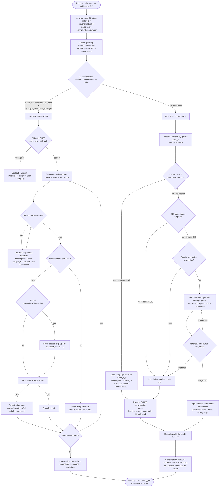

# INBOUND PIPELINE — MASTER PLAN (the complete secure inbound brain)

> **Status:** READ-ONLY architecture + plan. No code, no deploy, no git. This doc is the single
> decision-ready plan the founder + builders follow. It synthesises six grounded research/explore docs:
> `plan-existing-inbound.md`, `plan-lead-history.md`, `plan-campaign-context.md`, `plan-aim-brain.md`,
> `plan-inbound-research.md`, and the SIP recipe `aim-inbound-wiring-plan.md` (+ `inbound-gap-analysis.md`,
> `inbound-stt-fix.md`).
>
> **Box (read-only):** `famit@168.144.153.145` (key `C:\Users\kunal\.ssh\do-blr-test\id_ed25519`).
>
> ## 🟥 THE #1 RULE — NEVER BREAK THE OUTBOUND EARNER
> The live outbound earner — `agent.py` / worker `agent_name="capsy"` / `famit-agent.service` / port 8090 /
> outbound trunks `ST_fmtVmNJmpzKa`+`ST_LH8ighJJtHSi` — **was just restored after an infra mistake.**
> Every inbound capability in this plan is **ADDITIVE + ISOLATED**: separate worker personas, separate
> systemd units/ports, a separate inbound trunk + dispatch rule, and **read-only reuse** of the shared
> campaign/lead/memory stores. **No step touches `agent.py`, the outbound trunks, the outbound dispatch,
> or any shared-infra setting on the outbound media/signaling path.** A **green outbound regression gate
> runs before AND after every single step** (see §3 and §6). If outbound ever regresses → STOP, roll back
> that one step, nothing else.

---

## 1. THE VISION — restated simply (for the founder)

You want your **one inbound phone line** (or a small set of numbers) to be answered by AI with **two
distinct brains**, chosen automatically the moment the phone rings:

**MODE A — CUSTOMER calls in (sales).** Anyone who dials a *customer* number:
- **If we already called them** (they're a lead) → the AI **recognises them by their number**, pulls up
  **what was said last time**, and **continues the conversation**: *"Aapne humse 2BHK ke baare mein baat ki
  thi, aur callback maanga tha…"* — then keeps selling using that campaign's script.
- **If they're brand-new** (saw the number on a banner/brochure) → the AI asks *"Aap kis project ke baare
  mein jaanna chahte hain?"*, figures out **which campaign/property** they mean (or knows it automatically
  if that banner had its own dedicated number), loads that campaign's knowledge, and **runs the sales pitch
  exactly like an outbound call** — and saves them as a new lead so the sale isn't invisible.

**MODE B — the MANAGER (you) calls in (command).** You dial a **private** number:
- The AI **authenticates you** (your caller-ID is only a hint — you must enter a **PIN**).
- Then you **talk to it like a colleague**: *"Run a campaign."* It **asks the missing details** —
  *"New or existing? Which campaign? Hot, warm, or all leads? How many?"* — **reads it back**, you say
  **yes**, and it **executes** (runs/creates a campaign, pulls numbers, etc.). Money/bulk/destructive
  actions demand a **fresh PIN** each time.

**The honest status today:** Mode B's *brain and security* are ~70% built but **no inbound call has ever
completed** — the voice rail dies on a transient network blip (the **P0 silence bug**), there's **no SIP
number wired in**, and the brain **can't yet ask for missing details** (no multi-turn slot-filling).
Mode A is **100% greenfield** — but the entire sales brain it needs **already exists in the outbound earner**
and is **reusable read-only without touching it**.

---

## 2. THE INBOUND CALL FLOW (one diagram, end to end)

**Why this ordering is safe (the load-bearing rule):** the manager branch is selected by **DID OR registry
membership**, but **mode B still demands the PIN** — caller-ID never grants access. A spoofed manager
caller-ID that hits the manager DID gets the **PIN prompt and nothing else**. A customer-line call **never
reaches command execution** regardless of caller-ID. The two trust domains are **structurally separate** and
the router decides **once** at classify time (no in-call escalation from customer → command).

---

## 3. THE SECURITY MODEL

### 3.1 Authentication & the manager (Mode B)
- **Caller-ID is a HINT for routing/context, NEVER a credential.** It is trivially spoofable (entire sites
  place calls with any caller-ID; AI voice-cloning needs ~3 s of audio). Possession of the line is proven by
  a **PIN the manager knows**, demanded **BEFORE any business data or command**.
- **PIN via DTMF (keypad) preferred** over spoken — DTMF digits arrive as signaling events and never transit
  STT or the recording (leak-proof). Spoken-PIN is the fallback **with the recording paused** around capture;
  the value is masked to `****` in transcript + audit + recording.
- **PIN storage** = per-user salted hash today (`firewall.py`, PIN 4827 box-default); target **Argon2id +
  pepper, per-user** (`aim-nlu-policy-security.md §4`). Per-vendor PIN (not the single box PIN) is a Phase-3
  deliverable.
- **Step-up per risky action** — a **fresh, scoped, short-TTL (300 s)** authorization for **every**
  money/bulk/destructive command. One login must **not** silently authorize every later spend.
- **Lockout + dual-key rate-limit** after N wrong PINs (per number **AND** per user, so a spoofed ANI can't
  grind). **Uniform "PIN didn't match"** (anti-enumeration — never reveal user-exists-vs-wrong-PIN).
  **PIN reset only out-of-band** (dashboard/OTP) — never talk your way to a new PIN in-band.
- **Always-block list** (secrets read, compliance-bypass, account-delete) — independent of PIN.

### 3.2 Tenant isolation
- Every inbound call is **attributed to a resolved `tenant_id`** (from the DID, or from
  `_resolve_contact_by_phone`/`_link_inbound`). Reads/writes are **tenant-scoped**; target is PG **FORCE-RLS**
  on the `ai_manager_*` tables (already designed) so there is **no cross-vendor session/transcript bleed** —
  verified with a control-layer-style T-probe set at Phase 3 activation.
- Mode A's campaign/lead lookups are tenant-scoped via the resolver's `tenant_id`; the inbound call is
  metered + wallet-gated against **that** tenant exactly like outbound (it costs STT/LLM/TTS money).

### 3.3 Customer mode cannot reach manager commands
- The router decides **once** by DID + registry. A customer-line call has **no path** to the command
  machine, the catalog, the runner, or PIN/step-up — **structurally**, not by a flag. A manager who lands on
  the wrong (customer) line is simply told to use the manager number; **there is no in-call escalation**.

### 3.4 Audit, recording, disclosure
- **Immutable audit** with the **verified** identity as actor; the **PIN/OTP value is NEVER logged**
  (masked `****` everywhere). Every command persists intent · risk · permission · pin-result · confirm ·
  status · cost · result into `ai_manager_*`.
- **Recording**: target LiveKit **Egress** (room-composite), **paused around PIN spans**, uploaded to DO
  Spaces, URL stored on the session row (today recording is a `_NullRecorder` no-op — a Phase-2 gap).
- **Disclosure/consent**: the inbound agent **identifies as an automated assistant** and honours
  recording-consent (TRAI/DLT posture mirrors outbound's configurable disclosure).
- **STIR/SHAKEN** caller-attestation + callback-to-registered-number are defense-in-depth where available —
  never a replacement for the PIN.

### 3.5 The HARD ISOLATION rule (additive + regression-gated at every step)
- **Inbound = separate workers** (`agent_name="manager"` for Mode B, `agent_name="sales-in"` for Mode A),
  **separate systemd units** (`aim-voice-agent.service` :8091, a new `sales-in` unit), a **separate inbound
  trunk + dispatch rule**, and **read-only reuse** of `agent.py`'s `_load_campaign`/`build_system_prompt`,
  `memory.py`, `caller.norm`, `_resolve_contact_by_phone`/`_link_inbound`, `campaigns/*.json`.
- **No edits** to `agent.py`, the outbound trunks, the outbound dispatch, or shared keys the earner reads.
- **The one shared-infra change** the whole plan needs is enabling **TCP 5060 on the SIP container ADDITIVELY**
  (keep the existing UDP mapping; recreate ONLY the `sip` container — `agent.py` + `famit-agent.service` +
  `livekit-server` + `redis` untouched). This is reversible by restoring one dated `.bak`.
- **REGRESSION GATE (non-negotiable, every step):** assert `famit-agent` `is-active` **and** place one real
  test outbound call (Riya answers) **BEFORE and AFTER** each step. Any regression → STOP + roll back that
  step only.

---

## 4. GAP ANALYSIS (capability → state, with the reuse seam / file:line)

| # | Capability | State | Evidence / what exists vs what's missing |
|---|---|---|---|
| **Inbound routing (SIP)** | DID → room → agent dispatch | ❌ **MISSING** | `lk sip inbound list` + `dispatch list` = **EMPTY**; recipe `aim-inbound-wiring-plan.md` Units 1–6 UN-APPLIED. SIP container is **UDP-only**, Vobiz needs **TCP** → additive TCP-5060 enable required. |
| **A/B router** | classify manager vs customer at S0/S1 | ❌ **MISSING** | No unified entrypoint that branches by DID/registry/ANI. `plan-inbound-research.md §1` specifies it. |
| **Inbound voice rail (works at all)** | greet → hear → respond, never silent | 🟥 **BROKEN (P0)** | `aim-voice-agent.service` LIVE but **0 clean sessions**: Sarvam STT streaming uses `max_retry=0` (`livekit/plugins/sarvam/stt.py:567`); one transient DNS/WS blip kills the job → **silence**. Greet-on-join + apology guard ARE done (`aim_voice_agent.py:481/381`). |
| **Caller-history lookup (Mode A)** | phone → prior summary, continue | 🟡 **PARTIAL (greenfield wire)** | Every piece exists: per-person memory `var/memory/{digits}.json`, `memory.load_memory/build_recap`, caller-ID read at `aim_voice_agent.py:398-413`. **No wire** connects inbound caller-ID → `norm()` → `load_memory` → recap inject. Must key off **SIP caller-ID, not room name**. |
| **Campaign disambiguation (Mode A new caller)** | which property? | 🟡 **PARTIAL** | `list_campaigns` (`caller.py:1188`) is the known-set; `_link_inbound` (`caller.py:1466`) resolves returning-lead campaign. **Missing:** DID→campaign map (`var/inbound_dids.json`), an **active**-campaign flag, and the ask-and-NLU-match flow. |
| **Sales-conversation reuse (Mode A)** | run the pitch like outbound | 🟡 **PARTIAL (brain ready, no worker)** | Brain is 100% portable: `_load_campaign` (`agent.py:142`) + `build_system_prompt` (`prompt.py:254`) + tuned `AgentSession` kwargs. **Missing:** a NEW isolated `sales-in` worker that runs them on inbound. |
| **Conversational command slot-filling (Mode B)** | hold partial command, ask missing | ❌ **MISSING** | `CommandMachine` executes ONE complete utterance; `clarify` is a dead-end ("rephrase") that **discards intent+slots** (`state_machine.py:212`). No `missing_fields`, no `PendingCommand`, no `ToolSpec.required_slots`, no S4.5 ELICIT. |
| **Command safety spine (Mode B)** | PIN, risk, step-up, confirm, audit, multi-command | ✅ **EXISTS (solid)** | `CommandMachine` S0–S9, `firewall.py` PIN+HS256 step-up, `runner.py` re-enforces caps/idempotency/kill-switch, deterministic risk, multi-command loop. `plan-aim-brain.md`. |
| **Recording / logging / session-history** | transcript + recording_url + panel view | 🟡 **PARTIAL** | PG `ai_manager_*` tables exist; voice write-path is best-effort JSONL not PG. **Recording is a `_NullRecorder` no-op** (no Egress, no `recording_url` column, no Spaces creds, no upload). Read API `endpoints.py` **NOT mounted** in caller.py. No panel sessions LIST page. |
| **Multi-vendor numbers** | DID per vendor, per-vendor PIN, isolation | 🟡 **PARTIAL** | Registry `ai_manager/registry.py` + `var/aim_numbers.jsonl` is the per-number identity map (live S1 gate). **Missing:** hardcoded `AIM_AUTHORIZED_CALLER` still layered on top, single box PIN (not per-tenant), no DID→tenant dispatch, JSONL→PG+RLS consolidation. |

---

## 5. THINGS THE FOUNDER FORGOT (deep-reasoning — required for a complete pipeline)

Each is recorded so the build doesn't drop it; most are small + additive.

1. **Per-campaign customer DID provisioning.** The clean zero-ask flow needs a DID per campaign (banner
   prints its own number) **plus** a separate **private** manager DID. Procuring/mapping DIDs (Vobiz) is a
   founder/carrier step, not code. Without it, every new caller needs the "which property?" turn.
2. **Brand-new caller = create the lead.** A banner caller who isn't a lead yet has **no CRM row**. Mode A
   must **create the lead** (name asked in-call + caller-ID) attached to the resolved campaign — else the
   sale is invisible to the panel.
3. **PIN-fail handling.** Define explicitly: N attempts → **lockout** + uniform "didn't match" + audit +
   graceful hang-up; reset **out-of-band only**. Never reveal whether the number is registered.
4. **Voicemail / human handoff / callback.** When the AI can't answer, the caller insists on a human, or
   it's after-hours: **warm-transfer (caller-ID preserved)** or a **logged callback task** — never a dead drop.
5. **Business-hours / DND / compliance window.** Answering an inbound call is consent-by-action, but any
   **scheduled callback created in-call** must respect the DND/compliance window; don't keep an opted-out
   (STOP) lead engaged past their request.
6. **Number-to-campaign mapping for banners.** `var/inbound_dids.json` (or PG `inbound_dids`):
   `{did, tenant_id, campaign_id, agent_name, lang, label}` — the zero-ask router.
7. **Barge-in / interruption + latency.** Inherit the outbound tuned `AgentSession` kwargs
   (preemptive_generation, endpointing, semantic turn-detect, ElevenLabs flash) so inbound matches the
   ~1.1 s/turn moat; verify after wiring (don't re-derive).
8. **Language detection / code-mix.** Reuse Sarvam `saarika:v2.5 language="unknown"` (Hinglish) verbatim —
   already in the inbound worker.
9. **Repeat-caller dedupe + normalization.** The same person appears as `06375548830` / `+91…` / `91…`.
   ALWAYS pass the raw caller-ID through `caller.norm()` first; fall back across `_match_forms()` digit-reps
   so memory/lead/call all reconcile to one identity (naive `load_memory(raw_cli)` MISSES).
10. **Inbound room-name convention.** Pin inbound rooms to `famit-{caller_digits}-{uuid6}` (or pass phone in
    metadata) so `memory.parse_phone` + `_link_inbound` resolve the returning lead — **without this the
    "continue the conversation" promise silently fails.**
11. **Inbound concurrency / barge-storm + cost gate.** Many simultaneous inbound calls hit one worker;
    confirm the inbound worker's job concurrency is independent of the outbound earner (separate unit/port —
    already designed) and wallet-gate + meter each inbound call against the resolved tenant.
12. **Abuse / rate-limit + spam callers.** Rate-limit repeated abusive/robocaller numbers; suppression list
    applies to inbound too.
13. **Graceful errors, NEVER silence.** Any exception still speaks "Sorry, I had a glitch, please try again"
    before hangup. This is the P0 never-silent guard — the single most important UX rule.
14. **Recording + transcript persistence for inbound** (both modes) visible in the panel — Mode A into
    contact-360/call history, Mode B into `ai_manager_sessions`.
15. **Mode-switch boundary.** Document that a customer can **never** reach command execution and a manager on
    the wrong line is redirected — keep the trust domains hard-separated (already in the router design).
16. **Outbound regression-gate automated.** A scripted pre/post check (`famit-agent` active + a real test
    call) gating every inbound change — non-negotiable given the recent incident.

---

## 6. PHASED, SAFE BUILD PLAN (small · verifiable · reversible · outbound untouched)

**Universal gate on EVERY phase below (do FIRST and LAST):**
`G` = `systemctl is-active famit-agent` == active **AND** one real test outbound call → Riya answers.
Backup-first (dated `.bak`), restart ONLY the inbound unit(s), **NO git**, **NO `agent.py`/outbound-trunk/
outbound-dispatch edit**. Any regression → STOP + roll back that step only.

```mermaid
flowchart LR
    P0[P0 - Voice works at all<br/>STT resilience + never-silent] --> P1[P1 - SIP wiring<br/>TCP trunk + dispatch + DID]
    P1 --> P2[P2 - Mode B slot-filling<br/>conversational command]
    P2 --> P3[P3 - Mode A returning caller<br/>history + continue]
    P3 --> P4[P4 - Mode A new caller<br/>campaign disambiguation]
    P4 --> P5[P5 - Logging + recording<br/>PG + Egress + panel]
    P5 --> P6[P6 - Multi-vendor<br/>registry + per-vendor PIN + RLS]
    P6 --> P7[P7 - Polish<br/>handoff + compliance + latency]
```

### PHASE 0 — Inbound VOICE WORKS AT ALL (lowest-risk, highest-value first) 🟥
*Nothing below matters until a call is answered and heard. Touches `aim_voice_agent.py` ONLY.*
- **Do:** wrap Sarvam STT in `livekit.agents.stt.FallbackAdapter([sarvam, sarvam_backup_key])` **+** pass
  `conn_options=APIConnectOptions(timeout=15, max_retry=2, retry_interval=0.5)` (fixes the `max_retry=0` at
  `livekit/plugins/sarvam/stt.py:567`); add a session-level STT-error handler that recreates the stream +
  rotates `_next_sarvam_key()`; pin `api.sarvam.ai` in `/etc/hosts`; confirm greet-on-join + the
  always-apology guard fire even on failure.
- **Accept:** a LiveKit-only (no PSTN) smoke session: greet heard → say a phrase → STT transcribes →
  reply heard; force a transient STT blip → call survives (reconnects), **never silence**.
- **Gate:** `G` before + after. Rollback = restore `aim_voice_agent.py.bak`, restart `aim-voice-agent` only.

### PHASE 1 — SIP WIRING (a real phone call reaches the worker)
*Apply `aim-inbound-wiring-plan.md` Units 1–6. The ONE additive shared-infra change (TCP-5060) lives here.*
- **Do:** (U1) add `"5060:5060/tcp"` to the SIP container `ports:` **keeping** the UDP line, recreate ONLY
  `sip`; (U2) allow TCP 5060 from the **10 Vobiz IPs** in UFW + DOCKER-USER; (U3) `lk sip inbound create`
  the **manager DID** trunk with the 10 `allowed_addresses`; (U4) `lk sip dispatch create` DID→room→
  `agent_name="manager"`; (U5) confirm the `manager` worker registered; (U6) seed the founder as an
  authorized user + enrol PIN (DTMF verify_mode).
- **Accept:** founder calls the manager DID from his phone → INVITE hits the box (from a Vobiz IP) → room
  created → `manager` joins → greeting heard → PIN demanded → wrong PIN refuses+locks, correct PIN proceeds.
- **Gate:** `G` before + after; `lk sip outbound list` shows **both** outbound trunks **unchanged**; rollback
  = teardown in reverse (delete dispatch → delete inbound trunk → stop manager unit → remove TCP fw rules →
  restore `docker-compose.yml.bak`, `docker compose up -d sip`). **Outbound never referenced any inbound object.**

### PHASE 2 — MODE B conversational command (slot-filling)
*Additive to `intent/driver.py` + `state_machine.py` + `ToolSpec`. No outbound touch.*
- **Do:** emit `missing_fields[]` from NLU; add declarative `ToolSpec.required_slots` (e.g.
  `campaign.run → [campaign_ref, lead_segment, count]`) + slot→question + slot→validator maps; carry a
  `PendingCommand` across the loop; add **state S4.5 ELICIT** between CAPTURE and PERMISSION that asks the
  next missing slot, merges the answer, bounded by `MAX_CLARIFY≈3`; make `resolve_campaign`
  ambiguous/not_found an ELICIT question (not a block). Downstream S5→S8 spine unchanged.
- **Accept:** "Run a campaign" → AI asks new-or-existing? which campaign? hot/warm/all? how many? → reads
  back → PIN → executes a real (test/dry) `/run`. Low-confidence routes to ELICIT, not "rephrase".
- **Gate:** `G` before + after. Offline `CommandMachine` test passes; live call executes one safe command.

### PHASE 3 — MODE A returning caller (history + continue)
*New isolated `sales-in` worker; read-only reuse of memory/campaign/resolver. No outbound touch.*
- **Do:** new worker `agent_name="sales-in"` (own unit/port) copying the outbound `AgentSession` kwargs; on
  join: `key = caller.norm(sip.phoneNumber)` → `_resolve_contact_by_phone(key)` → if `campaign_id` found,
  `_load_campaign` + `build_system_prompt` + inject `"=== PICHHLI BAAT ===" + build_recap(load_memory(key))`
  (fall back across `_match_forms` digit-reps); pin inbound room to `famit-{caller_digits}-{uuid6}`; on
  hangup **merge prior history + this call's turns** and `save_memory` + write the call record + transcript.
- **Accept:** a number with existing `var/memory/{digits}.json` calls in → AI greets with the prior context
  and continues the right campaign's pitch → on hangup the memory file grew (thread didn't truncate) and a
  new call record + transcript appear.
- **Gate:** `G` before + after. Verify memory/leads/calls files of the **outbound** path are unchanged in
  shape (read-only reuse only).

### PHASE 4 — MODE A new caller (campaign disambiguation + lead creation)
- **Do:** add `var/inbound_dids.json` (DID→`{tenant_id, campaign_id}`); add an **active**-campaign flag (or
  derive from recent `/run`); disambiguation flow: DID→campaign (zero-ask) → else single active campaign →
  else ask ONE open question + NLU-match against active campaigns (`matched/ambiguous/not_found`); on miss,
  **capture name + interest as a fresh lead** attached to the tenant; never the wrong script, never dead-air.
- **Accept:** a brand-new number on a campaign-specific DID → loads that campaign with no question; on a
  shared DID → asks once, matches, sells; an unmatched caller → captured as a new lead + callback promised.
- **Gate:** `G` before + after.

### PHASE 5 — LOGGING + RECORDING + PANEL HISTORY (the audit/replay product)
- **Do:** mount the `ai_manager` router in caller.py (tenant-from-token; service-token POST); switch the
  voice write-path from JSONL → PG `ai_manager_*`; add a `recording_url` column; start LiveKit **Egress**
  on join (PAUSED around PIN spans) → upload to **DO Spaces** → store URL; build the panel **sessions LIST**
  page feeding the existing `[id]` detail + wire the recording player. (Needs Spaces creds — currently absent.)
- **Accept:** a completed call shows up in the panel list → detail page shows transcript + each command
  (intent·risk·permission·pin·status·cost·result) + a playable recording; **grep the session+audit for the
  raw PIN → 0 hits.**
- **Gate:** `G` before + after; deploy via FORTRESS (backup first; coordinate with any concurrent panel wave;
  do NOT clobber `app/creative`).

### PHASE 6 — MULTI-VENDOR (DID per vendor · per-vendor PIN · isolation)
- **Do:** replace hardcoded `AIM_AUTHORIZED_CALLER` with `registry.lookup(caller_id)` as the real gate
  (tenant+role+grants from the row); per-vendor PIN (per-tenant firewall PINs); per-DID→tenant dispatch;
  consolidate registry/persistence onto **PG + FORCE-RLS**.
- **Accept:** two vendors on two DIDs each reach their own isolated session; a control-layer-style T-probe
  set shows **no cross-vendor session/transcript bleed**; each vendor's PIN works only for their tenant.
- **Gate:** `G` before + after.

### PHASE 7 — POLISH
- Human handoff / warm-transfer + logged callback; business-hours/DND/consent/DLT; abuse rate-limit;
  shared slot-fill helper for Mode A structured sub-tasks (book site-visit → {date,time,property};
  callback → {when}); verify inbound latency inherits the ~1.1 s/turn moat; barge-in tuning.
- **Gate:** `G` before + after.

---

## 7. THE FIRST SAFE STEP (start here)
**Phase 0 — STT resilience + never-silent guard in `aim_voice_agent.py` only.** It is the lowest-risk,
highest-value piece: it touches **only** the inbound file, requires **no SIP/DID/founder dependency**, is
verifiable on a LiveKit-only smoke session, is fully reversible (restore `aim_voice_agent.py.bak`, restart
`aim-voice-agent` only), and **unblocks everything else** — until a call is answered and heard, nothing else
matters. Run the outbound regression gate `G` before and after.

---

## 8. EVIDENCE INDEX (file:line, live box — all read-only)
- **Outbound brain (reuse read-only):** `agent.py:142` `_load_campaign`; `prompt.py:254` `build_system_prompt`;
  `agent.py:346-395` metadata→prompt→recap; `agent.py:597-651` tuned `AgentSession` kwargs.
- **Memory:** `memory.py:34` `parse_phone`, `:53` `load_memory`, `:67` `build_recap`, `:96` `save_memory`;
  store `var/memory/{digits}.json`.
- **Resolvers / stores:** `caller.py:649` `norm`; `:1188` `list_campaigns`; `:1465` `_resolve_contact_by_phone`;
  `:1466` `_link_inbound`; `:2042-2069` room/dispatch/record_call; campaigns `var/campaigns/{id}.json`;
  calls `var/calls.json`; leads `var/leads.json`; transcripts `var/transcripts/{room}.json`.
- **Inbound worker / brain:** `aim_voice_agent.py:398-413` caller-ID off `sip.phoneNumber`; `:481` greet;
  `:381` apology guard; `:124-133` hardcoded allowlist; `:644` `_build_stt` (single provider — P0).
  `ai_manager/state_machine.py` S0–S9 (`:201` loop, `:212` clarify dead-end); `intent/driver.py`;
  `delegate.py:67`; `workforce/runner.py`; `workforce/tools/catalog.py` (`ToolSpec`, no `required_slots`);
  `firewall.py` PIN+step-up; `ai_manager/registry.py` + `var/aim_numbers.jsonl`; `ai_manager/store.py` +
  PG `ai_manager_*`; `recorder.py` (`_NullRecorder`); `ai_manager/endpoints.py` (NOT mounted).
- **STT root cause:** `livekit/plugins/sarvam/stt.py:567-571` `max_retry=0`; `:1122` `_run_connection`.
- **SIP wiring:** `aim-inbound-wiring-plan.md` Units 1–6; manager DID `+918071583488`; carrier Trunk ID
  `317a5dce-9237-4ff9-8de9-54b85c2dfe2d`; outbound trunks `ST_fmtVmNJmpzKa`+`ST_LH8ighJJtHSi` (frozen);
  10 Vobiz signaling IPs (AWS ap-south-1).
- **Companion docs:** `plan-existing-inbound.md`, `plan-lead-history.md`, `plan-campaign-context.md`,
  `plan-aim-brain.md`, `plan-inbound-research.md`, `inbound-gap-analysis.md`, `inbound-stt-fix.md`,
  `aim-voice-telephony.md`, `aim-nlu-policy-security.md`.
