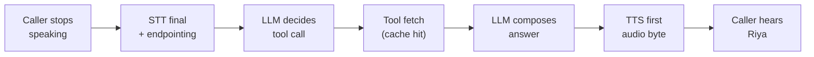
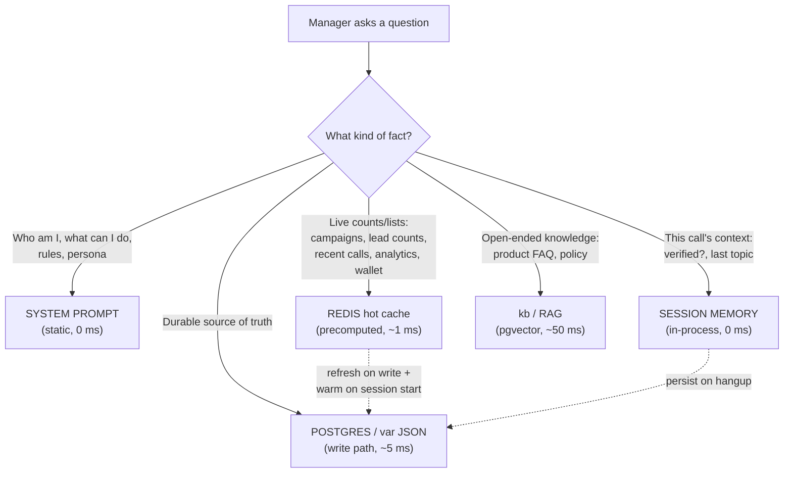

# LATENCY ARCHITECTURE — AI Manager Inbound Voice ("Riya")

**Status:** Diagnosis + research + design. READ-ONLY investigation (no box mutation, no deploy).
**Date:** 2026-06-12
**Box (read-only):** `famit@168.144.153.145` — `/opt/famit-agent/`
**Live agent:** `aim_voice_agent.py` (systemd `aim-voice-agent`, LiveKit `agent_name="manager"`, HTTP :8091)
**Bridge:** `ai_manager/voice_tools.py` → httpx loopback → `caller.py:8209` (X-Auth) → `var/*.json`
**Stack:** Sarvam STT (`saarika:v2.5`), Groq LLM (`llama-4-scout-17b`), ElevenLabs flash TTS, LiveKit turn-detection.

> **IMPORTANT — build order.** Wave #5 (customer mode) is editing this SAME file (`aim_voice_agent.py`)
> right now. **Nothing in this doc is built until wave #5 lands.** Every fix below is additive, isolated
> to the inbound `manager` worker, and gated on a no-regression check against the outbound earner
> (`agent.py`/`caller.py` are never touched).

---

## 1. The measured root cause of the 3–5 minute stall

The founder's symptom — ask "how many hot leads / how many campaigns", Riya goes **silent for 3–5
minutes**, he repeats it, eventually she answers, and once said *"I have to call the check-leads tool"* —
is **not** a data-retrieval problem. The data is tiny and the backend is instant.

### What is actually slow (proven on the live box)

The backend reads are **4–6 milliseconds**, not minutes:

| Route (loopback, admin) | Measured time |
|---|---|
| `GET /leads` | 0.0045 s |
| `GET /campaigns` | 0.0059 s |
| `GET /stats` | 0.0059 s |

Data volume is trivial: `leads.json` = 1.7 KB (6 leads), 11 campaign files (148 KB total), `calls.json`
= 73 KB. There is **no slow disk read, no slow DB, no slow HTTP** in the data path.

### The real cause: a tool-call **schema-rejection retry storm** (the smoking gun)

The live agent log shows the failure, repeated **76 times** in the last 2000 log lines
(48× `check_leads`, 28× `run_campaign`):

```
openai.APIError: tool call validation failed: parameters for tool check_leads
                 did not match schema: errors: [missing properties: 'campaign']
...wrapped as...
livekit.agents._exceptions.APIConnectionError: Connection error.   (retryable=True)
"failed to generate LLM completion: Connection error., retrying in 2.0s"   attempt 2, attempt 3...
```

**The mechanism, step by step:**

1. Manager asks *"how many hot leads?"*. The LLM (Groq `llama-4-scout`) decides to call `check_leads`.
2. `check_leads`'s only argument, `campaign`, is **optional in Python** (`campaign: str = ""`) — but
   LiveKit builds the JSON tool-schema from the signature and Groq's **strict tool validator marks it
   required**. The model, correctly understanding it's optional, emits the call **without** `campaign`.
3. Groq rejects the streamed tool call: *"missing properties: 'campaign'"* → an `openai.APIError`.
4. LiveKit catches this **mid-stream** and re-raises it as a **retryable** `APIConnectionError` (it
   cannot tell a transport error from a validation error inside the SSE stream).
5. LiveKit **retries the whole LLM turn** (2 s, 2 s, …), the model emits the **same** invalid call, it
   is rejected again, the attempts exhaust → marked unrecoverable → the turn yields **no speech**.
6. The user hears silence, repeats themselves, which queues another turn → the storm compounds into
   **minutes**. During the stall the ElevenLabs TTS websocket also times out and drops (`1006`),
   adding reconnect delay. This is exactly why Riya occasionally narrates *"I have to call the
   check-leads tool"* (the model's pre-amble text) and then goes dark.

> **The single biggest win:** make the LLM's tool call **always schema-valid**. Two equivalent fixes,
> both in the inbound worker only: **(a)** make every tool argument *truly required with no default*
> (so the model always sends it) **OR (b)** disable Groq strict-schema tool validation
> (`groq.LLM(..., tool_choice/strict=False)` / send tools without `strict: true`). **Fix (a) is the
> safest and most portable** — see P0 below. Eliminating this one loop removes the 3–5 minute stall
> outright. Everything else in this document is the difference between "answers in ~3 s" and
> "answers in <1.5 s, like a human."

---

## 2. Target latency budget (per stage, per conversational turn)

A production voice turn for a *retrieval* question ("how many hot leads") should feel like talking to a
person: **first audio back in under ~1.5 s**, with a verbal filler if a fetch is slow.



| Stage | Budget (target) | Today | Notes |
|---|---|---|---|
| Endpointing (silence → STT final) | 250–450 ms | ~250 ms (VAD) / 1.8 s (semantic) | Fine on VAD; semantic adds wait |
| STT final transcript | < 300 ms | ~ok | Sarvam saarika v2.5 |
| LLM → tool-call decision | 300–600 ms | **∞ (retry storm)** | **THE bug.** Must be one clean call |
| Tool fetch (cached) | **< 20 ms** | 4–6 ms backend, but +TCP setup | In-process cache → ~0 ms |
| LLM → final spoken answer | 400–700 ms | ok once tool returns | Cap tokens (already 140) |
| TTS first audio byte | 150–300 ms | ok (flash) | Keep WS warm |
| **Total perceived (cache hit)** | **≈ 1.2–1.8 s** | **180,000–300,000 ms** | The storm is the entire gap |

**Rule:** if any single fetch can exceed ~700 ms, the agent must speak a **filler** ("One sec, let me
pull that up…") *before* awaiting it, so the caller never hears dead air. With the cache (P1) almost no
fetch exceeds 20 ms, but the filler is a cheap safety net for the rare cold path.

---

## 3. WHAT-GOES-WHERE map (for THIS system)

The core design principle: **the LLM should almost never need a tool round-trip for a simple question.**
Put facts where they can be answered at the speed of the layer that holds them.



### Layer-by-layer placement

| Layer | What lives here (THIS system) | Latency | How it stays fresh |
|---|---|---|---|
| **System prompt (static)** | Persona ("You are Riya…"), the rules (no-hallucination, PIN gate, read-back-before-dial), the tool catalogue, language/Hinglish style. **Plus a small "account snapshot" block** injected at session start: campaign count + names, total/hot/warm/cold lead counts, wallet balance. | 0 ms | Rendered once per call from the warm cache (see Redis). Covers ~80% of "how many X" with **zero tool calls**. |
| **Redis (hot cache)** | Precomputed, spoken-ready answers + raw rollups, per tenant: `aim:{tenant}:campaigns` (count+names+status), `aim:{tenant}:leadcounts` (total/hot/warm/cold), `aim:{tenant}:recent_calls`, `aim:{tenant}:analytics`, `aim:{tenant}:wallet`. Values are the **exact spoken summary strings** the tools already return. TTL 60–300 s. | ~1 ms | (a) **Warm-on-session-start** — entrypoint fills all keys for this tenant in one batch before the greeting. (b) **Refresh-on-write** — `caller.py` write paths (lead add, campaign create, call complete, wallet topup) invalidate/recompute the relevant key. (c) TTL backstop. |
| **Postgres / `var/*.json` (durable)** | Source of truth: leads, campaigns, calls, stats, wallet, audit. Already fast (4–6 ms). The cache is *derived* from here; this is the fallback if a cache key is cold. | ~5 ms | Written by the panel + the dialer; the cache reads from it. |
| **Per-session memory (in-process)** | This call's volatile state: `is_manager`, `verified`, resolved tenant, last campaign discussed, slot-fill progress for `run_campaign`. Already in the Agent object. | 0 ms | Lives in the worker process for the call; **persisted to `var/memory/<digits>.json` on hangup** (already wired for customers). |
| **kb / RAG (semantic)** | Open-ended knowledge that isn't a count: product/property details, pricing FAQs, objection handling, policy. Corpus is **currently empty** (`kb/core.py` pgvector+FTS, 0 rows). | ~50 ms | Populate offline from campaign fields + a curated FAQ. Budget: only call kb when the question is *not* answerable from prompt/cache (LLM decides). Cap retrieved chunks to ~3 and ~600 tokens. |

**The big idea:** today **every** "how many X" forces a tool round-trip (and hits the broken schema
loop). After P1+P2, the **counts/lists for the current tenant are already in the system prompt** (warmed
from Redis at call start), so the model answers most status questions **with no tool call at all** —
sub-second and storm-proof. Tools become the fallback for *specific* / *fresh* / *action* requests.

---

## 4. The concrete fixes (what to actually change)

All changes are in the **inbound manager worker** (`aim_voice_agent.py` + `voice_tools.py`) and an
**additive cache helper**; the outbound earner and `caller.py` reads are untouched (the only `caller.py`
change is optional, additive cache-invalidation hooks on write paths — P3).

1. **Kill the schema-rejection loop (THE fix).**
   - Make every `@function_tool` argument **required with no Python default** (`campaign: str`,
     `count: str`, `confirmed: str`, `segment: str`). The model already passes them in the happy path;
     forcing them means the emitted JSON always satisfies Groq's strict validator. Keep the forgiving
     coercion that already exists (empty string / "all" / "0" handled inside the tool body).
   - **Belt-and-suspenders:** also construct the LLM with strict tool-validation **off** if the plugin
     exposes it (so a future tool with an optional arg can't reanimate the storm).
   - **Cap the blast radius:** if a tool call *does* fail validation, it must **degrade to a spoken
     fallback in ≤1 retry**, never an unbounded `APIConnectionError` retry loop. (LiveKit's
     `max_tool_steps` / catching the error and speaking "let me check that another way".)

2. **Warm a per-tenant cache at call start, and inject a snapshot into the prompt.**
   - In `_entrypoint_impl`, after identity resolve and **before** the greeting, batch-fetch
     campaigns + lead counts + wallet (one pass) and (a) store them in Redis with TTL, (b) render a
     compact "ACCOUNT SNAPSHOT" block into the manager system prompt. Now "how many campaigns / leads"
     is answered from the prompt — **no tool, no network, sub-second.**

3. **Replace per-call HTTP clients with cached/in-process fast reads.**
   - `voice_tools.py` opens a **new `httpx.Client()` per call** (fresh TCP, no keep-alive) and
     `resolve_campaign` issues an **extra** `list_campaigns()` GET. Fixes: (a) a module-level pooled
     `httpx.Client` (keep-alive) reused across tools; (b) read counts/lists from the **warm Redis cache**
     first, fall back to HTTP only on miss; (c) memoize `list_campaigns()` for the call so resolution
     doesn't re-fetch. This shaves the TCP-setup tax and removes redundant GETs.

4. **Add "one moment" filler speech around any await that can exceed ~700 ms.**
   - Before any genuinely slow path (cold cache, `run_campaign` audience resolve, kb lookup), the agent
     speaks a short filler ("One sec, let me pull that up") *then* awaits. With the cache this almost
     never triggers, but it guarantees the caller never hears silence on the rare slow turn. LiveKit
     supports a pre-tool "thinking" utterance / `say()` before the `await`.

5. **Streamline endpointing / turn-detection.**
   - Keep VAD turn-detection (`MAX_EP_DELAY=0.45`) as the default; **semantic** mode sets
     `MAX_EP_DELAY=1.8 s`, which adds up to ~1.4 s of extra wait before the LLM even starts. For a
     command/manager flow, VAD is snappier. If semantic is wanted for naturalness, lower its max-EP to
     ~0.8–1.0 s. (Already `preemptive_generation=True`, good.)

6. **Populate the kb corpus + budget RAG.**
   - Seed `kb` from campaign fields + a curated property/product FAQ so open-ended questions have a fast
     semantic source. Gate it: the LLM only calls kb when prompt + cache can't answer; cap to ~3 chunks.

---

## 5. Prioritized build plan (P0 first; each additive + regression-gated)

> Every step ships behind the inbound `manager` worker only, is reverted by a one-line env/flag, and is
> validated by: **(i)** a real test call ("how many hot leads", "how many campaigns", "run X hot 5") that
> must answer in **< 2 s with no schema error in the log**, and **(ii)** an outbound-earner smoke call
> proving `agent.py` is byte-for-byte unaffected. **Built only AFTER wave #5 lands** (same file).

| P | Step | Why / win | Effort | Gate |
|---|---|---|---|---|
| **P0** | **Eliminate the tool-call schema storm** — make all `@function_tool` args required-no-default (`check_leads`, `run_campaign`, `recent_calls`, `campaign_*`); add LLM strict=off belt; cap tool-error to ≤1 retry → spoken fallback. | **Removes the 3–5 min stall entirely.** The single biggest win. | S | 0 `did not match schema` in log over 5 test asks; answer < 3 s. |
| **P1** | **Warm-on-call-start cache + ACCOUNT SNAPSHOT in system prompt** — batch-fetch campaigns/leadcounts/wallet before greeting; inject compact snapshot block. | Most "how many X" answered **with no tool call** → sub-second, storm-proof even if P0 regressed. | M | "how many campaigns/leads" answered in < 1.5 s with **zero** tool calls in log. |
| **P2** | **Redis hot-cache + pooled client in `voice_tools.py`** — module-level keep-alive `httpx.Client`; read counts/lists from Redis (`aim:{tenant}:*`, TTL 60–300 s) with HTTP fallback; memoize `list_campaigns` per call; warm keys in P1's batch. | Cuts per-tool TCP-setup tax + redundant GETs; tool fallbacks now ~1 ms. | M | Tool round-trip < 50 ms warm; no extra `list_campaigns` GET in `resolve_campaign`. |
| **P3** | **Refresh-on-write hooks (additive, in `caller.py`)** — on lead add / campaign create / call complete / wallet topup, recompute the matching `aim:{tenant}:*` key. | Keeps the cache correct without waiting for TTL; the snapshot is always live. | M | After a panel write, the next voice ask reflects it within one turn; earner reads unaffected. |
| **P4** | **Filler-speech + endpointing trim** — pre-await "one sec" on slow paths; VAD default / lower semantic max-EP to ~0.9 s. | Removes residual dead-air on cold/slow turns; trims ~0.5–1.4 s of turn latency. | S | No silence > 1.5 s on any turn; perceived turn < 1.8 s. |
| **P5** | **Populate kb corpus + budget RAG** — seed from campaign fields + curated FAQ; gate kb to non-count questions; cap 3 chunks / 600 tokens. | Open-ended questions get a fast, grounded answer instead of a hallucination or a stall. | M | FAQ question answered from kb in < 1.5 s; no kb call on pure count questions. |

**Net effect:** P0 alone makes Riya usable (no more multi-minute silence). P1+P2 make her **fast**
(sub-1.5 s on status questions, mostly with no network at all). P3–P5 make her **fresh, smooth, and
knowledgeable**. All additive, all reversible, all isolated from the live outbound earner.

---

## 6. Appendix — evidence (live box, read-only)

- **Schema storm:** `journalctl -u aim-voice-agent` → 76× `tool call validation failed … missing
  properties: 'campaign'` (48 `check_leads`, 28 `run_campaign`), each followed by
  `APIConnectionError … retrying in 2.0s` and `recoverable=False`. ElevenLabs WS `1006` drop during stall.
- **Backend is fast:** `curl -w time_total` on loopback `/leads`,`/campaigns`,`/stats` = 0.0045–0.0059 s.
- **Data is tiny:** `var/leads.json` 1.7 KB (6 leads), 11 campaign files (148 KB), `var/calls.json` 73 KB.
- **Cache not used for data:** app Redis `:6380` holds only `rl:ip:*` rate-limit keys (dbsize 1).
- **kb empty:** `kb/core.py` present (pgvector+FTS) but corpus 0 rows; no `%kb%/%embed%` PG tables.
- **Per-call HTTP cost:** `voice_tools.py` `_client()` builds a fresh `httpx.Client()` every tool call
  (no pooling); `resolve_campaign()` triggers an extra `list_campaigns()` GET.
- **Endpointing:** `MIN_EP_DELAY=0.25`, `MAX_EP_DELAY=0.45` (VAD) / `1.8` (semantic),
  `preemptive_generation=True`, `GROQ_MAX_TOKENS=140`.
