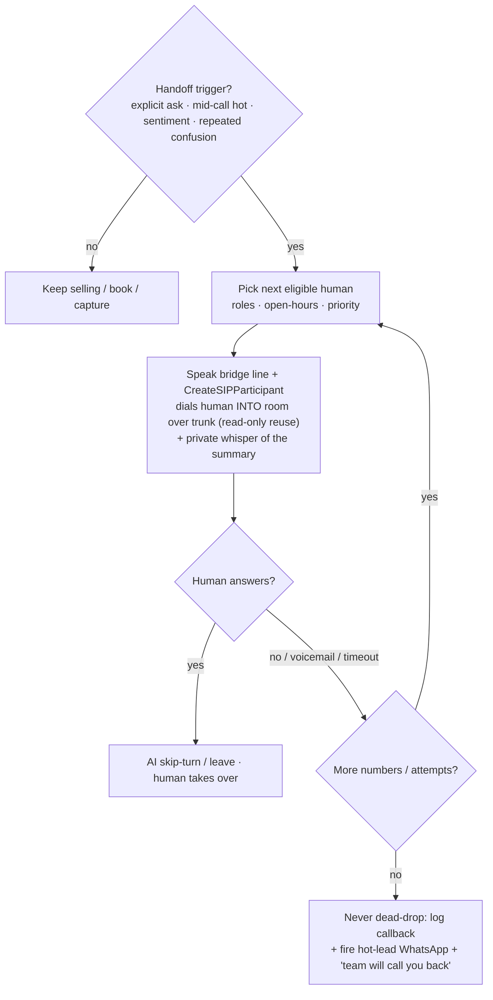
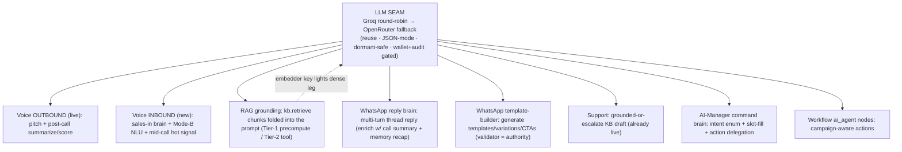
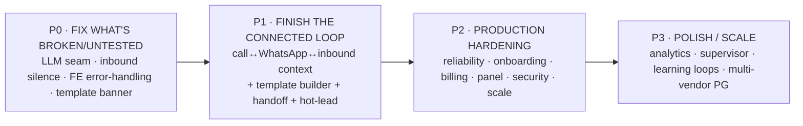

# PRODUCTION ROADMAP — the complete connected lifecycle to PRODUCTION-GRADE + SELLABLE

> **Status:** READ-ONLY synthesis. No box changes, no deploy, no git. This is the **single decision-ready
> document** the founder + builders follow to take the **one connected pipeline** —
> *outbound AI call → per-person memory → WhatsApp follow-up (template, then LLM conversation) →
> inbound AI call with full history → warm human handoff + hot-lead WhatsApp to the team* —
> from "works in a demo / front-end illusion" to **production-grade and sellable.**
>
> **Date:** 2026-06-12. It folds the four live audits + the existing master plans into one roadmap:
> `INBOUND-PIPELINE-MASTER-PLAN-V2.md` (the inbound brain + handoff + hot-lead + RAG + modular spine),
> `inbound-gap-analysis.md` (the P0 silence root-cause), `audit-wa-template-builder.md` (the live
> 2026-06-12 Meta-template probe), `wa-llm-conversation.md` (the WhatsApp reply brain), `plan-handoff-hotlead.md`
> (warm transfer + hot-lead WA), `plan-feature-inventory.md` (every capability + state), `WHATSAPP_GOLIVE.md`
> (proven Meta/Spaces creds), and `GO_LIVE_READINESS.md` (panel dormant-safe matrix).
>
> **Box (read-only):** `famit@168.144.153.145` (key `C:\Users\kunal\.ssh\do-blr-test\id_ed25519`).
> Voice venv `/opt/capsy-agent/.venv` (livekit-api 1.1.0, livekit-agents 1.5.17); API venv `/opt/famit-agent/.venv`.
> Panel `C:\Users\kunal\Desktop\caps\famit-panel`. Creds present locally in `caps\.env.local`.
>
> ## 🟥 THE #1 RULE — NEVER BREAK THE OUTBOUND EARNER (absolute, on every item below)
> The live outbound earner — `agent.py` / worker `agent_name="capsy"` / `famit-agent.service` / port 8090 /
> outbound trunks `ST_fmtVmNJmpzKa`+`ST_LH8ighJJtHSi` — **was just restored after an infra mistake.** Every
> item in this roadmap is **ADDITIVE + ISOLATED**: separate workers, separate units/ports, read-only reuse of
> shared stores. **No item edits `agent.py`, the outbound trunks, the outbound dispatch, `build_system_prompt`,
> or any shared setting on the outbound media/signaling path.** The **green outbound regression gate `G`**
> (`famit-agent` `is-active` **AND** one real test outbound call → Riya answers) runs **before AND after every
> single item**. Any regression → STOP, roll back that one item (restore the dated `.bak`, restart only the new
> unit), nothing else.

---

## 1. STATE OF THE SYSTEM (one paragraph — what is truly LIVE vs the front-end illusion)

**What is genuinely live and earning today:** the **outbound AI voice caller** (Riya — warm, human, ~1.1 s/turn,
Hindi/English/Hinglish, langdetect, barge-in) places real campaign calls, scores each call post-hangup
(`interest 0-100`, `hot = score≥70`), writes leads/calls/memory, and **bills real metered vendor usage**
(ElevenLabs/Groq/Sarvam + Vobiz CDR). **WhatsApp is now LIVE end-to-end** (real Meta send proven, webhook
verified, DO Spaces storage proven — `WHATSAPP_GOLIVE.md`), and a working **multi-turn WhatsApp reply brain**
already exists (inbound webhook → per-phone thread → Groq reply). The **panel** builds green (33 routes) and
**every module page is dormant-safe** — but that is exactly where the **illusion** lives: the core pages
(Dashboard / Leads / Calls / Campaigns / Billing / Run) are backed by the real earner, whereas the **9 module
pages** (ai-manager, workflows, forms, funnels, booking, payments, ads, support, whatsapp-builder) render
**premium "coming soon" states over backends that are flag-OFF, not-yet-mounted, or founder-cred-blocked** — they
look finished but do nothing yet. The **inbound AI line is built but silent** (a transient STT WS/DNS blip at
session-start kills the job with no retry/fallback — the #1 P0), and the three flagship connectors —
**warm human transfer, hot-lead-to-team WhatsApp, and RAG-into-the-voice-prompt** — are **designed and have all
their primitives present on the box, but are un-wired**. **The honest headline: ~70% of a world-class connected
system already exists as flag-gated, import-safe, tenant-scoped modules; most remaining work is WIRING the
inbound voice path + the connectors to engines that already exist — additive, low-risk, never touching the
earner — plus a handful of founder cred/Meta steps.**

---

## 2. STATE MATRIX (every capability across the connected lifecycle + the panel)

Legend — **State:** BUILT (live/working) · PARTIAL (built but dormant/un-wired/outbound-only) · NOT-BUILT ·
NOT-TESTED · DORMANT (code present, off until creds/flag). **Blocker type:** `code` (we build/wire) ·
`config` (env/flag/populate, no code) · `founder-cred` (3rd-party account/key) · `Meta` (Meta template/approval).

### A. Outbound call → memory (the live earner)
| Capability | State | Blocker | Evidence / note |
|---|---|---|---|
| Outbound AI voice call (warm, low-latency, multi-lang) | **BUILT** | — | `agent.py` / `famit-agent` / :8090 — the earner. FROZEN. |
| Post-call summarize + interest 0-100 + hot flag | **BUILT** | — | `agent.py:155 _summarize_transcript`; `caller.py:1297 hot=score≥70`. |
| Per-person memory save/recap | **BUILT** | — | `memory.py load/build_recap/save`, `var/memory/<phone>.json`. |
| Real metered billing (vendor APIs + CDR) | **BUILT** | — | live billing meter (memory index v3). |
| Lead / call records written | **BUILT** | — | `_update_lead_after_call`; leads/calls files. |

### B. WhatsApp follow-up (template → LLM conversation)
| Capability | State | Blocker | Evidence / note |
|---|---|---|---|
| Meta Cloud API send (text + template) | **BUILT** | — | proven live 200 + wamid (`WHATSAPP_GOLIVE.md`); number Cloud-API-registered. |
| Inbound webhook (verify + signed receive) | **BUILT** | — | `/whatsapp/inbound` GET+POST, HMAC-verified, subscribed. |
| Multi-turn LLM reply brain (per-phone thread) | **PARTIAL** | code | `caller.py:1518 _wa_reply_text` — grounded only in campaign + last-10 turns; **does not load call summary / memory recap**. |
| Post-call auto follow-up (cold template) | **PARTIAL** (mid-flight wave) | config/Meta | `_wa_ai_followup`; `WA_AUTO_FOLLOWUP=0` default; needs a **real approved template** (only `hello_world` exists). |
| Box `.env` Meta token | **PARTIAL** | config | box still holds the OLD bad token; new `EAA…` must be set for the in-app send path. |
| WhatsApp **AI template-builder** (create Meta templates) | **PARTIAL** | code/config/Meta | mounted live (`FEATURE_WHATSAPP_BUILDER=1`); text-create works (live 200); **image-banner header + dead Groq key + FE error-handling broken** (§3). |
| Approved production template(s) | **NOT-BUILT** | Meta | only `hello_world` (test-number-only). Cold sends need real approved templates. |
| Embedder / RAG dense leg for WA grounding | **DORMANT** | config | no `EMBED_*` key; FTS leg works keyless. |

### C. Inbound AI call (with full history)
| Capability | State | Blocker | Evidence / note |
|---|---|---|---|
| Inbound voice rail works at all (never silent) | **NOT-BUILT / BROKEN (P0)** | code | STT is a bare single provider, no retry/FallbackAdapter → one WS/DNS blip kills the job (`inbound-gap-analysis.md`). |
| Human greet-on-join + never-silent guard | **PARTIAL** | code | greeting authored; not resilient; Mode-A sales greeting doesn't exist yet. |
| SIP wiring (DID → room → dispatch, inbound trunk) | **NOT-BUILT** | code/founder-cred | `aim-inbound-wiring-plan.md` Units 1-6; needs TCP-5060 + inbound DID procurement. |
| Mode-B manager command brain (PIN/risk/audit) | **BUILT** (brain) / PARTIAL (voice) | code | `CommandMachine` S0-S9 solid; voice rail blocked on P0. |
| Mode-A returning-caller history continue | **NOT-BUILT** | code | new `sales-in` worker over `voice_core` (V2 Phase 3). |
| Mode-A new-caller campaign disambiguation + lead create | **NOT-BUILT** | code | `var/inbound_dids.json` map (V2 Phase 4). |
| RAG / pgvector grounded knowledge into prompt | **PARTIAL** | code/config | engine built (`kb/`+`brain/`, pgvector 0.6.0); **corpus 0 rows, embedder not configured, voice never imports it**. |
| In-call booking / payment / CRM-write tools | **PARTIAL** | code (+founder-cred for payments) | `booking/` `payments/` `crm/` mounted; **voice never calls them**. |
| ai_manager router mounted + PG session persistence | **PARTIAL** | code | historically NOT mounted; voice writes flat JSONL not the rich PG tables. |
| Recording (Egress → Spaces → URL) | **NOT-BUILT** | code (creds present) | `_NullRecorder` no-op; Spaces creds proven. |

### D. Warm handoff + hot-lead (the close)
| Capability | State | Blocker | Evidence / note |
|---|---|---|---|
| Live warm transfer (dial human into room) | **PARTIAL** | code (+verify carrier) | `transfer_sip_participant` present in venv; **zero code calls it; no handoff list**. Pattern C chosen (§4). |
| Mid-call hot signal (transfer-on-hot) | **NOT-BUILT** | code | post-call hot exists; mid-call `lead_is_hot` tool-call is the gap (GAP-B1). |
| Hot-lead → team WhatsApp notify | **PARTIAL** | code/Meta | all blocks exist (`whatsapp.py:248`); needs `hot_lead_alert` **approved template** (GAP-C1). |
| Per-vendor handoff-number list (multiple) | **NOT-BUILT** | code | Brain `handoff{}` block + Settings card (§6, V2). |
| No-answer fallback ladder (never dead-drop) | **NOT-BUILT** | code | ring-next → callback → hot-WA; reuse `scheduler_loop`. |

### E. Panel (front-end vs working backend)
| Page | State | Blocker | Note |
|---|---|---|---|
| Dashboard / Leads / Calls / Campaigns / Run / Billing | **BUILT** | — | backed by the live earner + real billing meter. |
| crm / suppression / callbacks / webhooks / vendors / analytics | **BUILT/PARTIAL** | config | mounted routes; some need PG/flag on. |
| ai-manager (sessions list/detail, numbers) | **PARTIAL** | code | dormant-safe FE; **router historically not mounted** → no live backend for sessions. |
| whatsapp (11-step builder wizard) | **PARTIAL** | code/Meta | FE built; generate works to fallback; **submit-to-Meta + banner + "Submit" button gaps** (§3). |
| workflows / forms / funnels / booking / support | **DORMANT** | config (+1 security fix each for funnels/booking) | cred-free activatable; dormant-safe coming-soon. |
| payments / ads | **DORMANT** | founder-cred | Razorpay/Stripe; Meta Ads/Google Ads. |
| super-admin (control layer) | **BUILT** | — | live + enforcing (entitlements/suspend/act-as/audit). |

---

## 3. THE WHATSAPP TEMPLATE-BUILDER FIX (AI creates + submits real Meta templates with image banners)

**Goal (founder ask):** a vendor picks a campaign → the AI writes Meta-compliant WhatsApp templates **with an
image banner**, validates them against Meta's grammar, and **submits them to Meta for approval from inside the
panel** — no Meta console. **Ground truth (live 2026-06-12 probe, `audit-wa-template-builder.md`):** the backend
package `whatsapp_builder/` **is deployed + mounted** (`FEATURE_WHATSAPP_BUILDER=1`); the Meta **TEXT** template
create call is **REAL and returns HTTP 200 + a PENDING template id**. Three concrete defects block "create +
banner + submit," each a precise work item:

| # | Defect (root cause, probed) | Fix | Effort | Risk | Founder/Meta? |
|---|---|---|---|---|---|
| **WB-1** | **AI generation always fails** ("thinking → try again") — box `GROQ_API_KEY` returns 403 `error code 1010` (key revoked at org), and **no OpenRouter fallback** is set on the box. | Set a **valid `GROQ_API_KEY`** (+ `_2/_3`) from `.env.local`; add `OPNEROUTER_API_KEY` (the var read first) as fallback; set `GROQ_LLM_MODEL=llama-3.3-70b-versatile`. Restart `famit-caller` only. | XS | Low (env only, no earner touch) | config (keys exist in `.env.local`) |
| **WB-2** | **FE flags any soft error as fatal** — backend returns usable **fallback** templates with `status="partial"` + `error="llm:http_403"`, but `waapi.ts` treats any `d.error` as `ok:false` → user sees "Try again," never the fallback cards. | In `app/whatsapp/_lib/waapi.ts`: treat `status==="partial"` WITH `suggestions.length>0` as `ok:true` (render cards + "AI copy unavailable, starter template" note); only `ok:false` when no suggestions or `status` starts `"error:"`. | XS | Low (FE only) | code |
| **WB-3** | **Image-banner header submit 400s** — backend emits `example:{header_handle:[""]}` (empty); nothing mints a handle; `META_WA_APP_ID` absent → resumable upload impossible. Meta needs EITHER a `header_handle` (resumable upload) OR `example.header_url`. | **Fastest unblock:** host the banner on **DO Spaces (proven live)** and submit `example.header_url:["https://…"]` — no App-ID needed. **Hardened:** add `META_WA_APP_ID` + the 2-call resumable upload (`/{app_id}/uploads` → handle) in `meta_submit.py`. Source the image from the `creative.*` banner bound to the template. | S (interim) / M (resumable) | Med (real Meta submit) | code (+ Meta App ID for the hardened path) |
| **WB-4** | **No "Submit to Meta" button in the FE** + **no status webhook** — approve/reject never push back (poll-only). | Wire a Submit action after Approval → `POST …/submit-to-meta` → show PENDING badge. Subscribe the WABA webhook to **`message_template_status_update`**, handle it in `/whatsapp/inbound` POST → write `meta_review=APPROVED/REJECTED` onto `ai_wa_templates`. | S | Low | code (+ Meta webhook field subscribe) |

**The honest chain it produces:** *AI writes copy (WB-1/WB-2) → AI/creative banner hosted on Spaces and put in
the template header (WB-3) → one-click Submit to Meta from the panel (WB-4) → Meta approves → the approved template
is usable for cold sends and for the connected-loop follow-ups.* **The validator remains the authority** (Meta
grammar + category auto-classify + NO-INVENT scrub — `wa-template-ai-backend.md`); the LLM only proposes.
**Demo-today path:** WB-1 + WB-2 (AI copy works) + WB-3-interim (`header_url` via Spaces) → a real banner template
submits to Meta (text already proven 200). WB-3-resumable, WB-4 harden it for production.

---

## 4. THE LIVEKIT HANDOFF APPROACH (chosen method)

**DECISION: Pattern C — dial-the-human-INTO-the-room conference (warm/attended), with a Pattern-B private
whisper of the summary where possible. Keep Pattern A (SIP REFER) only as a lighter fallback if Vobiz confirms
REFER support.** Grounded in `plan-handoff-hotlead.md` + `plan-research-transfer.md` (Vapi/Retell/Telnyx all
converge on these three shapes).

**Why Pattern C:** it needs **no carrier REFER** (sidesteps the unverified Vobiz-REFER gap, GAP-A1), reuses the
**exact outbound dial path as read-only reuse of the trunk ID** (never edits the trunk/dispatch/`agent.py`), gives
a **genuine warm spoken intro**, and lets the AI **skip-turn** and stay on as a safety net. The primitive
(`transfer_sip_participant` + `CreateSIPParticipant`) is **present and verified in the live voice venv** — zero
code calls it today and no handoff list exists. **Triggers** (never "the AI got confused"): explicit ask · mid-call
hot score ≥ per-vendor threshold · sustained negative sentiment · bounded repeated-confusion (≤3). **Context
preservation = belt-and-braces:** spoken whisper to the human **AND** the hot-lead WhatsApp dropped into the
human's chat simultaneously. **No-answer = the fallback ladder** (ring next by `ring_strategy`, skip out-of-hours,
voicemail-detect, then logged callback + hot-WA + "team will call you back") — **never a dead drop.** Every transfer
audited; the human leg is wallet/meter-gated against the resolved tenant.

---

## 5. THE LLM-EVERYWHERE INTEGRATION MAP (one seam, many consumers)

**Principle: ONE LLM seam (Groq → OpenRouter fallback, round-robin key pool), reused everywhere — no new client,
no new money door.** Each consumer adds a prompt + a tool table + the wallet/audit gate, never a new provider.

**Where each lands (file:line seams):** outbound pitch + `_summarize_transcript` (live, `agent.py`); inbound
`sales-in` + Mode-B NLU (`ai_manager/intent/driver.py`, new `voice_core`); WhatsApp reply (`caller.py:1518
_wa_reply_text` — **enrich with call summary + `memory.build_recap`**, the named gap in `wa-llm-conversation.md`);
template-builder (`whatsapp_builder/llm.py`); Support (`support/core.py:154`, live); AI-Manager
(`workforce/tools/catalog.py`); Workflow ai_agent nodes. **RAG is the fact layer** under all of them
(`kb/core.py` hybrid FTS+pgvector RRF — FTS works keyless now; the **embedder key** lights the dense leg).
**The single load-bearing config fact:** the box's Groq key is **dead (403 1010)** with **no OpenRouter fallback**
— restoring this one seam (WB-1) un-breaks the template builder **and** every other LLM consumer at once.

---

## 6. THE PRIORITISED ROADMAP TO SELLABLE

Every item carries: **Effort** (XS/S/M/L) · **Risk** · the **OUTBOUND regression gate `G`** (always before+after)
· and the **founder/cred/Meta** step it needs. All items are additive · flag-gated · import-safe-degrade.

### P0 — FIX WHAT'S BROKEN OR UNTESTED (do first; mostly config + tiny code)
| # | Item | Effort | Risk | Founder/cred/Meta |
|---|---|---|---|---|
| P0.1 | **Restore the LLM seam on the box** — valid `GROQ_API_KEY*` + `OPNEROUTER_API_KEY` fallback + current model (WB-1). Un-breaks template builder + all LLM consumers. | XS | Low | config (keys in `.env.local`) |
| P0.2 | **Update box Meta token** to the live `EAA…` + activate `FEATURE_WHATSAPP`/`WHATSAPP_ENABLED` — turns on the in-app send path. | XS | Low | config |
| P0.3 | **Inbound voice never-silent (P0 silence)** — wrap STT in `FallbackAdapter` + connect-retry; greet-on-join before the pump can fatal; entrypoint try/except always speaks an apology. Inbound unit only. | S | Med (new unit, earner untouched) | code |
| P0.4 | **WhatsApp-builder FE fault-tolerance** (WB-2) — render fallback cards on `status=partial`. | XS | Low | code |
| P0.5 | **Template banner header** (WB-3 interim) — submit `example.header_url` via DO Spaces public URL. | S | Med (real Meta submit) | code |
| P0.6 | **Automate the regression gate `G`** — a scripted `famit-agent is-active` + one test outbound call, run before+after every change. | XS | Low | code |

### P1 — FINISH THE CONNECTED LOOP (the product the founder is selling)
| # | Item | Effort | Risk | Founder/cred/Meta |
|---|---|---|---|---|
| P1.1 | **WhatsApp reply brain = call-aware** — persist call summary/next_action/interest on the thread at seed; reload them + `memory.build_recap(phone)` into `_wa_reply_text`. The 2nd+ turn stops forgetting the call. | S | Low | code |
| P1.2 | **Approved production WhatsApp templates** — a UTILITY "your enquiry details" follow-up template + the `hot_lead_alert` template; submit via the builder (WB-4). | S (code) | Low | **Meta** (approval) |
| P1.3 | **Submit-to-Meta button + status webhook** (WB-4) — close the no-console loop; APPROVED/REJECTED pushes back. | S | Low | code (+Meta webhook field) |
| P1.4 | **SIP wiring for inbound** — TCP-5060 (keep UDP), Vobiz IPs, inbound DID trunk + DID→room→`agent_name` dispatch. The one additive shared-infra change. | M | Med | code + **founder-cred** (inbound DID) |
| P1.5 | **Mode-A inbound sales brain** (`sales-in` worker over `voice_core`) — returning-caller history continue + new-caller campaign disambiguation + **capture brand-new caller as a lead** (else inbound sale is invisible). | L | Med | code |
| P1.6 | **RAG into the inbound prompt** — Tier-1 precompute (FTS, keyless) folds grounding chunks into the prompt off the hot path; populate corpus per tenant; (later) embedder key lights dense leg + Tier-2 tool. | M | Low | code + config (corpus) + **founder-cred** (embedder key, optional) |
| P1.7 | **In-call booking tool** — `book_appointment` over the live `booking/core.py` (atomic no-double-book). Founder forgot this engine exists. | M | Low | code |
| P1.8 | **Warm human transfer** (Pattern C, §4) — `transfer_to_human` tool + dial-into-room + whisper + fallback ladder. | M | Med | code (+verify Vobiz REFER for the fallback only) |
| P1.9 | **Mid-call hot signal** — LLM `lead_is_hot` tool-call (reuse `_CLOSE_*` banks) enabling transfer-on-hot. | S | Low | code |
| P1.10 | **Hot-lead → team WhatsApp** — `notify_handoff_team()` on the post-call hot trigger; sends `hot_lead_alert` to every `hot_lead_wa` number. | S | Low | code + **Meta** (template P1.2) |
| P1.11 | **Per-vendor handoff-number list** — Brain `handoff{}` block + Settings → Human Handoff panel card over `PUT /brain`. | M | Low | code |
| P1.12 | **Inbound session persistence + recording** — mount the ai_manager router; voice write-path → PG `ai_manager_*`; LiveKit Egress → Spaces → `recording_url`; panel sessions LIST page. | M | Med | code (Spaces creds present) |

### P2 — PRODUCTION HARDENING (reliability · onboarding · billing · panel · security · scale)
| # | Item | Effort | Risk | Founder/cred/Meta |
|---|---|---|---|---|
| P2.1 | **Vendor onboarding flow** — DID provisioning map (`var/inbound_dids.json`), per-vendor PIN, KB-corpus upload, handoff list, brand kit — a guided panel wizard. | L | Low | code |
| P2.2 | **Multi-vendor isolation in voice** — `registry.lookup(caller_id)` as the real gate; per-vendor PIN/threshold; control-layer-style T-probe (no cross-vendor session/transcript/KB bleed). | L | Med | code |
| P2.3 | **Activate cred-free panel modules** — forms, support, booking-core, workflow-studio, ai-manager (flip flags; fix funnels/booking mount-time security seam first). | M | Med | config (+small code for 2 security fixes) |
| P2.4 | **Billing/wallet over the new spend paths** — meter inbound minutes, handoff legs, template-gen, RAG embeds; per-vendor caps. | M | Low | code |
| P2.5 | **Compliant recording posture** — consent line + Indian-region storage + 90-day retention; PIN/secret spans paused in the recording. | S | Low | code + policy |
| P2.6 | **Abuse/compliance wiring** — `ratelimit.py` on the inbound number; DND/STOP on inbound callbacks; non-optional natural AI disclosure; business-hours windows. | S | Low | code |
| P2.7 | **Per-call production QA score** — reuse `eval/scorers.score_reply` on each call record (coaching + trust). | S | Low | code |
| P2.8 | **Founder-cred panel modules** — payments (Razorpay/Stripe), ads (Meta/Google) once creds land. | M | Low | **founder-cred** |
| P2.9 | **DPDP data-handling + delete-my-data path** + DLT number-series posture. | S | Low | code + policy + **founder-cred** (carrier) |

### P3 — POLISH / SCALE
| # | Item | Effort | Risk | Founder/cred/Meta |
|---|---|---|---|---|
| P3.1 | **Inbound business analytics dashboard** — containment/booking/transfer/hot/sentiment/language-mix off call records. | M | Low | code |
| P3.2 | **WhatsApp out-of-box top-5** — auto follow-up sequences, voice+WA combined sequences, per-segment creative, template leaderboard, promote-winner-to-ad (`wa-out-of-box.md`). | M each | Low | code (+Meta template, +ads creds for promote) |
| P3.3 | **Knowledge-gap + objection learning loop** — mine transcripts → draft KB chunks → re-ingest. | M | Low | code |
| P3.4 | **Supervisor whisper / live-monitor** for the human team (biggest "we trust the AI" enabler). | M | Low | code |
| P3.5 | **Consolidate JSON stores → PG + FORCE-RLS** (tenants/brain/numbers/inbound-dids) for true multi-vendor scale. | L | Med | code |
| P3.6 | **Optional `voice_brain/` shared library** (byte-identical extraction behind `VOICE_BRAIN_LIB=1`, transcript-diff proof) — only after inbound is proven. | M | Med (touches `agent.py` — gated) | code |

---

## 7. FOUNDER ACTION LIST (the non-code steps only you can do — plain language)

These are the things a builder **cannot** do for you; everything else we build. Each is one-time.

1. **Meta — approve real WhatsApp templates.** Today only `hello_world` exists (Meta's test template, unusable on
   your real number). In Meta → WhatsApp → Message Templates, create + submit **two**: a **UTILITY** follow-up
   ("your enquiry details / we'll send the brochure") and the **`hot_lead_alert`** team-notify
   (*"🔥 Hot lead {{1}} ({{2}}). Summary: {{3}}. Score {{4}}/100. Reply to take over."*). We give you the exact
   text; you click Submit. Without these, cold WhatsApp follow-ups and the hot-lead team alert can't send.
   *(Once the template builder fix lands, you can do this from the panel — no Meta console.)*
2. **Meta — subscribe the webhook field `message_template_status_update`** (so approve/reject status flows back
   automatically) and confirm the WABA/number: it is branded **"MedFlow" / +91 97550 40013** — confirm that is the
   intended Famit WhatsApp number before scaling.
3. **Inbound phone number (DID) from Vobiz** — a **private manager DID** (for you, PIN-gated) and **per-campaign
   customer DIDs** (the numbers printed on banners). Use the correct **DLT 160-series** for service/inbound. Ask
   Vobiz one question: **"Do you support SIP REFER?"** — it decides whether we keep the lighter transfer fallback.
4. **Embedder API key (optional, for richer RAG)** — an off-box bge/e5 or OpenRouter embedding key for the
   `EMBED_*` env. **Not blocking** — grounded knowledge already works keyless via full-text search; the key just
   adds semantic recall. (Never an in-process model on the earner box.)
5. **Payment gateway (when you want in-call deposits)** — a **Razorpay or Stripe** merchant account + API keys.
6. **Ads platform (when you want the ad flywheel)** — authorize **Meta Business Manager** + (optionally) **Google
   Ads** so the "promote winning template → ad" loop can run.
7. **DO Spaces — already proven** (recordings + banner hosting). No action; just confirming it's live.
8. **Confirm the box `.env` update window** — we must replace the **old/dead Groq key and old Meta token** on the
   box (P0.1/P0.2) in a careful wave that does **not** collide with the in-flight WhatsApp-automation wave and
   **never touches the earner**. Greenlight when ready.

---

## EVIDENCE INDEX (source docs, all read-only)
- **Inbound brain + handoff + hot-lead + RAG + modular spine:** `design/INBOUND-PIPELINE-MASTER-PLAN-V2.md`.
- **P0 silence root-cause (STT no-retry):** `design/inbound-gap-analysis.md`.
- **WhatsApp template-builder live probe (2026-06-12):** `design/audit-wa-template-builder.md`.
- **WhatsApp reply brain + the call-context gap:** `design/wa-llm-conversation.md`.
- **Warm transfer + hot-lead + WhatsApp send:** `design/plan-handoff-hotlead.md`.
- **Every capability + state + seam:** `design/plan-feature-inventory.md`.
- **Template-gen backend (validator = authority):** `design/wa-template-ai-backend.md`.
- **Proven Meta/Spaces creds + go-live notes:** `WHATSAPP_GOLIVE.md`.
- **Panel dormant-safe matrix + cred/mount blockers:** `GO_LIVE_READINESS.md`.
- **WhatsApp out-of-box top-5 features:** `design/wa-out-of-box.md`.
- **Modular monolith decision + voice_core spine:** `design/plan-modular-arch.md`.
- **In-flight WhatsApp-automation wave (do-not-collide):** `design/wa-automation-WIRE-STATE.md`.
- **Creds present locally (key names only, no values):** `caps/.env.local`.
