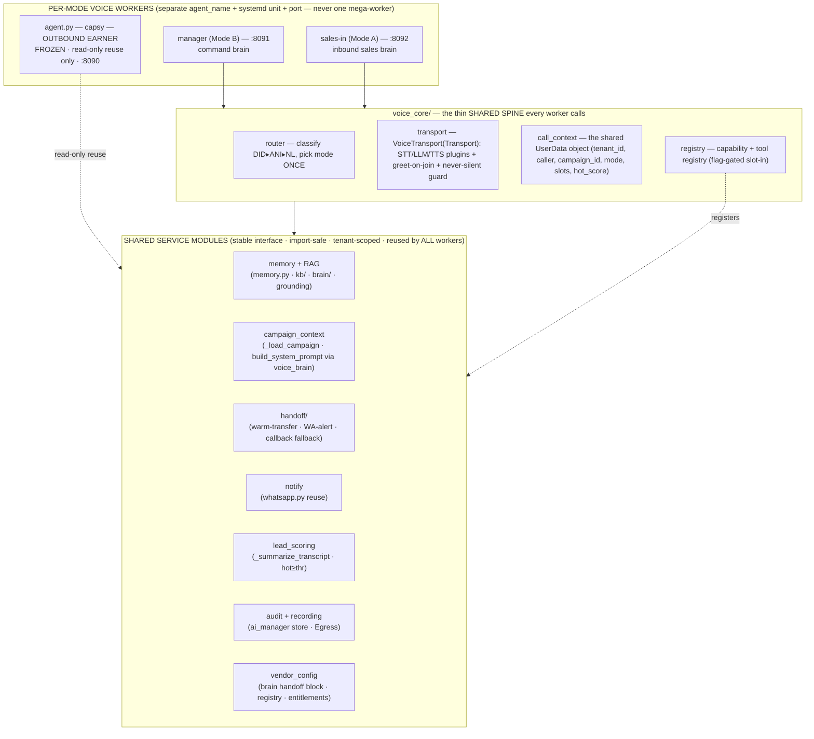

# Plan — MODULAR + SCALABLE ARCHITECTURE for the inbound voice brain (add features forever)

_EXPLORE-4 (inbound-pipeline extension). Authored 2026-06-12 from the live box `famit@168.144.153.145`
(READ-ONLY) + the existing inbound master plan and its four companion explore docs. Evidence-grounded,
file:line cited. No code, no deploy, no git — this doc only._

> **#1 RULE — NEVER BREAK THE OUTBOUND EARNER.** `agent.py` / worker `agent_name="capsy"` /
> `famit-agent.service` / outbound trunks `ST_fmtVmNJmpzKa`+`ST_LH8ighJJtHSi` are **byte-frozen**. Every
> module/seam below is **ADDITIVE + ISOLATED**: new packages, new workers, new flags, **read-only reuse** of
> shared stores. No refactor touches the earner. The ONE allowed touch to outbound code — extracting a shared
> `voice_brain` library — is a separate, gated, *optional* unit (§5) and is **deferred behind a flag**; the
> default path keeps the inbound worker re-implementing the brain read-only so the earner is never edited.
> Outbound regression gate `G` (famit-agent active + one real test call) runs BEFORE and AFTER every step.

---

## 0. THE DECISION (one line, aligned with the project's standing rule)

The project's architecture verdict is **modular monolith + a few coarse services, NOT a microservice swarm**
(`famit-architecture-decision` skill; reaffirmed by the live shape — `kb/ brain/ workforce/ ai_manager/`
are already flag-gated, import-safe, tenant-scoped packages inside one repo). So the inbound brain is **NOT a
new service** — it is **new packages + new per-mode voice workers inside the existing monolith**, sharing a
small set of **clean SERVICE modules** behind **stable interfaces**, slotted in by a **capability registry +
feature flags** so the founder can add capabilities forever without editing what already earns.

---

## 1. WHAT THE CODE ALREADY GIVES US (the pattern to extend, not invent)

The box is **already a modular monolith** — every subsystem follows the SAME five-part convention, so new
modules must look identical (no new shape to learn):

| Convention (verified live) | Evidence |
|---|---|
| **One package per capability** (`__init__.py` + `core.py`/`store.py`) | `kb/ brain/ workforce/ ai_manager/ payments/ funnels/ workflow/ booking/ crm/ media_gen/ support/ ads_engine/` |
| **`config.py` with a master `_b("X_ENABLED", False)` flag** — mounted but **inert until ON** | `ai_manager/config.py:36 aim_enabled()`, `workforce/config.py:31 workforce_enabled()` |
| **`schema.sql` + FORCE-RLS, tenant-scoped by `app.tenant_id` GUC** | `kb/schema.sql`, `workforce/schema.sql`, `ai_manager/schema.sql` |
| **Import-safe degrade** — absent dep ⇒ no-op / `[]` / `{ok:False}`, never crashes a call | `vendors/embeddings.py status()=="not_configured"`, `kb.retrieve→[]` |
| **Reached over an authed loopback** (coarse-service seam without a separate deploy) | `workforce.config.loopback_base 127.0.0.1:8209`, asset svc `:8310` |
| **Provider-agnostic vendor shims** (swap a provider via env, not code) | `vendors/{elevenlabs,sarvam_meter,groq_meter,embeddings,vobiz}.py` |

LiveKit itself reinforces this at the voice layer: **STT/LLM/TTS are swappable plugins** passed to
`AgentSession`, and the production pattern is **a front-line agent + specialist agents that hand off via a
shared `UserData`/context object** ([LiveKit sequential-pipeline](https://livekit.com/blog/sequential-pipeline-architecture-voice-agents),
[2026 multimodal guide](https://www.forasoft.com/blog/article/building-multimodal-ai-agents-with-livekit-guide)).
That is exactly our **per-mode worker + shared services** target.

**Tangled seams to NOT replicate** (`plan-vendor-modules.md §3`): `caller.py` (256 KB god-router with
resolvers inlined), `agent.py` (sales brain inlined, not a library), `aim_voice_agent.py` (transport + STT
build + state-drive in one file), JSONL/PG-mixed persistence. New work goes into **clean packages**, never
back into the god-router.

---

## 2. THE TARGET LAYOUT — per-mode workers over a shared CORE + SERVICES (the picture)

**Read it as:** workers are thin (transport + which-mode); the **brain logic lives in CORE + SERVICES**;
new capabilities register into the **registry** behind a flag. To add a feature you write a service module +
register a tool — you do **not** edit a worker, the router, or the earner.

---

## 3. THE SHARED SERVICE MODULES (stable interfaces — the contracts that make it scale)

Each is a package with the standard 5-part shape (§1), a **single documented interface**, and **import-safe
degrade**. A worker depends on the *interface*, never another module's internals (the modular-monolith rule:
talk through contracts, not direct model imports — [modular monolith](https://breadcrumbscollector.tech/modular-monolith/),
[registry pattern](https://dev.to/dentedlogic/stop-writing-giant-if-else-chains-master-the-python-registry-pattern-ldm)).

| Service module | Stable interface (the contract) | Reuses (live, read-only) | New? |
|---|---|---|---|
| **memory + RAG** | `memory.load_memory/build_recap/save_memory`; `grounding.precompute(tenant,cid,seed)->str`; `brain.retrieve(tenant,q,scope)` tool | `memory.py`, `kb/core.py`, `brain/core.py` | wire-only |
| **campaign_context** | `load(cid)->fields`; `system_prompt(fields)->str` | `_load_campaign` (`agent.py:142`), `build_system_prompt` (`prompt.py:254`) | wire-only (lib §5) |
| **handoff** | `transfer_to_human(ctx, reason)`; `notify_team(tenant, lead, summary)`; `fallback_callback(ctx)` | `transfer_sip_participant`/`CreateSIPParticipant`; `whatsapp.send_whatsapp` | **NEW pkg** |
| **notify** | `send(to, template, params)` / `send_text(to, text)` | `whatsapp.py:248/233` verbatim | reuse |
| **lead_scoring** | `score_post_call(transcript)->{interest,outcome,...}`; `is_hot(score,tenant)->bool`; `mid_call_signal()` | `_summarize_transcript` (`agent.py:155`), `hot=score>=thr` (`caller.py:1297`) | reuse + mid-call hook |
| **audit + recording** | `log(session, event)`; `start_recording(room)`/`pause(span)`/`url()` | `ai_manager/store.py`, `recorder.py`, LiveKit Egress | wire (Egress is a gap) |
| **vendor_config** | `get_handoff(tenant)`; `get_brain(tenant)`; `entitlement(tenant,key)`; `lookup_did(did)` | `brain/core.py`, `registry.py`, `entitlements.py`, `var/inbound_dids.json` | wire + 1 block |

**Contract discipline:** interfaces are **synchronous-callable + import-safe** (every entrypoint already
returns a degrade value on failure — preserve that). Heavy/latency work (`grounding.precompute`, recording,
team-notify, post-call scoring) runs **off the turn-loop** (call-setup or `asyncio.to_thread` / shutdown),
never parking the voice loop — verified against the ~1.1 s/turn moat by gate `G` after wiring.

---

## 4. THE `voice_core/` SPINE + the CAPABILITY REGISTRY (how new features slot in)

The biggest scalability lever is to stop putting brain logic *in the worker file* and instead put it in a
thin shared spine that two (later three) workers share — mirroring LiveKit's front-line/specialist + shared
`UserData` pattern and the registry/feature-flag pattern.

- **`voice_core/router.py`** — the single classify-once entrypoint: `classify(did, ani, nl) -> Mode`
  (DID ▸ ANI ▸ NL). Decides Mode A vs Mode B **once**; no in-call escalation (master-plan §3.3). Each worker's
  LiveKit `entrypoint(ctx)` is now ~10 lines: build transport → router.classify → hand to the mode's driver.
- **`voice_core/transport.py`** — promote the existing `VoiceTransport(Transport)` (`aim_voice_agent.py:278`)
  into the shared spine: STT/LLM/TTS as **swappable plugins** (Sarvam/Groq/ElevenLabs today, any
  OpenAI-compatible later — one-line swap), the **greet-on-join** + **never-silent apology guard** baked in
  ONCE so every mode inherits the P0 UX rule, plus the tuned barge-in/endpointing kwargs.
- **`voice_core/call_context.py`** — the shared **`UserData`** object: `tenant_id, caller, campaign_id, mode,
  pending_command, slots, hot_score, audit_id`. This is how a future "scheduling" or "billing" specialist
  hands off mid-call without re-deriving context (LiveKit's documented handoff mechanism).
- **`voice_core/registry.py`** — the **capability + tool registry**: a module registers a tool with
  `register(ToolSpec(name, required_slots, risk, run, channels, flag))`; the registry is filtered at runtime
  by `entitlements.entitlement(tenant, key)` + the module's `*_ENABLED` flag. **New capability = a new module
  that calls `register(...)`** — no edit to the router, the driver, or any worker. This extends the existing
  closed-enum tool catalog (`workforce/tools/catalog.py`, `ai_manager/intent/driver.py:70`) from a hardcoded
  list into a **registry the modules populate** — the documented "query the flag system, update the registry"
  pattern. `ToolSpec.required_slots` (today missing) is added here, powering Mode-B slot-filling (master-plan
  Phase 2) AND any future structured sub-task (book site-visit, callback) from one mechanism.

**Result:** adding "send a brochure on WhatsApp mid-call" = a 1-file `notify`-backed tool that
`register()`s itself behind `NOTIFY_ENABLED`; it appears for entitled tenants automatically, slot-fills via
its `required_slots`, audits via the shared audit service, and **touches nothing else**.

---

## 5. THE ONE REFACTOR WORTH DOING (optional, gated, outbound-safe)

`agent.py` has the sales brain **inlined** — the inbound `sales-in` worker must re-implement `_load_campaign`
+ `build_system_prompt` read-only (today's safe default). The scalable end-state is to **extract a
`voice_brain/` library** (pure functions: `load_campaign(cid)`, `system_prompt(fields)`, `tuned_session_kwargs()`)
that BOTH outbound and inbound import. This kills the duplication and makes the brain a versioned contract.

**Why it's gated/deferred:** extraction touches `agent.py` (the frozen earner). So it is a **separate unit,
behind `VOICE_BRAIN_LIB=1`**, done as a *pure move* (logic byte-identical, only the import site changes),
with gate `G` + a transcript-diff proving the outbound prompt is unchanged before it ever ships. Until then,
inbound re-implements read-only and the earner is never edited. **Do inbound-first with re-implementation;
adopt the shared lib only once inbound is proven and the diff is green.**

---

## 6. THE DATA MODEL (vendor config · handoff-list · DID-map — where settings live, consolidated)

Four tenant-scoped stores already exist (`plan-vendor-modules.md §1`); the new config is **additive blocks +
one new map**, not new infrastructure:

| Datum | Home (decision) | Shape |
|---|---|---|
| **Handoff list** (multiple numbers per vendor) | **additive `handoff{}` block on Business Brain** `var/brain/<tenant>.json` (NOT a new table — inherits RT-5 isolation, versioning, audit, and the live `PUT /brain` write surface) | `numbers[]{id,name,phone,whatsapp,roles[warm_transfer|hot_lead_wa],hours,priority,active}` + `rules{transfer_on,ring_strategy,ring_timeout_s,after_hours,fallback}` + `wa_template` |
| **DID → mode/campaign/tenant map** | **`var/inbound_dids.json`** (→ PG `inbound_dids` at multi-vendor consolidation) | `{did, tenant_id, mode, campaign_id, agent_name, lang, label}` — the zero-ask router input |
| **Per-vendor PIN + hot threshold** | per-tenant `firewall.py` PIN; `hot_score_gte` on the Brain `handoff.rules` | replaces single box PIN / hardcoded 70 |
| **What-modules-a-vendor-gets** | `entitlements.py` (Control Layer) — unchanged | `registry.json` + `plans.json` + PG overrides; HIDE 404 / LOCK 402 / ON |
| **Account/plan/caps · voice numbers · KB corpus** | `var/tenants.json` · `ai_manager/registry.py`+`aim_numbers.jsonl` · `kb_*` (FORCE-RLS) | unchanged |

**Consolidation target (scale, later unit):** migrate the JSON stores (`tenants.json`, `var/brain/*.json`,
`aim_numbers.jsonl`, `inbound_dids.json`) onto **PG + FORCE-RLS** for true multi-vendor isolation, keeping
JSON as the dev/degrade fallback the modules already support. This is a Phase-6 unit, not a blocker for
shipping inbound.

---

## 7. BUILD ORDER (how the modular work folds into the master plan's phases — no new phases)

The module layout is **delivered incrementally inside the existing phases**, never as a big-bang refactor:
- **P0–P1 (voice works + SIP):** introduce `voice_core/transport.py` (promote `VoiceTransport`) — the
  greet/never-silent guard lives here once. No new services yet.
- **P2 (Mode B slot-filling):** introduce `voice_core/registry.py` + `ToolSpec.required_slots`; the command
  brain reads tools from the registry. First proof of "register a capability, it slots in."
- **P3–P4 (Mode A):** stand up the `sales-in` worker over `voice_core`; wire `memory+RAG`, `campaign_context`,
  `lead_scoring` services (read-only reuse). RAG via `grounding.precompute` (Tier-1, off hot path).
- **P5 (logging/recording):** wire the `audit + recording` service (Egress + PG write-path).
- **P6 (multi-vendor):** wire `vendor_config` fully (registry as the gate, per-vendor PIN, PG+RLS consolidation).
- **P7 (polish):** ship the `handoff/` module (warm-transfer + hot-lead WA + callback fallback) consuming the
  Brain `handoff{}` block; optionally adopt the `voice_brain/` shared lib (§5) behind its flag.

Every step is one verifiable module behind a flag, gate `G` before+after, reversible by restoring a dated
`.bak` and restarting only the inbound unit(s). **The earner is never in the blast radius.**

---

## 8. 14-LINE MODULE / ARCHITECTURE RECOMMENDATION (the return value)

1. **Decision:** inbound brain = **NEW packages + per-mode workers inside the existing modular monolith**, NOT a new service — aligns with the project's standing "modular monolith + a few coarse services, NOT a swarm" verdict and the already-modular live shape (`kb/ brain/ workforce/ ai_manager/` are flag-gated, import-safe, tenant-scoped).
2. **Keep the live 5-part module convention for everything new:** `__init__.py` + `core.py`/`store.py`, a `config.py` `_b("X_ENABLED")` master flag (mounted-but-inert), `schema.sql` + FORCE-RLS by `app.tenant_id`, import-safe degrade, reachable over the authed loopback.
3. **Per-mode voice WORKERS stay separate** (`capsy` FROZEN · `manager` :8091 · `sales-in` :8092) — separate `agent_name`+systemd+port, **never one mega-worker** — exactly LiveKit's front-line/specialist pattern.
4. **Introduce a thin shared `voice_core/` SPINE** the workers call: `router` (classify mode ONCE: DID▸ANI▸NL), `transport` (promote `VoiceTransport` — STT/LLM/TTS as swappable plugins + greet-on-join + never-silent guard baked in once), `call_context` (the shared `UserData` object), `registry`.
5. **`voice_core/registry.py` = the capability + tool registry** — a module `register(ToolSpec(name, required_slots, risk, run, channels, flag))`s itself; the registry is filtered at runtime by `entitlements` + the module flag. **Adding a feature = a new module that registers — zero edits to workers/router/earner.**
6. **Seven SHARED SERVICE MODULES behind stable interfaces** (talk through contracts, never import internals): memory+RAG, campaign_context, handoff, notify, lead_scoring, audit+recording, vendor_config. Workers depend on the interface only.
7. **Reuse-first:** memory+RAG = `memory.py`+`kb/`+`brain/` (wire-only); campaign_context = `_load_campaign`+`build_system_prompt`; notify = `whatsapp.py` verbatim; lead_scoring = `_summarize_transcript`+`hot≥thr`. The ONLY genuinely-new package is `handoff/`.
8. **Latency discipline (load-bearing):** all heavy work (RAG precompute, recording, team-notify, post-call scoring) runs **off the turn-loop** (call-setup, `to_thread`, or shutdown) — never parks the voice loop; verify the ~1.1 s/turn moat with gate `G` after each wiring.
9. **Data model:** handoff-list = additive `handoff{numbers[],rules,wa_template}` block on the **Business Brain** (`var/brain/<tenant>.json`, edited via existing `PUT /brain` — no new table, inherits RT-5 isolation+versioning+audit); DID routing = **`var/inbound_dids.json`** `{did,tenant_id,mode,campaign_id,agent_name}`; per-vendor PIN + `hot_score_gte` replace the single box PIN / hardcoded 70.
10. **The one optional refactor:** extract a `voice_brain/` shared library from `agent.py`'s inlined brain so inbound+outbound import one versioned contract — but it's **gated behind `VOICE_BRAIN_LIB=1`** as a pure byte-identical move with a transcript-diff proof; **default = inbound re-implements read-only so `agent.py` is never edited.**
11. **Consolidation for scale (later unit):** migrate JSON stores (`tenants.json`, `var/brain/*`, `aim_numbers.jsonl`, `inbound_dids.json`) → **PG + FORCE-RLS**, keeping JSON as the dev/degrade fallback the modules already support — Phase-6, not a ship blocker.
12. **Delivered incrementally inside the master plan's existing phases** (P0 transport → P2 registry → P3/4 services+RAG → P5 recording → P6 vendor_config → P7 handoff/voice_brain) — one verifiable flag-gated module per step, **no big-bang refactor**.
13. **Isolation invariant:** every module is ADDITIVE + flag-gated + import-safe-degrade; the outbound earner (`agent.py`/trunks/dispatch) is **read-only reused, never edited**; gate `G` (famit-agent active + real test call) runs before+after every step; rollback = restore dated `.bak` + restart only the inbound unit.
14. **Human-like greeting (small, in `transport`):** the greet-on-join line becomes natural ("Hey, this is Riya from <company>…") with the legally-required AI disclosure phrased conversationally — one edit in the shared `voice_core/transport` greeting, inherited by every mode.

---

## 9. EVIDENCE INDEX (file:line, live box `168.144.153.145`, all read-only)
- **Module convention:** `ai_manager/config.py:36 aim_enabled` (`_b("AIM_ENABLED")`), `workforce/config.py:31 workforce_enabled`; pkgs `kb/ brain/ workforce/ ai_manager/ payments/ funnels/ workflow/ booking/ crm/ media_gen/ support/ ads_engine/`; loopback `workforce.config.loopback_base 127.0.0.1:8209`, asset `:8310`.
- **Inbound worker spine to promote:** `aim_voice_agent.py:278 class VoiceTransport(Transport)`, `:367 entrypoint(ctx)`, `:392 _entrypoint_impl`, `:481 greet`, `:381 apology guard`, `:644 _build_stt` (single STT — P0), `:663 _build_tts`; drivers `ai_manager/state_machine.py` (S0–S9), `ai_manager/intent/driver.py:70` (closed enum), `workforce/tools/catalog.py` (`ToolSpec`, no `required_slots`).
- **Shared services to reuse:** `agent.py:142 _load_campaign`, `prompt.py:254 build_system_prompt`; `memory.py:53/67/96`; `kb/core.py:299 retrieve` + `brain/core.py` + `vendors/embeddings.py`; `whatsapp.py:248 send_whatsapp`, `:233 send_whatsapp_text`; `agent.py:155 _summarize_transcript`, `caller.py:1297 hot=score>=70`; `ai_manager/store.py` + `recorder.py` (`_NullRecorder` gap); transfer `livekit/api/sip_service.py:804 transfer_sip_participant`.
- **Config stores:** `var/tenants.json`; `brain/core.py` + `var/brain/<tenant>.json` via `caller.py:2206/2218 GET/PUT /brain`; `entitlements.py` + `var/control/{registry,plans}.json`; `ai_manager/registry.py` + `var/aim_numbers.jsonl`; (new) `var/inbound_dids.json`.
- **Tangled (do NOT extend):** `caller.py` 256 KB god-router; `agent.py` 44 KB inlined brain (FROZEN); `aim_voice_agent.py` 36 KB transport+STT+drive mixed.
- **Companion docs:** `INBOUND-PIPELINE-MASTER-PLAN.md`, `plan-rag-context.md`, `plan-handoff-hotlead.md`, `plan-vendor-modules.md`, `plan-{existing-inbound,lead-history,campaign-context,aim-brain,inbound-research}.md`.
- **External patterns:** LiveKit swappable-plugin + front-line/specialist + shared-UserData handoff; modular-monolith contract-not-internals + registry/feature-flag slot-in.

Sources:
- [LiveKit — Sequential Pipeline Architecture for Voice Agents](https://livekit.com/blog/sequential-pipeline-architecture-voice-agents)
- [2026 LiveKit Multimodal Agents Guide (Forasoft)](https://www.forasoft.com/blog/article/building-multimodal-ai-agents-with-livekit-guide)
- [Modular monolith in Python (breadcrumbscollector.tech)](https://breadcrumbscollector.tech/modular-monolith/)
- [Python Registry Pattern (dev.to)](https://dev.to/dentedlogic/stop-writing-giant-if-else-chains-master-the-python-registry-pattern-ldm)
