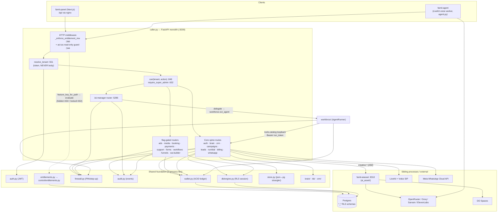
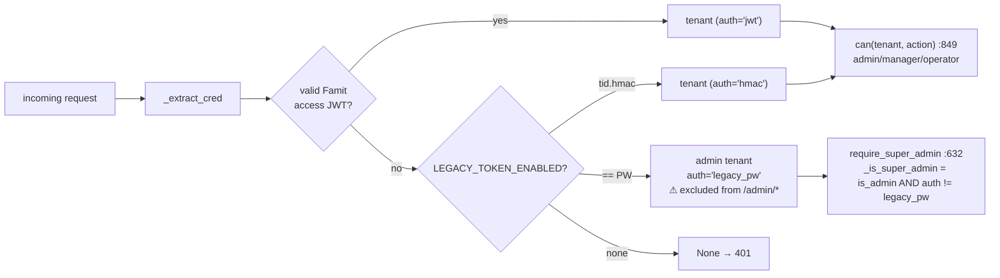

# 01 — Backend Monolith (`droplet_work` / the live `famit-caller`)

> **Onboarding map for the backend.** Every box/edge below is grounded in real code at `file:line`.
> Source root: `C:\Users\kunal\Desktop\caps\droplet_work`. Live process: `famit-caller` on
> `famit@168.144.153.145` (priv `10.122.0.4`) `:8209`, fronted by nginx on the panel box at `/api`.
> READ-ONLY doc — do not edit app code from here.

---

## 0. TL;DR — what this thing is

`caller.py` is a **~5,400-line FastAPI modular monolith** (`caller.py:27` imports `FastAPI`). It is the
single live API process (`famit-caller`). It owns the **core spine directly** (auth, tenants, brain/KB,
CRM contacts, campaigns, leads, the dial runner, wallet, firewall, billing, WhatsApp, audit) as
`@app.<verb>` decorator routes, and **mounts feature modules as routers behind per-feature flags**
(ads, media, booking, payments, support, forms, workflows, AI-Manager, funnels, WhatsApp-builder).

Two companion processes run on the same backend box but are **separate services** (not part of
`caller.py`): `famit-agent` (the LiveKit voice worker, `agent.py`) and `famit-aiasset` (the AI Asset
image/banner service, `ai_asset/`, `:8310`). The monolith reaches the asset service over the VPC
loopback; the voice worker calls back into `/api`.

**Key design pattern:** a *strangler* monolith. New capability is added as a **self-contained package
with its own `build_router(...)` and its own `*_*` RLS Postgres schema**, mounted additively and
flag-gated so the resting (all-flags-off) process is byte-identical to legacy. Tenant is **always
derived from the auth token, never from the request body** (`caller.py:551`).

---

## 1. Module / component map (what each piece owns + its route surface)

### 1.1 The core spine — `caller.py` `@app.*` routes (always on)

These are defined directly in `caller.py` (no router); they are the legacy live earner.

| Domain | Routes (prefix) | Owner code | Notes |
|---|---|---|---|
| Health/infra | `GET /health` `:2090`, `GET /metrics` `:2095`, `GET /` `:4940` | caller.py | Control-exempt (`caller.py:323`) |
| **Auth** | `POST /login` `:2122`, `POST /auth/login` `:2151`, `/auth/refresh` `:2166`, `/auth/logout` `:2182`, `GET /me` `:2192` | `auth.py` | JWT issue/refresh/revoke |
| **Business Brain** | `GET/PUT /brain` `:2206/:2218`, `/brain/completeness` `:2242`, `POST /brain/knowledge` `:2253`, `GET /brain/retrieve` `:2273` | `brain/core.py` (in-proc) | RAG grounding store |
| **CRM** | `GET /contacts` `:2292`, `/contacts/{phone}` `:2313`, `/timeline` `:2335`, `/nba` `:2353`, `PUT /contacts/{phone}` `:2371` | `crm/core.py` (in-proc) | NBA = next-best-action |
| **Audit** | `GET /audit` `:2403` | `audit.py` | JSONL + PG `events` leg |
| **Wallet** | `GET /wallet` `:2451`, `/wallet/ledger` `:2475`, `/wallet/holds` `:2493`, `POST /wallet/topup/{tid}` `:2511` | `wallet.py` | ACID paise ledger |
| **Firewall** | `PUT /firewall/pin` `:2546`, `POST /firewall/verify-pin` `:2560`, `GET /firewall/status` `:2579` | `firewall.py` | PIN + step-up tokens |
| **Campaigns** | `GET /campaigns` `:2610`, `POST /campaigns` `:2691`, `GET /campaigns/{cid}` `:2720`, `/ab` `:2731`, `POST /campaigns/{cid}` `:2782`, `DELETE` `:2826` | caller.py + `store.py` | 8 live campaigns |
| **Leads** | `GET /leads` `:2925`, `POST /leads` `:2938`, `/leads/batches` `:2977`, `DELETE /leads/{id}` `:3010`, `GET /leads/hot` `:4930` | caller.py + `store.py` | CSV/XLSX ingest |
| **Dial runner** | `POST /run/preview` `:3028`, `POST /run` `:3071`, `GET /status` `:3163`, `/calls` `:3178`, `/calls/{id}` `:3197` | caller.py → LiveKit | Dispatches `famit-agent` |
| **Analytics/stats** | `GET /stats` `:3214`, `GET /analytics` `:3241`, `/usage` `:3445`, `/usage/all` `:3462` | caller.py | |
| **Tenants** | `GET /tenants` `:3283`, `POST /tenants` `:3297`, `POST /tenants/{tid}/limits` `:3482` | caller.py | admin-gated |
| **Suppression/DND** | `GET/POST /suppression` `:3328/:3339`, `DELETE` `:3360`, `POST /optout` `:3376` | caller.py | |
| **Callbacks** | `GET /callbacks` `:3396`, `DELETE/POST` `:3409/:3425` | caller.py | |
| **Control plane (admin)** | `/admin/features` `:3561`, `/admin/flags*` `:3572`, `/admin/plans*` `:3601`, `/admin/vendors*` `:3691`, `/admin/vendors/{vid}/{entitlements,plan,status,credits,impersonate}` `:3744-:3866`, `/admin/act-as/exit` `:3902` | `entitlements.py` + `auth.py` | gated by `require_super_admin` |
| **Entitlements (self)** | `GET /me/entitlements` `:3919` | `entitlements.py` | |
| **Billing** | `GET /billing` `:3947`, `/billing/ledger` `:3970`, `/billing/overview` `:4015`, `/billing/vendors` `:4041`, `/billing/explorer` `:4087`, `/billing/audit` `:4133`, `POST /billing/sync` `:4167`, `POST /billing/{tid}` `:4282` | caller.py | vendor-API meter |
| **WhatsApp (sender)** | `POST /whatsapp/send` `:4321`, `/whatsapp/log` `:4350`, `GET/POST /whatsapp/inbound` `:4361/:4415`, `/whatsapp/threads*` `:4438/:4464` | `whatsapp.py` (`wa_mod`) | Meta Cloud API |
| **Webhooks** | `GET/POST /webhooks` `:4477/:4486`, `DELETE` `:4508` | caller.py | |
| **Voices/extract** | `POST /extract` `:2590`, `GET /voices` `:2597` | caller.py | |

### 1.2 Flag-gated mounted modules (each is a self-contained package)

Mounted at the **bottom of `caller.py`** (`:4953`–`:5386`), each in a `try/except` so a mount failure
never crashes the spine. All read tenant from the token via the injected `resolve_tenant`.

| Module | Mount prefix | Flag (default OFF) | Mount site | What it owns |
|---|---|---|---|---|
| `ads_engine/` | `/ads` | `FEATURE_ADS` `:4964` | `:4960` | Propose-only Meta ads campaigns, budget approve/pause/optimize (`ads_engine/endpoints.py:90`) |
| `media_gen/` | `/media` | `FEATURE_MEDIA` `:4997` | `:4993` | Video/image/3D gen jobs. **Only `build_router` mounted** — bare `router` trusts `X-Tenant-Id` = hole (`caller.py:4978`) |
| `booking/` | `/booking` | `FEATURE_BOOKING` `:5038` | `:5034` | Resources, availability, book/reschedule/cancel, reminder `/tick` (`booking/router.py:178`) |
| `payments/` | `/payments` | `FEATURE_PAYMENTS` `:5083` | `:5078` (uses `wire()`) | Payment links, invoices, receipts, mark-paid, refund, provider webhooks (`payments/router.py:102`) |
| `support/` | `/support` | `FEATURE_SUPPORT` `:5131` | `:5126` (uses `wire()`) | Tickets inbound/draft/reply/escalate/claim/resolve, channel webhooks (`support/router.py:120`) |
| `forms-surveys/` | `/forms`, `/f/{token}` (public) | `FEATURE_FORMS` `:5201` | `:5181` | Form CRUD, submissions, insights, public submit (`forms-surveys/endpoints.py:43`) |
| `workflow-studio/` | `/workflows` | `FEATURE_WORKFLOWS` `:5249` | `:5241` | Visual workflow DSL: draft/publish/run, approval node (`workflow-studio/workflow/endpoints.py:183`) |
| `ai_manager/` | `/ai-manager` | `FEATURE_AI_MANAGER` `:5292` | `:5286` | The voice/chat command center (see §3). **Mounted live today.** |
| `funnels/` | `/funnels` | `FEATURE_FUNNELS` `:5331` | `:5325` | Funnel templates/compile/publish/run; lazy-`import workflow` to delegate run (`funnels/endpoints.py:132`) |
| `whatsapp_builder/` | `/whatsapp/campaign` | `FEATURE_WHATSAPP_BUILDER` `:5375` | `:5371` | AI WhatsApp template gen, select/approve/submit-to-Meta, attach banner (`whatsapp_builder/router.py:21`) |

**Security invariant on every mount:** the comments at `:4978`, `:5015`, `:5221`, `:5310`, `:5359`
state the rule explicitly — mount **only** `build_router(resolve_tenant, can, need_auth, ...)` which
derives tenant from the token; **never** mount a bare module-level `router` that reads
`X-Tenant-Id`/body tenant (that would be a cross-tenant hole).

### 1.3 Shared foundation modules (imported in-process, NOT routers)

These are libraries the spine and the mounted modules call directly.

| Module | Public surface (file:line) | Role |
|---|---|---|
| `auth.py` | `issue_pair` `:129`, `resolve_token` `:142`, `access_claims` `:164`, `make_act_as`/`act_as_claims` `:186/:209`, `login` `:219`, `refresh` `:232`, `logout` `:256`, `revoke_all` `:269` | HS256 JWT, revocable refresh, act-as impersonation tokens |
| `wallet.py` | `balance` `:80`, `topup` `:172`, `reserve` `:214`, `settle` `:277`, `release` `:344`, `sweep_expired_holds` `:395`, `transactions`/`holds` `:426/:448` | ACID no-oversell paise ledger (FORCE-RLS, admin GUC) |
| `firewall.py` | `classify` `:85`, `has_pin`/`set_pin`/`check_pin` `:120/:124/:136`, `mint_step_up` `:146`, `verify_step_up_token` `:157`, `require_step_up` `:186`, `request_otp`/`verify_otp` `:220/:225` | PIN (salted-sha256) + HS256 sub-bound step-up, 300s TTL |
| `audit.py` | `record` `:60`, `tail` `:112` | Append-only JSONL + immutable PG `events` leg |
| `entitlements.py` | re-exports `control/entitlements.py`: `evaluate`/`mode_for` `:355`, `feature_key_for_path` `:401`, `load_registry` `:136`, `set_override`/`set_status`/`set_plan` `:508/:547/:576` | Control-layer feature gating engine |
| `db/engine.py` | `init` `:46`, `available` `:140`, `session(tenant_id, is_admin)` `:160`, `sync_engine`/`async_engine` `:199/:203` | SQLAlchemy engine + per-request RLS GUC session |
| `store.py` | strangler `StoreSpec` `:44`, per-store mode `json`/`dual`/`pg` `:7` | JSON→PG migration seam for the legacy file stores |
| `brain/core.py`, `kb/core.py`, `crm/core.py` | called inline from `/brain/*`, `/contacts/*` routes (`caller.py:2212`, `:2299`) | In-process projections (PG-native) |

---

## 2. Module dependency graph



**Edges that matter most for a newcomer:**

- **`ai_manager → workforce → tools/catalog → the live `/api`.`** The AI-Manager does *not* re-implement
  business logic. `ai_manager/delegate.py` calls `workforce.run_agent` (`ai_manager/delegate.py:11`);
  the workforce `AgentRunner` executes tools whose live catalog maps **1:1 onto existing `caller.py`
  routes over an authenticated localhost loopback** (`workforce/tools/catalog.py:1`,
  `workforce/tools/transport.py:1`). So a voice command ultimately re-enters the same `/whatsapp/send`,
  `/run`, `/ads/campaigns/propose` HTTP routes a human would hit — RLS-scoped by a minted `run_token`.
- **`wallet`/`firewall`/`audit` are shared, not owned by any one module.** The spine, the mounted
  modules, the workforce runner, and the AI-Manager all import them directly
  (`workforce/__init__.py:45/:51` imports `wallet`/`firewall`; `ai_manager` bridges to them via
  `firewall_bridge`/`audit_bridge`).
- **Control Layer middleware wraps `resolve_tenant`.** `_enforce_entitlement_mw` (`caller.py:366`) calls
  `entitlements.feature_key_for_path(path)` → `evaluate(tenant_id, feature_key)` and returns **404 for
  `hidden`, 402 for `locked`** (`caller.py:422-427`) — but only when `CONTROL_ENABLED` is on
  (`caller.py:374`); else byte-identical passthrough.
- **`store.py` is the strangler.** caller.py's `_read_raw`/`_write_raw` (`caller.py:658/:667`) delegate
  to `store.py` per-store mode (`json`→pass-through, `dual`→JSON authoritative + PG mirror, `pg`→PG),
  degrading to `json` if `db.engine.available()` is false (`store.py:14`).

---

## 3. The AI-Manager command pipeline (state machine → delegate → workforce → catalog → /api)

The AI-Manager is the highest-privilege human-facing surface (a phone call / chat that can spend money
and trigger bulk outreach). The **LLM only fills slots; a deterministic state machine decides
authority** (`ai_manager/state_machine.py:5`). Two distinct gates: **S2 login PIN** proves *who*; **S6
step-up PIN** authorizes *this specific* risky action (fresh, scoped, 300s).

```mermaid
sequenceDiagram
    autonumber
    participant U as Caller (voice/chat)
    participant SM as state_machine.py\n(S0→S9, deterministic)
    participant ID as identity.py\n(classify_risk / permits)
    participant FW as firewall.py\n(PIN + step-up)
    participant DG as delegate.py\n(intent→role)
    participant WF as workforce AgentRunner\n(runner.py)
    participant CAT as tools/catalog.py\n(loopback)
    participant API as caller.py /api\n(real routes)
    participant W as wallet.py

    U->>SM: S0 connect / S1 verify (caller-ID = HINT only)
    SM->>FW: S2 authenticate (PIN/OTP) — BEFORE any data
    FW-->>SM: identity proven (lockout after max_pin_attempts)
    SM->>SM: S3 context · S4 intent (NLU strict JSON, model = input)
    SM->>ID: classify_risk(intent) — DETERMINISTIC table\n(money/bulk/destructive/safe); model label IGNORED
    ID->>SM: S5 permit? (role-family AND per-number grant, default-deny)
    alt risky action
        SM->>FW: S6 mint_step_up(scope) — fresh, scoped, 300s
        FW-->>SM: X-Step-Up token (sub == caller)
        SM->>U: S7 confirm (amount read back)
    end
    SM->>DG: S8 delegate (map_intent_to_action)
    Note over DG: role_for(intent) → WORKER role\n(never bare "manager"; that = blocked:unknown_tool)
    DG->>WF: run_agent(role, task{plan, step_up_token, run_token})
    WF->>WF: policy.resolve · guardrails (scope/caps/kill-switch/DND)
    Note over WF: DEFENSE IN DEPTH — runner re-enforces its OWN gates;\nmoney action reserves a wallet HOLD before acting
    WF->>W: reserve(amount_minor)
    WF->>CAT: execute tool(args, ctx{run_token})
    CAT->>API: HTTP loopback (Bearer run_token, RLS-scoped)
    API-->>CAT: result {ok, data, actual_spend_minor}
    WF->>W: settle(hold, actual)  — single-use approval consumed
    WF-->>SM: AgentRunResult {status, steps, result.effective}
    SM->>U: S9 report (executed = status==done AND outcome==effective)
```

**Hard facts (don't re-derive — from `memory/brain/mod-ai-manager.md` + verified in code):**

- **In-process composition, not cross-plane HTTP.** `delegate.py` imports `workforce` directly
  (`ai_manager/delegate.py:11`). The cross-plane HTTP transport in the spec was for the *deferred*
  LiveKit voice front; that front (`inbound_agent.py`) is an import-safe stub.
- **Intent → worker role table:** `_INTENT_ROLE` (`ai_manager/delegate.py:32`) maps e.g.
  `ads.set_budget→ad`, `whatsapp.send→whatsapp`, `leads.enqueue_calls→telecaller`,
  `creative.generate→creative`; default `ops` (`:52`). It calls `run_agent(role=<worker>)`, never the
  bare `manager` role (which has only a no-op `delegate` scope → `blocked:unknown_tool`).
- **The workforce runner is the second enforcement wall** (`workforce/runner.py:73`): `policy.resolve`
  → kill-switch (`:87`) → `context.gather` (`:96`) → plan validate against `allowed_tools` (`:109`) →
  per-action gate + **single-use, action+amount-bound approval matching** (`:133-:140`) → **wallet
  reserve before side effect** (`:194`) → tool exec → **settle actual** (`:227`). A `done`-but-parked
  run is reported `executed:False` (truth-in-reporting; `endpoints.commands_execute`).
- **The live catalog maps 1:1 to caller.py routes** (`workforce/tools/catalog.py`): `_whatsapp_send →
  POST /whatsapp/send` `:71`, `_leads_enqueue_calls → POST /run` `:75`, `_ads_set_budget → POST
  /ads/campaigns/propose` `:80`, `_analytics_read → GET /analytics` `:58`, `_brain_retrieve → GET
  /brain/retrieve` `:62`. ToolSpec registrations at `:199`–`:252`, registered via `register_live`
  (`:252`). Each call carries a `run_token` (`_tok(ctx)` `:19`) so the loopback is RLS-scoped.
- **AI-Manager router surface** (`ai_manager/endpoints.py`, prefix `/ai-manager` `:343`): ~35 routes —
  `/status`, `/numbers*`, `/sessions*`, `/profile`, `/authorized-users*`, `/pin/*`, `/commands*`
  (incl. the dashboard `POST /commands/test` `:625` → confirm/cancel/execute `:637-:652`),
  `/dashboard/summary`, `/audit-logs`, `/action-runs`, voice/whatsapp webhook **stubs** (dormant until
  a DID). The Test Console `POST /commands/test` drives the **same** deterministic engine the phone
  uses (`:627`).

---

## 4. Tenant / auth / control gating (the security spine)



- **`resolve_tenant` (`caller.py:551`)** precedence: JWT (`auth.resolve_token`) → legacy bare password
  `== PW` (admin) → signed `tenant_id.hmac` token. Tenant id always comes from the credential.
- **`can(tenant, action)` (`caller.py:849`)**: `manage_tenants`→admin only; `write`→admin/manager;
  `read`→any authed.
- **`require_super_admin` (`caller.py:632`)** is the *one* `/admin/*` gate. **#1 security finding:** the
  legacy static password is a permanent un-revocable admin bearer token, so `_is_super_admin`
  (`caller.py:622`) excludes `auth_method == 'legacy_pw'` even though it still authenticates
  vendor-grade routes during the transition. Returns **403** (not 404) for non-admins — the admin plane
  *exists* (not a secret), only hidden *features* 404.
- **Act-as read-only guard (`caller.py:344`)** is always on (independent of `CONTROL_ENABLED`): a
  `read_only` act-as impersonation token may only make GET/HEAD/OPTIONS; any mutation → 403 except
  `/admin/act-as/exit` and `/firewall/verify-pin` (`caller.py:341`).
- **Feature flags (all default OFF, env-driven, `caller.py:4964`–`:5375`):** `FEATURE_ADS`,
  `FEATURE_MEDIA`, `FEATURE_BOOKING`, `FEATURE_PAYMENTS`, `FEATURE_SUPPORT`, `FEATURE_FORMS`,
  `FEATURE_WORKFLOWS`, `FEATURE_AI_MANAGER`, `FEATURE_FUNNELS`, `FEATURE_WHATSAPP_BUILDER`. Plus
  `CONTROL_ENABLED` (`caller.py:144`, master entitlement enforcement) and `LEGACY_TOKEN_ENABLED`
  (post-cutover kill of legacy auth). Separately, AI-Manager runtime flags `AIM_ENABLED` (master) and
  workforce `WORKFORCE_ENABLED` + `AIWF_SERVICE_TOKEN` (mints loopback run tokens) live in the
  modules' own `config.py`.

---

## 5. Persistence model (strangler: JSON files → Postgres RLS)

- Legacy stores are JSON files under `var/` (leads, calls, suppression, campaigns, ledger). `store.py`
  is the migration seam: per-store mode `json | dual | pg`, keyed by file name (`store.py:7`), default
  `json` for every store. `dual` writes JSON-authoritative then mirrors to PG off the request path via a
  per-store coalescing worker (`store.py:16`); `pg` reads/writes PG (leads only in P1).
- New modules ship **PG-native with FORCE-RLS** and their own `schema.sql` (`*_* ` namespaced tables):
  `wallet` (`db/ddl_wallet.sql`), `ai_manager_*` (`ai_manager/schema.sql`), `workforce` (`workforce/schema.sql`),
  plus `crm`, `funnels`, `support`, `booking`, `ads_engine`, `ai_asset`, `forms`, `kb` schemas. Every PG
  session is opened tenant-scoped via `db.engine.session(tenant_id=..., is_admin=...)` (`db/engine.py:160`)
  which sets the RLS GUC; admin reads pass `is_admin=True`.
- Two immutability legs for audit: append-only JSONL (`audit.py:60`) **and** an immutable PG `events`
  table; money-mutating rows ride *inside* the wallet transaction (atomic with COMMIT).

---

## 6. Where the newcomer should start reading

1. `caller.py:366` — the request middleware (control gate + act-as guard).
2. `caller.py:551` & `:632` & `:849` — tenant resolution, super-admin gate, permissions.
3. `caller.py:4953`–`5386` — the module mount block (the map of everything flag-gated).
4. `ai_manager/state_machine.py:1` then `ai_manager/delegate.py:1` — the command brain + the seam into
   the workforce.
5. `workforce/runner.py:73` then `workforce/tools/catalog.py:1` — the second enforcement wall + the
   loopback back into `/api`.

> ⚠ **Source of truth caveat (from `mod-ai-manager.md` §B4):** the *live box* files for a few
> `ai_manager` internals (`intent/driver.py`, `identity`, `delegate`, `store`) can be **newer** than
> this local `droplet_work/` tree. For AI-Manager work, re-sync from the box before editing.
