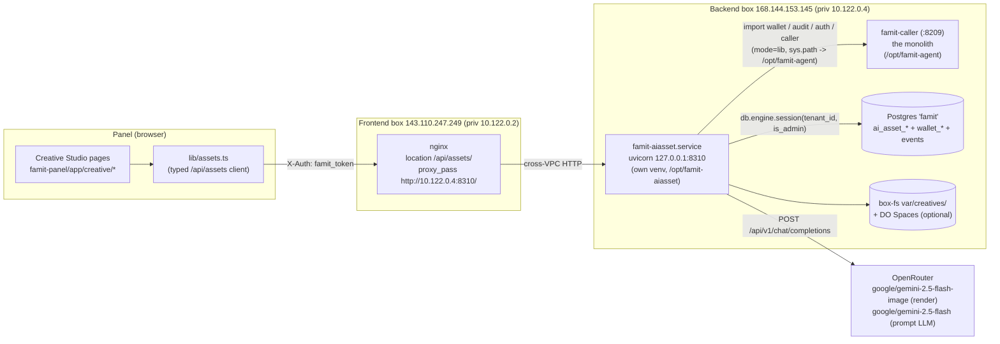
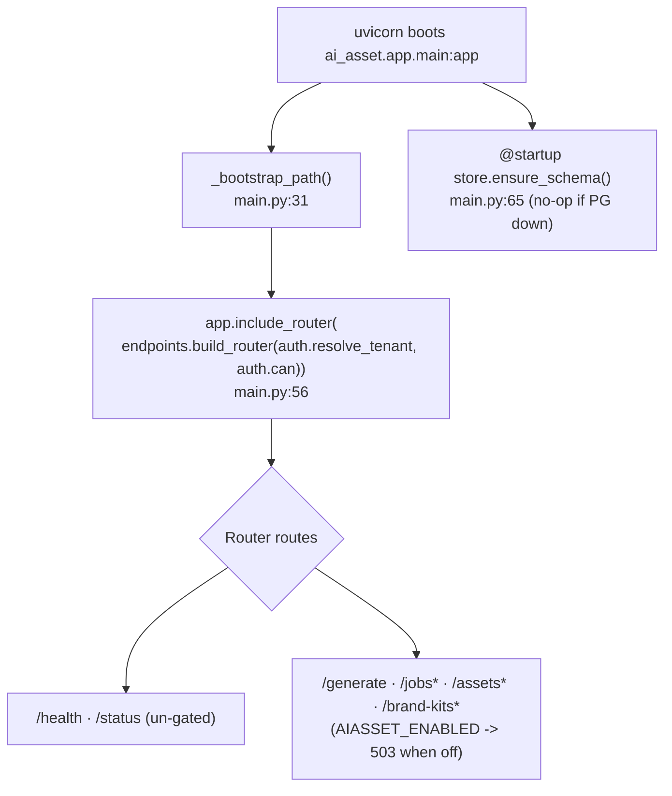
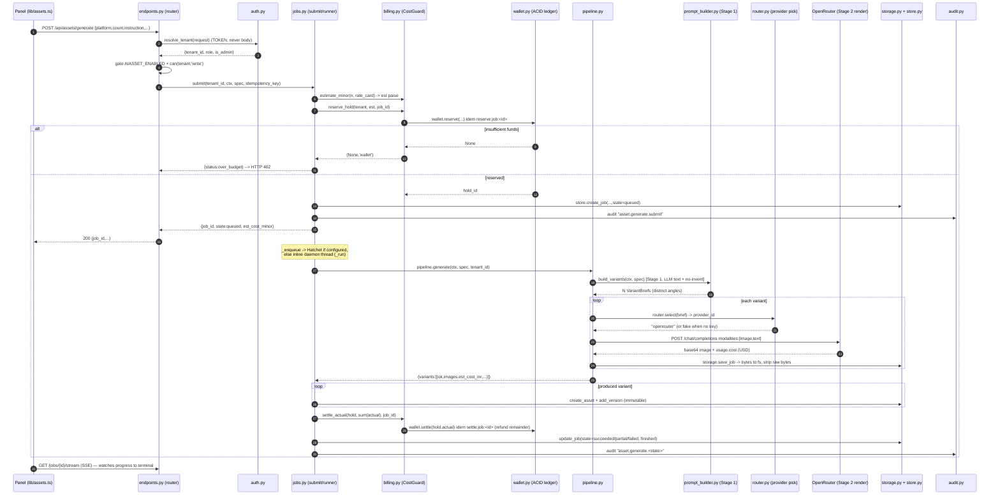
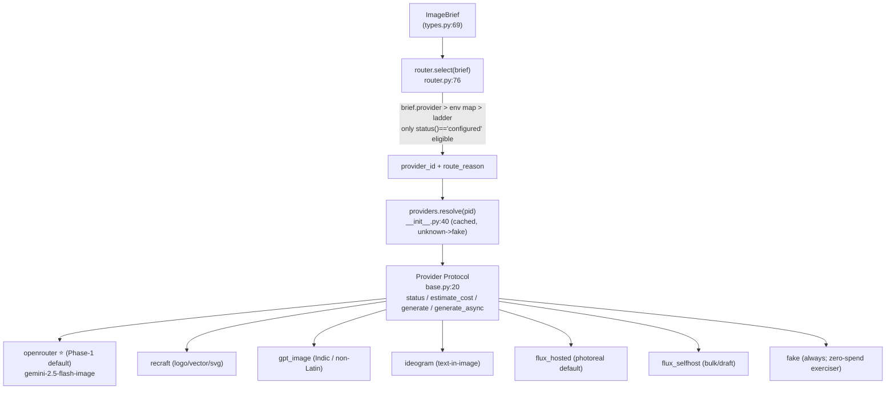
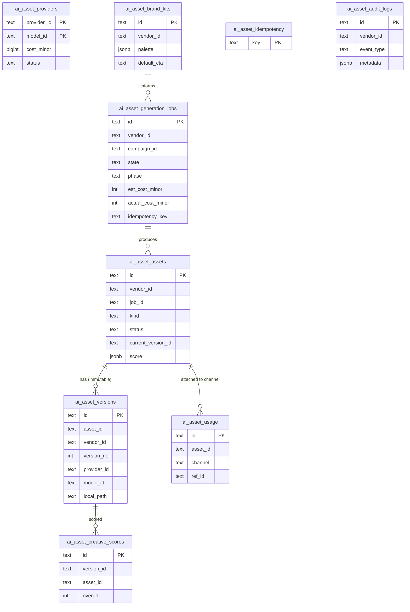

# 02 — The AI Asset Service (`:8310`)

> **What it is, in one sentence:** a **standalone FastAPI process** (its own venv, its own port `127.0.0.1:8310`, its own PG schema `ai_asset_*`) that turns a **campaign + a one-line instruction** into **on-brand banner images** through a **two-stage pipeline** (LLM writes the briefs → OpenRouter renders the pixels), metering every render against the platform **wallet** and recording it in the immutable **audit** ledger.
>
> It is the backend for **Creative Studio** in the panel. It ships **dormant** (`AIASSET_ENABLED=0`) — mounted but inert, byte-identical to the live system until a flag is flipped.

This is the new-teammate map for the service. Every box/edge below is grounded in real code (`file:line`).

- **Service code:** `droplet_work/ai_asset/` (the service shell, pipeline, jobs, billing, store, auth, endpoints)
- **Reused render engine:** `droplet_work/creative/image_banner_studio/` (the Provider abstraction + 6 adapters + router + storage)
- **Frontend client:** `famit-panel/lib/assets.ts` (the typed `/api/assets/*` binding)
- **On the box:** deployed at `/opt/famit-aiasset/`, systemd unit `famit-aiasset.service`

---

## 1. Where it lives in the platform

The AI Asset Service is a **dedicated coarse service**, not a module inside the monolith. It runs on the **backend box** (`168.144.153.145`, priv `10.122.0.4`) next to the voice monolith, but in its own process. The **panel never talks to it directly** — the **frontend box** (`143.110.247.249`, priv `10.122.0.2`) nginx reverse-proxies `/api/assets/` across the VPC to it.

**Grounding:**
- Standalone-service intent + own port/schema: `droplet_work/ai_asset/__init__.py:1`
- `sys.path` bootstrap so the standalone venv can `import wallet/audit/db/caller` from `/opt/famit-agent` (co-located **`mode=lib`**, flips to HTTP on extraction): `droplet_work/ai_asset/app/main.py:31` (env override `AIASSET_MONOLITH_PYPATH`, default `/opt/famit-agent`, `:37`)
- nginx route (verified on the live frontend box `/etc/nginx/sites-available/panel.famit.in`): `location /api/assets/ { proxy_pass http://10.122.0.4:8310/; }` — note the trailing slash strips the prefix, so the router is mounted with **no prefix** (`endpoints.build_router(..., prefix="")`, `endpoints.py:39`).
- Client base: `ASSET_BASE = "/api/assets"`, same `X-Auth` header convention as `lib/api.ts`: `famit-panel/lib/assets.ts:27`

---

## 2. The service shape (FastAPI app)

`ai_asset/app/main.py` is a thin shell. It does three things and nothing else at import time:

1. **Bootstraps `sys.path`** so the standalone venv can import the engine (`creative.image_banner_studio`) and the monolith shared libs (`wallet`/`audit`/`db.engine`/`caller`). `main.py:31`
2. **Mounts the authed router additively**, injecting the auth seam as callables — never a module-level router with hard-coded auth (the "media-gen security lesson"). `main.py:56` → `endpoints.build_router(auth.resolve_tenant, auth.can)`
3. **Lazy-applies the schema on startup** (`store.ensure_schema()`, a no-op if PG is down — never raises). `main.py:65`

Two routes are **always alive**, even fully dormant:

| Route | Gated? | Purpose | `file:line` |
|---|---|---|---|
| `GET /health` | no | liveness (always 200, no deps) — systemd/uptime probe | `main.py:75` |
| `GET /status` | no | **readiness / dormancy probe** the UI reads to render dormant-vs-live (config posture + schema + provider readiness, **no secrets**) | `main.py:81` |

Everything else lives on the **injected router** (`endpoints.build_router`) and is **`AIASSET_ENABLED`-gated → 503** except its own `/status`. So mounting the whole surface is byte-identical to the live system until the flag flips.

### The dormancy contract
The whole service defaults to the **safe-off** posture (`config.py:43`): master flag OFF, no provider keys → providers `not_configured` → the **`fake`** provider keeps the pipeline exercisable **at zero spend**, no service token, Hatchet dormant (inline fallback). The module is import-safe with **zero env set** and **never raises at import** (`config.py:1`). The frontend client mirrors this — a `503`/`404`/`401` from the service resolves to a calm "disabled/empty" shape and **never logs the panel out** (`assets.ts:42`, `handle401` is a deliberate no-op `:49`).

---

## 3. The generation pipeline (the two-stage core)

This is the heart of the service. **One "Create banner" click → one `ai_asset_generation_jobs` row** that the UI polls/streams, driven by a state machine, paid for by a wallet hold.

### State machine
`queued → running → streaming → (succeeded | partial | failed | cancelled)` with a finer `phase`: `queued → reading_campaign → building_prompts → rendering → scoring → storing → done` (`jobs.py:1`).

### End-to-end sequence

### Stage 1 — `prompt_builder.py` (the intelligence core, no spend)
`CampaignContext + GenerateSpec → N VariantBriefs`, each a **different marketing angle** (price / location / emotion / urgency / trust / problem-solution / benefit / offer / retargeting / comparison) with `headline/subhead/cta/visual_direction/size/style/hypothesis` **plus a rich `render_prompt`** (`prompt_builder.py:1`, `VariantBrief` `:147`, `CampaignContext` `:60`, `GenerateSpec` `:115`).

Two hard rules govern it:
- **Angle diversity** — N variants = N *different* angles, not N random images (`prompt_builder.py:13`).
- **NO-INVENT (fail-closed)** — a deterministic post-LLM validator **strips** any price / discount% / location / phone / RERA / guarantee / award / "approved/certified/100%/no.1" claim **not present verbatim** in the `CampaignContext.fact_blob()` (`prompt_builder.py:16`, `fact_blob` `:86`). The LLM is an **input, never the authority on facts**.

The Stage-1 LLM is **`google/gemini-2.5-flash` via OpenRouter** (`response_format: json_object`, temp 0), wired through an **injected callable** `set_llm_fn` so prod uses the real HTTP path and tests/dry-runs pass a MockLLM with **zero network** (`prompt_builder.py:197`, built-in transport `_openrouter_text` `:204`). Bad JSON → deterministic angle-table fallback, never stalls.

### Stage 2 — `pipeline.py` + the reused engine (the render)
`pipeline.generate()` (`pipeline.py:39`) calls Stage 1, then for **each** variant: `router.select(brief)` picks a provider → `providers.resolve(pid).generate(brief)` renders → `storage.save_job(brief, result)` writes bytes to disk and **strips raw bytes** from the dict. `dry_run=True` runs **Stage 1 only** — assemble prompts, never render, never spend (`pipeline.py:160`). The pipeline is gated behind `config.enabled()` (returns `not_enabled` when off) and **never raises** (`pipeline.py:56`).

---

## 4. The Provider abstraction (the reused render engine)

The service **does not own** an image-generation engine — it **reuses the built-but-undeployed `creative.image_banner_studio` engine** (`__init__.py:6`). That engine is a clean Provider plugin system.

**Provider contract** (`providers/base.py:20`): `status() → 'configured'|'not_configured'|'error'`, `estimate_cost(brief) → INR`, `generate(brief) → ImageResult` (**never raises**, returns non-ok on failure), `generate_async`. Adapters read keys **fresh via `os.getenv`** (so key rotation needs no restart) and are **dormant when unconfigured**.

**Registry** (`providers/__init__.py:21`): id → class. `resolve()` is cached, unknown id → `fake`. `all_status()` reports every provider's status (this powers `/status` and `/providers`).

**Router** (`router.py`): override order `brief.provider > per-job-type env map > built-in ladder`; only `configured` providers are eligible; if none are, it lands on **`fake`** so the pipeline is *always* runnable. Built-in ladder (`router.py:35`): logo/vector → `recraft`; non-Latin/Indic → `gpt_image`; text-in-image → `ideogram`; bulk/draft → `flux_selfhost`/`flux_hosted`; default → `flux_hosted`/`ideogram`. The universal fallback chain leads with **`openrouter`** (`__init__.py:34`, `router.py:61`). Every hop is recorded in `route_reason`.

**The OpenRouter adapter** (`providers/openrouter.py`) is the live default:
- Generates images through the **chat-completions** endpoint with `modalities:["image","text"]` (`openrouter.py:167`). Image returns **synchronously** as a base64 data-URL; the adapter **decodes to PNG bytes** and the raw data-URL is **never** returned upward or stored in PG (`openrouter.py:9`, `_decode_data_url` `:72`).
- Cost is **live** — it reads `usage.cost` (USD) from the response and settles **ACTUAL** (`estimated=False`); only the pre-flight estimate uses the rate-card seed `AIASSET_IMAGE_RATE_USD` default `$0.039` (`openrouter.py:128`, `:208`).
- Key resolution (founder typo first): `OPNEROUTER_API_KEY__<tenant>` → `OPENROUTER_API_KEY__<tenant>` → `OPNEROUTER_API_KEY` → `OPENROUTER_API_KEY` (`openrouter.py:54`; same precedence in `config.openrouter_key()` `config.py:57`).

---

## 5. Wallet + audit reuse (no new money mechanism)

`ai_asset/billing.py` is the **CostGuard** — a **thin wrapper over the proven `wallet.py` ACID ledger**. No new money mechanism; the F4 no-double-spend guarantee is reused, not reinvented (`billing.py:1`). Everything is **INTEGER PAISE**; USD→INR uses **ceil** so it never under-charges (`usd_to_inr_minor` `billing.py:53`).

The money flow (`billing.py:8`):
1. `estimate_minor(n, rate)` = `ceil(rate × n × COST_SAFETY)` (default safety 1.15, never under-reserve) — `billing.py:148`
2. `reserve_hold(...)` → wallet hold, idem `reserve:job:<job_id>` — `billing.py:161`
3. `settle_actual(...)` → charge actual, refund remainder, idem `settle:job:<job_id>` — `billing.py:190`
4. `release_hold(...)` on full failure/cancel, idem `release:job:<job_id>` — `billing.py:212`

**Two key safety details:**
- **Hold-backend tag**: every hold records whether it was minted by the real `wallet` (INTEGER id) or the `json` degrade shim (`hold_<hex>` id); settle/release dispatch to the *same* backend so a JSON hold never silently no-ops against `wallet.settle(int)` (`billing.py:15`). The `_JsonHold` shim (`billing.py:89`) reproduces no-double-settle semantics so the **whole pipeline runs offline at zero spend** on a build box with no wallet/PG.
- **Two balances caveat** (F4): this service charges the **`prepaid_wallet`** (`wallet_accounts`), never the legacy `prepaid` `billing.balance`; the plan branch is decided at the gate, the two are never summed (`billing.py:19`).

**Audit** — every generation/lifecycle event is recorded to **BOTH** legs (`jobs.py:42`):
- the cross-module immutable ledger via `audit.record(... channel="ai_asset")` → PG `events` (the monolith shared `audit` module), and
- the per-vendor mirror `ai_asset_audit_logs` (INSERT/SELECT-only at the DB → tamper-evident).

**Crash safety:** a worker death mid-job leaves the hold OPEN; `wallet.sweep_expired_holds` reclaims it (the proven TTL primitive) and a reconcile pass marks the job failed — no money leaks, no new mechanism (`jobs.py:20`).

---

## 6. Async / Hatchet jobs

`jobs.submit()` (`jobs.py:77`) does **estimate → reserve → persist `queued` → enqueue**, then `_enqueue()` (`jobs.py:152`) routes:
- **Hatchet** when `AIASSET_HATCHET_HOST_PORT` is set → the F3 Hatchet worker (durable, survives a restart) via `workflow.enqueue(job_id)` (`jobs.py:161`). The deploy ships a **disabled** `famit-aiasset-worker.service` for this (`systemd/famit-aiasset-worker.service`, `ExecStart=... -m ai_asset.app.workers.hatchet_worker`).
- **inline fallback** otherwise → a daemon thread running `_run(job_id)` so `submit()` returns immediately and the UI loader shows (`jobs.py:157`).

The **state machine + persistence are identical in both modes**; only the executor differs (`jobs.py:9`). The runner has an **idempotent re-entry guard** — a Hatchet retry or double inline call won't re-render/re-charge a job already past `queued` (`jobs.py:194`). Idempotency at submit: a retried submit with the same `idempotency_key` returns the **same** job (`jobs.py:89`; UNIQUE clash handled in `store.create_job` `store.py:202`).

> **Status note (2026-06-11):** the Hatchet cross-box gRPC cutover has not landed; the live path is the **inline threaded fallback**. The worker unit is installed but disabled.

---

## 7. The data model — `ai_asset_*` schema

PG-native, **RLS-scoped by `vendor_id`** (FORCE-RLS), applied **lazily** via `store.ensure_schema()` — **never Alembic**, kept off the P1 keystone migration chain (`schema.sql:6`, `store.py:62`). Every store op is **one RLS-scoped txn** via `db.engine.session(tenant_id=vendor_id, is_admin)` — the same GUC-in-txn discipline the rest of the platform uses (`store.py:98`). All ops **degrade to `None`/`[]` when PG is down and never raise** (`store.py:10`).

**Key invariants:**
- **Versions are immutable** — an edit/regenerate appends a *new* version row; the original is never overwritten (`store.add_version` `store.py:325`, `ON CONFLICT (asset_id, version_no) DO NOTHING`). Lifecycle = **status flips, no hard DELETE** (`set_asset_status` `store.py:393`).
- **`local_path` never leaves the API** — `public_dict()` strips it from every record before it serializes (`store.py:174`); the bytes are streamed only via `GET /assets/{id}/raw` → `FileResponse` (`endpoints.py:207`).
- **Tenant-AGNOSTIC `ai_asset_providers`** (read-all, admin-write); everything else is vendor-scoped (`schema.sql:21`).
- `ai_asset_audit_logs` is **immutable** (INSERT/SELECT-only grant) — `schema.sql:14`.
- Table list + RLS introspection: `store.AI_ASSET_TABLES` `store.py:124`, `schema_report()` reports `forced_rls` per table `:137`.

---

## 8. The auth seam (tenant-from-TOKEN, never from body)

Because the service is standalone, it must derive the tenant **itself** from the credential the panel forwards. `ai_asset/auth.py` is the seam, and it enforces the **#1 platform isolation rule**: the tenant is **always token-derived, never read from the body** — a body `tenant_id` is **IGNORED** (`auth.py:1`, enforced at the route in `endpoints.py:117`).

Resolution precedence (`auth.py:105`, all additive/reuse):
1. **`mode=lib`** (co-located): verify the panel/AIM-minted **scoped access JWT** against the shared HS256 secret (`auth.access_claims(cred)`), reading tenant/role/is_admin straight from the **verified claims** — `auth.py:117`. The secret is lazily loaded from the monolith's `SECRET_FILE` (default `/opt/famit-agent/var/secret`, override `AIASSET_JWT_SECRET_FILE`) since the standalone process never ran `caller`'s `auth.init()` (`_ensure_token_secret` `auth.py:61`).
2. **Fallback:** `caller.resolve_tenant(request)` — the full monolith precedence (JWT + legacy hmac + bare-password admin) — `auth.py:144`.
3. **Dormant/offline:** neither importable → `None` → **401**. Never raises (`auth.py:18`).

`can(tenant, action)` reuses `caller.can` with a **conservative fallback that never widens** (`auth.py:179`). `service_token_ok()` authenticates internal/provider/AIM-dispatch callers with `AIASSET_SERVICE_TOKEN` — **dormant-until-set → always False** (`auth.py:200`). RLS is then **re-enforced** on the executing side; the §9 isolation suite ships a **negative control** (a body-reading variant) to prove the teeth (`auth.py:9`). A cross-tenant id returns **404, no field leak** (`endpoints.py:13`, `store.get_asset` returns `None` cross-tenant → 404 `store.py:356`).

---

## 9. The API surface (`/api/assets/*`)

Built by `endpoints.build_router(resolve_tenant, can)` (`endpoints.py:37`). Every route except `/status` is `AIASSET_ENABLED → 503`-gated; writes also pass `can(tenant,'write')`.

| Method + path | What it does | `endpoints.py` |
|---|---|---|
| `GET /status` | un-gated dormancy probe (config + persistence + billing + providers) | `:70` |
| `GET /providers` | model/provider registry for the "Model" selector | `:94` |
| `POST /generate` | **the main entry** → `jobs.submit`; `402` over_budget, `503` unavailable | `:107` |
| `GET /jobs` · `GET /jobs/{id}` | list / poll a job (id RLS-scoped → 404 cross-tenant) | `:135` `:144` |
| `GET /jobs/{id}/stream` | **SSE** live progress to a terminal state | `:154` |
| `POST /jobs/{id}/cancel` | release the hold, mark cancelled | `:166` |
| `GET /assets?<facets>` | library list (status/platform/campaign/kind), newest-first | `:181` |
| `GET /assets/{id}` | asset + all versions | `:194` |
| `GET /assets/{id}/raw` | stream bytes (`FileResponse`; `local_path` never in JSON) | `:207` |
| `POST /assets/{id}/edit` · `/regenerate` | NL edit / new angle → a **new** job/version (original kept) | `:230` `:234` |
| `POST /assets/{id}/approve` · `/reject` | lifecycle flip (gates attach) | `:265` `:269` |
| `POST /assets/{id}/attach` · `/attach-whatsapp` | **approved-only** (409 if not) → `ai_asset_usage` handoff to whatsapp/meta_ads/workflow | `:290` `:344` |
| `POST /variation-from-upload` | multipart reference image → variation job | `:315` |
| `GET/POST /brand-kits` | brand-memory CRUD | `:349` `:365` |

The frontend client `famit-panel/lib/assets.ts` binds exactly this surface (the comment at `:5` calls it FROZEN) and is **dormant-safe**: 503/404/401 resolve to calm disabled/empty shapes (`assets.ts:281` `getAssetStatus`, `:360` `listAssets`). One gotcha documented in the client: `POST /generate` reads a **JSON body** (not multipart) — a FormData POST 422s (`assets.ts:308`).

---

## 10. Deployment & the extraction seam

- **systemd:** `famit-aiasset.service` runs `uvicorn ai_asset.app.main:app --host 127.0.0.1 --port 8310 --workers 2`, **localhost-only** (never world-exposed), own venv `/opt/famit-aiasset/.venv`, `EnvironmentFile=-/opt/famit-aiasset/.env`, inert until `AIASSET_ENABLED=1` (`systemd/famit-aiasset.service`).
- **render worker:** `famit-aiasset-worker.service` (Hatchet) — installed **disabled** until the cutover.
- **`mode=lib` ↔ `mode=http` seam** (`config.mode()` `config.py:50`): today it co-locates and **imports** `wallet`/`audit`/`db.engine`/`caller` directly via the `sys.path` add. On extraction to a GPU droplet it flips to **HTTP calls** (no shared-lib import) — the design seam is already in the code (`__init__.py:6`, `main.py:8`).
- **Storage:** box-fs `var/creatives/<job_id>/{brief.json,result.json,N.png}` + append-only `index.jsonl` (`storage.py:8`), with a **best-effort DO Spaces mirror** when `SPACES_*` is set (reuses the dormant `asset_library.spaces` uploader — no new S3 client, `storage.py:28`).

---

## 11. Where to look first (new-teammate cheat-sheet)

| You want to… | Open |
|---|---|
| Understand the request flow | `ai_asset/endpoints.py` (router) → `jobs.py` (submit/runner) → `pipeline.py` |
| Change how briefs/angles are written | `ai_asset/prompt_builder.py` (Stage 1, no-invent validator) |
| Add/swap an image model | `creative/image_banner_studio/providers/` + one line in `providers/__init__.py:21`; routing in `router.py` |
| Touch money | `ai_asset/billing.py` (wrapper over `wallet.py`) — never invent paise math |
| Touch the DB | `ai_asset/store.py` + `ai_asset/schema.sql` (RLS by `vendor_id`, lazy ensure) |
| Understand auth/isolation | `ai_asset/auth.py` (token-derived tenant) |
| The panel side | `famit-panel/lib/assets.ts` + `famit-panel/app/creative/*` |
| Config/flags | `ai_asset/config.py` (`AIASSET_ENABLED`, keys, caps, mode) |
