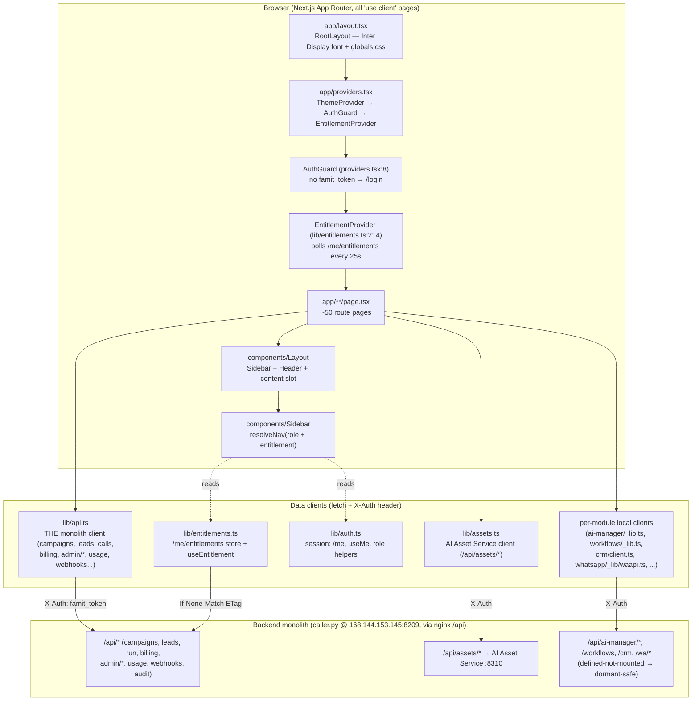
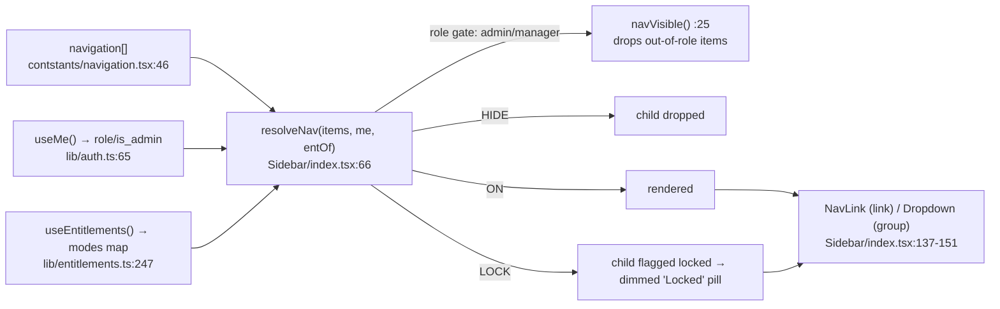
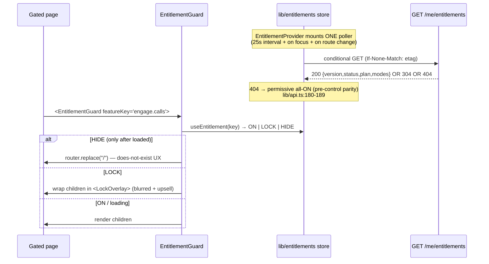
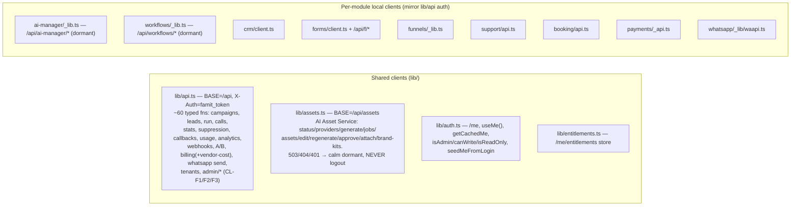

# 03 — Frontend (`famit-panel`)

> **Onboarding map for the Next.js panel.** Every box/edge below is grounded in real code (`file:line`).
> The panel is a **Core_2 dashboard kit** (`package.json:2` → `"name": "core-2"`) with the data layer rewired
> to the Famit backend monolith. It is a Next.js 15 App Router app (React 19, Tailwind v4) deployed at
> `panel.famit.in` on the frontend box (`root@143.110.247.249`, port `:3001`, fronted by nginx).

---

## 1. The big picture (how the panel is wired)

**Three cross-cutting truths to internalize first:**

1. **Auth is a localStorage bearer token.** Login stores `famit_token` (`app/login/page.tsx:22`); every client
   attaches it as the `X-Auth` header (`lib/api.ts:11-14`). A `401` on the *monolith* client clears the token +
   `famit_me` and hard-redirects to `/login` (`lib/api.ts:16-23`). **Tenant is always derived server-side from the
   token, never sent in the body** — a recurring comment throughout `lib/api.ts`.
2. **Entitlements (HIDE / LOCK / ON) are cosmetic.** The whole `lib/entitlements.ts` store, `resolveNav`,
   `EntitlementGuard`, and `LockOverlay` only spare the user a flash of a page they can't use. The backend
   choke-point (`404` hidden / `402` locked, fail-closed) is the only real boundary (`lib/entitlements.ts:11-16`).
3. **Newer modules each own a thin local client** that mirrors `lib/api.ts` auth exactly (same `BASE`, `X-Auth`,
   `handle401`) because their backend routers are **defined-not-mounted** today → every read degrades to a
   premium "dormant / coming soon" state instead of an error wall (`app/ai-manager/_lib.ts:1-15`,
   `app/workflows/_lib.ts:5-11`).

---

## 2. The shared shell

### 2.1 Boot sequence (`layout.tsx` → `providers.tsx` → `Layout`)

| Layer | File | What it does |
|---|---|---|
| **RootLayout** | `app/layout.tsx:45` | Loads **Inter Display** (5 weights 300–700) as the single app-wide font via `next/font/local` (`:7-31`); Gilroy was deliberately dropped (`:33-38`). Wraps everything in `<Providers>`. iOS viewport zoom guard (`:62`). |
| **Providers** | `app/providers.tsx:27` | `ThemeProvider` (next-themes, dark/light) → `AuthGuard` → `EntitlementProvider`. Skips the entitlement poller on `/login` (no token) (`:28-38`). |
| **AuthGuard** | `app/providers.tsx:8` | On every route except `/login`, if no `famit_token` in localStorage → `router.replace("/login")` (`:12-18`). |
| **Layout** | `components/Layout/index.tsx:12` | The per-page chrome: fixed `Sidebar` + sticky `Header` (carries the page `title`) + a centered content slot. Mobile drawer state + backdrop. Pages opt in with `<Layout title="...">`. |

> **Single source of the page title:** `Layout` takes a `title` prop and renders it once via `Header`. The old
> `PageHeader` component still exists in `components/PageHeader` but the W1 overhaul collapsed titles into `Layout`.

### 2.2 Navigation + `resolveNav` (role × entitlement filtering)

The sidebar IA is **data** in `contstants/navigation.tsx:46` (note the typo'd dir name `contstants`). It's an
8-section collapsible tree (`Command · AI Manager · Grow · Creative Studio · Sell · Engage · Automate · Money ·
Intelligence · Foundation · Super Admin`). Each entry is either a **link** (`{title, icon, href}`) or a
**collapsible group** (`{title, icon, list:[...]}`).

- **Role gating** (`Sidebar/index.tsx:25-30`): `roles:"admin"` → admins only; `roles:"manager"` → managers+admins
  (hidden for read-only agents); none → everyone. Works on top-level entries **and** group children. A group with
  zero visible children is dropped entirely (`:83`). The whole **Super Admin** group is `roles:"admin"`
  (`navigation.tsx:179`).
- **Entitlement gating** (`Sidebar/index.tsx:66-90`): a child whose `feature_key` resolves to `HIDE` is dropped
  like an out-of-role child; `LOCK` survives but is flagged `locked` (the `Dropdown` renders a dimmed pill); the
  whole group is dropped if its own `feature_key` is `HIDE`. Resolver is the pure `modeOfIn(payload, key)`
  (`lib/entitlements.ts:202`).
- While the role is still unknown (cache cold), only always-visible items render to avoid flashing admin links to
  a vendor (`Sidebar/index.tsx:99-106`).

### 2.3 The design system (Core_2 kit, reused not rebuilt)

~70 reusable primitives live in `components/`. The load-bearing ones for almost every page:

| Component | Role |
|---|---|
| `Layout`, `Sidebar`, `Sidebar/Dropdown`, `Header`, `NavLink`, `Logo`, `ThemeButton` | the shell |
| `Card`, `Table`, `TableRow`, `KpiCard`, `Tabs`, `Badge`, `Button`, `Icon`, `Modal`, `Field`, `Select`, `Search`, `Spinner` | the page-body kit |
| `Editor` (TipTap), `Range`, `Switch`, `Checkbox`, `DateAndTime`, `Emoji`, `Filters` | form/builder bits |
| **`EntitlementGuard`**, **`EntitlementToggle`**, **`LockOverlay`** | the control-layer trio (see §4) |
| `lib/badges.tsx` | `StatusBadge` / `OutcomeBadge` / `InterestBadge` / `ScoreBadge` — semantic call/lead state pills |

Styling: Tailwind v4 with a **semantic token palette** (`bg-b-surface1`, `text-t-primary`, `fill-primary-02`,
`var(--primary-02)` …) defined in `app/globals.css`; pages reference tokens, not raw hex (recent commits enforce
"token purity"). Charts use `recharts`; the workflow builder uses `@xyflow/react` (React Flow).

---

## 3. The page tree (`app/**`)

```mermaid
graph TD
    Root["/  (app/page.tsx)<br/>Dashboard — stats, recent calls, hot leads, usage"]
    Login["/login (app/login/page.tsx)<br/>email+pwd → famit_token + seedMeFromLogin"]

    subgraph A["A · Command"]
      Root
    end

    subgraph AIM["A2 · AI Manager (group, roles:manager) — local client _lib.ts"]
      AIMroot["/ai-manager → redirects to overview"]
      AIMov["/ai-manager/overview — engine summary"]
      AIMtest["/ai-manager/test — NLU Test Console (Try it)"]
      AIMcmd["/ai-manager/commands — Command History"]
      AIMapp["/ai-manager/approvals — Pending Approvals"]
      AIMcap["/ai-manager/capabilities — Intent Catalog (static)"]
      AIMset["/ai-manager/setup — profile + risk/PIN config"]
      AIMusr["/ai-manager/users — Authorized Users (Team)"]
      AIMsess["/ai-manager/sessions/[id] — session transcript"]
      AIMcc["/ai-manager/command-center — (legacy hub)"]
    end

    subgraph B["B · Grow"]
      Camp["/campaigns — list/create (lib/api)"]
      Ads["/ads — Ad Automation (UI scaffold)"]
      Fun["/funnels — funnel builder (_lib.ts)"]
      Forms["/forms + /forms/[id] — Form Builder (client.ts)"]
    end

    subgraph B2["B2 · Creative Studio — lib/assets.ts (:8310)"]
      Crv["/creative — Studio (generate)"]
      CrvLib["/creative/library — reusable asset store"]
      CrvBrand["/creative/brand — Brand Kit"]
    end

    subgraph C["C · Sell"]
      Leads["/leads — leads table + scoring (lib/api)"]
      Crm["/crm + /crm/[id] — pipeline (client.ts)"]
    end

    subgraph D["D · Engage"]
      Run["/run — Run a Campaign (lib/api + _lib/audience)"]
      Calls["/calls — Call Logs (lib/api)"]
      Cbs["/callbacks — Callbacks (lib/api)"]
      Wa["/whatsapp — WA campaign builder (_lib/waapi)"]
      Sup["/support — Customer Support (api.ts)"]
      Book["/booking — Booking (api.ts)"]
    end

    subgraph E["E · Automate"]
      Wf["/workflows — React-Flow builder (_lib.ts)"]
      Wh["/webhooks — CRM webhooks (lib/api)"]
    end

    subgraph F["F · Money"]
      Pay["/payments — Payments (_api.ts)"]
      BillOv["/billing/overview — vendor-cost rollup"]
      BillV["/billing/vendors + /[id] — per-vendor cost"]
      BillEx["/billing/explorer — Spending (per-call cost)"]
      BillAu["/billing/audit — ledger vs vendor audit"]
      BillPl["/billing/plan — Plan & wallet"]
    end

    subgraph G["G · Intelligence"]
      An["/analytics — funnel analytics (lib/api)"]
    end

    subgraph H["H · Foundation"]
      Sup2["/suppression — Do-Not-Call (lib/api)"]
      Ven["/vendors — tenant admin (lib/api, roles:admin)"]
      Set["/settings — Settings"]
    end

    subgraph SA["Super Admin (group, roles:admin) — Control Plane /admin/*"]
      SAov["/super-admin — Control Overview (fleet)"]
      SAven["/super-admin/vendors + /[id] — Vendor Workspace + permission matrix"]
      SAfl["/super-admin/flags — global Feature Flags"]
      SApl["/super-admin/plans — Plans editor"]
      SAus["/super-admin/usage — fleet Usage analytics"]
      SAau["/super-admin/audit — immutable control Audit log"]
    end
```

**Page conventions (every page is `"use client"`):**
- Wraps body in `<Layout title="...">`; fetches data in a `useEffect` on mount; holds `loading`/`error`/data in
  `useState`; renders skeletons then real data (canonical example: `app/page.tsx:58-101`).
- **Dynamic routes:** `/crm/[id]`, `/forms/[id]`, `/billing/vendors/[id]`, `/super-admin/vendors/[id]`,
  `/ai-manager/sessions/[id]`.
- **Builder pages** carry private sub-trees: `app/whatsapp/_steps/*` (11-step wizard), `app/workflows/_nodes/*`
  + `_editor.tsx`/`_preview.tsx` (React-Flow canvas), `app/run/_lib/audience.ts` (audience builder),
  `app/creative/_components/*` + `_hooks/*` (asset studio), `app/ai-manager/_home.tsx`/`_tryit.tsx`/`_setup.tsx`/
  `_shared.tsx` (shared AIM UI).

---

## 4. The control layer on the client (HIDE / LOCK / ON)

This is the most important non-obvious subsystem — three files implement the founder's per-feature gating.

- **`lib/entitlements.ts`** — a single module-level store + tiny pub/sub (no React Context). `EntitlementProvider`
  (`:214`) runs the only poller; `useEntitlement(key)` (`:262`) and `useEntitlements()` (`:247`) subscribe via
  `useSyncExternalStore`. Conditional-GET with ETag; `onAccessSignal(status)` (`:187`) lets any page's `402/404/401`
  trigger a re-pull (self-healing). Modes: `"on"→ON`, `"locked"→LOCK`, `"hidden"→HIDE`, **unknown key → ON**
  (permissive). Cache in localStorage keys `famit_ent` / `famit_ent_etag`.
- **`components/EntitlementGuard`** — per-route guard (`:49`). `HIDE`→redirect to `/` (only after `loaded` to avoid
  flicker-bounce, `:69-78`); `LOCK`→`LockOverlay`; revalidates on route change.
- **`components/LockOverlay`** — renders the real page blurred + `inert` behind a centered upsell card with
  "Upgrade plan" (→ `/billing/plan`) + "Contact us" CTAs. Pure presentation from existing primitives.
- **`components/EntitlementToggle`** — the admin-side 3-state row (`On | Lock | Hide` + provenance pill + Reset)
  used in the Super Admin vendor permission matrix. `is_core` features (login/settings/billing-pay/dashboard) can
  be locked but **never hidden** (anti-lockout floor, `:159-163`).

> **`EntitlementGuard` is shipped but not yet wired into the route pages** (grep finds no `<EntitlementGuard>` usage
> in `app/**` today). Gating currently happens at the **nav level** (`resolveNav`) + the **backend** (404/402). The
> guard is the staged per-page layer for a later wave.

---

## 5. The data clients in detail

**Why two patterns?** `lib/api.ts` + `lib/assets.ts` cover the **live** backend surfaces. The per-module local
clients (`crm/client.ts`, `support/api.ts`, `booking/api.ts`, `payments/_api.ts`, `funnels/_lib.ts`,
`forms/client.ts`, `whatsapp/_lib/waapi.ts`, `ai-manager/_lib.ts`, `workflows/_lib.ts`) each re-declare the same
`BASE = NEXT_PUBLIC_API_BASE || "/api"` + `X-Auth` + `handle401` convention, but map non-200s to a **dormant** state
so a defined-not-mounted backend renders "coming soon" rather than crashing. This decoupling also avoids two
parallel sessions colliding on `lib/api.ts`. `lib/assets.ts` is special: its `handle401` is a deliberate **no-op**
(`lib/assets.ts:49-51`) so an asset-service auth failure never nukes the whole-panel session.

### 5.1 Which page calls which API (representative map)

| Page | Client | Key calls (`fn` → `/api/...`) |
|---|---|---|
| `/` Dashboard | `lib/api` | `getStats` → `/stats`, `getCalls` → `/calls`, `getLeads({hot})` → `/leads`, `getUsage` → `/usage` |
| `/login` | `lib/api` | `login` → `POST /login` (stores `famit_token`) |
| `/leads` | `lib/api` | `getLeads`, `getLeadBatches` → `/leads/batches`, `addLeads` → `POST /leads` |
| `/run` | `lib/api` (+`_lib/audience`) | `getCampaigns`, `getLeads`, `run` → `POST /run` (handles `402` insufficient_balance, `429` cap, `403`), `getStatus` → `/status?job=` |
| `/calls` | `lib/api` | `getCalls`, `getCallDetail` → `/calls/{id}` |
| `/campaigns` | `lib/api` | `getCampaigns`, `saveCampaign`, `deleteCampaign`, `extract` → `POST /extract`, `getVoices` |
| `/callbacks` | `lib/api` | `getCallbacks`, `addCallback`, `cancelCallback` |
| `/suppression` | `lib/api` | `getSuppression`, `addSuppression`, `deleteSuppression`, `optOut` |
| `/analytics` | `lib/api` | `getAnalytics` → `/analytics`, `getCampaignAB` → `/campaigns/{id}/ab` |
| `/webhooks` | `lib/api` | `getWebhooks`, `createWebhook`, `deleteWebhook` |
| `/billing/*` | `lib/api` | `getBillingOverview/Vendors/Vendor/Explorer/Audit`, `postBillingSync`, `getBilling`, `setBilling` |
| `/vendors` | `lib/api` | `getTenants`, `createTenant`, `setTenantLimits` |
| `/super-admin` (+children) | `lib/api` (CL-F1/F2/F3) | `getAdminVendors` → `/admin/vendors`, `getAdminVendor` → `/admin/vendors/{id}`, `setVendorEntitlement/Plan/Status`, `getAdminFlags/Plans/Features`, `getControlAudit` → `/audit?channel=control`, `getUsageAll` → `/usage/all` |
| `/creative` (+library/brand) | `lib/assets` | `getAssetStatus`, `getProviders`, `generate`, `listAssets`, `getAsset`, `editAsset`, `approveAsset`, `attachAsset`, `getBrandKits` |
| `/whatsapp` | `whatsapp/_lib/waapi` + `lib/api`(send) | local WA builder client + `sendWhatsApp`/`getWhatsAppLog` |
| `/ai-manager/*` | `ai-manager/_lib.ts` | `getAimStatus/Summary/Commands/Users/Profile`, `testCommand`/`confirm`/`execute`, `register/verify/revokeAimNumber` (all dormant-safe) |
| `/workflows` | `workflows/_lib.ts` | local builder client → `/api/workflows/*` (dormant) |
| `/crm`,`/support`,`/booking`,`/payments`,`/forms`,`/funnels` | own `client.ts`/`api.ts`/`_lib.ts` | module-local CRUD, dormant-safe |

> **Graceful-degradation note for the new teammate:** the Super Admin `getAdminVendors`/`getAdminVendor` functions
> auto-compose a fallback from `/usage/all` + `/tenants` when `/admin/vendors` returns `404` (control off / older
> box) — `lib/api.ts:763-794`. Same pattern repeats across the file: a `404` resolves to an empty-but-valid shape so
> a page never error-walls. The static feature-registry seed lives at `lib/api.ts:897` (`FEATURE_REGISTRY`).

---

## 6. Quick-start for the next teammate
- **Run it:** `cd famit-panel && npm run dev` (Next 15, port 3000 locally; prod `:3001`). Set
  `NEXT_PUBLIC_API_BASE` to point at the backend; default is the nginx-proxied `/api`.
- **Where to add a page:** create `app/<route>/page.tsx` (`"use client"`, wrap in `<Layout>`), add it to
  `contstants/navigation.tsx`, and either reuse `lib/api.ts` or add a dormant-safe local `client.ts`.
- **Where auth/role lives:** `lib/auth.ts` (`useMe`, `canWrite`, `isAdmin`). **Where gating lives:**
  `lib/entitlements.ts` + `resolveNav` (nav) + backend 404/402 (real). **Don't trust the client gate** — it's
  cosmetic by design.
