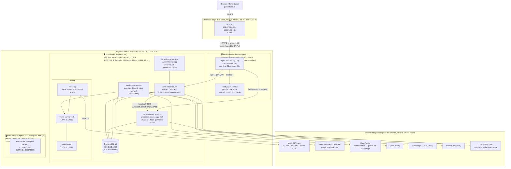
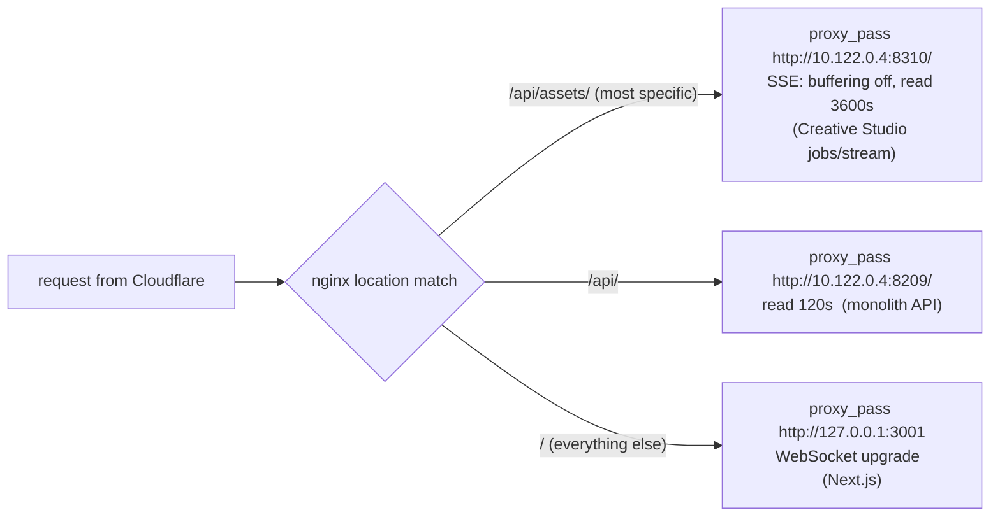
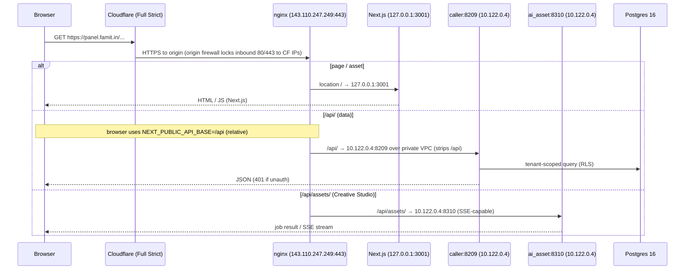

# 04 — Deployment & Infrastructure Topology

> **Scope:** the live production topology of Famit / Axcrio — every droplet, the systemd
> services + Docker containers on each, the ports, the private VPC, the nginx routing, the
> firewalls (host UFW + DO Cloud Firewall), and every external integration.
>
> **Grounding:** every box / service / port / rule below was read **read-only off the live
> boxes** on 2026-06-11 (`ss`, `systemctl`, `ufw`, `docker ps`, nginx config) and
> cross-checked against the fortress hand-over docs. Inferred / not-directly-probed items
> are marked. This is the onboarding map — start here, then read the per-module docs.

---

## 0. TL;DR for a new teammate

- **Two production droplets** in DigitalOcean **blr1**, on one private VPC `10.122.0.0/20`
  (VPC id `61f1950d-a7c4-4144-99b9-f1cda3d4c627`):
  - **`famit-panel-2`** — the *frontend* box (`143.110.247.249`, priv `10.122.0.2`). Runs
    **Next.js panel** + **nginx**. Holds ~no secrets. Born-hardened, **egress-locked**.
  - **`famit-livekit`** — the *backend* box (`168.144.153.145`, priv `10.122.0.4`). Runs the
    **monolith API**, the **voice agent**, the **dial bridge**, the **AI-Asset/Creative**
    service, **Postgres 16**, and **LiveKit + SIP + Redis** (Docker).
- A **third droplet — `famit-hatchet`** (`68.183.94.38`, priv `10.122.0.3`) — exists for the
  Hatchet durable-orchestration spine but is **not yet wired into the request path** (its
  `:7077` is filtered from the backend; caller.py cutover deferred). Documented for context.
- **Visitors never touch the origin directly.** `panel.famit.in` is **fronted by Cloudflare
  (Full Strict)**; Cloudflare → nginx on the frontend box → (over the **private VPC**) the
  backend services. The browser only ever talks to `https://panel.famit.in`.
- **The browser's API base is the relative path `/api`** (`NEXT_PUBLIC_API_BASE=/api`), so
  all `/api/*` calls hit nginx and get proxied — the backend IP is never exposed to the
  client.

---

## 1. Deployment / topology diagram



---

## 2. The boxes

| Box | DO id | Public IP | VPC priv IP | Role | Notes |
|---|---|---|---|---|---|
| **famit-panel-2** | 576010005 | `143.110.247.249` | `10.122.0.2` | Frontend: Next.js + nginx | Born-hardened, holds ~no secrets, **egress-locked** DO firewall. SSH **root** only. |
| **famit-livekit** | 574914961 | `168.144.153.145` | `10.122.0.4` | Backend API + voice + DB + LiveKit | Healthy, mostly untouched since fortress rebuild. SSH **famit** user. |
| **famit-hatchet** | 576483610 | `68.183.94.38` | `10.122.0.3` | Hatchet spine + Logto OIDC | Same VPC; **not yet in request path** (`:7077` filtered from backend). |

All three are **blr1**, same VPC `10.122.0.0/20`. (Note: the frontend box also carries a
second interface `10.47.0.5/16` — the default DO VPC — but **all app traffic uses
`10.122.0.0/20`**.)

---

## 3. Services, ports & what listens where

### 3a. Frontend box `famit-panel-2`

| Service | Cmd | Bind | Exposure |
|---|---|---|---|
| `nginx.service` | reverse proxy + TLS | `0.0.0.0:80`, `0.0.0.0:443` | Public (via Cloudflare) |
| `famit-panel.service` | `next start -H 127.0.0.1 -p 3001` (`/opt/famit-panel`, `NODE_ENV=production`) | `127.0.0.1:3001` | **Loopback only** — reachable only through nginx |

`NEXT_PUBLIC_API_BASE=/api` → the browser calls **relative** `/api/...`, which nginx proxies.

### 3b. Backend box `famit-livekit`

| Service | Cmd (`/opt/...`) | Bind | Who reaches it |
|---|---|---|---|
| `famit-caller.service` | `uvicorn caller:app --host 0.0.0.0 --port 8209` (wd `/opt/famit-agent`, venv `/opt/capsy-agent/.venv`) | `0.0.0.0:8209` | nginx `/api/` from `10.122.0.2` (UFW-locked) |
| `famit-aiasset.service` | `uvicorn ai_asset.app.main:app --host 10.122.0.4 --port 8310 --workers 2` (wd `/opt/famit-aiasset`) | `10.122.0.4:8310` | nginx `/api/assets/` + caller loopback `AIASSET_LOOPBACK_BASE=http://10.122.0.4:8310` |
| `famit-agent.service` | `python /opt/famit-agent/agent.py start` (LiveKit voice worker) | no inbound port (worker) | LiveKit dispatch |
| `famit-bridge.service` | `uvicorn bridge:app --host 0.0.0.0 --port 8208` (scheduler → LiveKit dial) | `0.0.0.0:8208` | legacy `168.144.125.155` UFW rule (old box, now dead) |
| `postgresql@16-main` | Postgres 16 | `127.0.0.1:5432` | local app processes only |
| Docker `livekit-server` v1.8 | LiveKit media server | `127.0.0.1:7880` | agent + SIP (loopback / VPC) |
| Docker `livekit-sip` | SIP gateway | `UDP 5060`, `RTP UDP 10000-10200` | Vobiz trunk |
| Docker `livekit-redis` 7 | LiveKit state | `127.0.0.1:6379` | livekit-server |

Other loopback ports seen but not in the request path: `8090` (python), `8111`, `6380` (redis),
`8208` (bridge). `8208`/`8209` both listen `0.0.0.0` but are gated at UFW.

---

## 4. nginx routing (the load-bearing edge map)

`/etc/nginx/sites-enabled/panel.famit.in` — two server blocks (`:80` for ACME + CF
Always-HTTPS, `:443` TLS). Both share the **same three locations, in this precedence**:



- Both `/api/` proxies have a **trailing slash** → nginx **strips the `/api` prefix** before
  forwarding (backend sees `/...`, not `/api/...`).
- Rate limit: `limit_req_zone … rate=20r/s` + `burst=40 nodelay` on both `/api*` locations.
- `/api/assets/` gets **SSE handling** (`proxy_buffering off`, `Connection ""`, 3600s read) for
  Creative-Studio job streaming; `/api/` is plain 120s.
- Hardening headers: HSTS, X-Frame-Options SAMEORIGIN, nosniff, Referrer-Policy; scanner
  UA block (nikto/sqlmap/nmap/…); `client_max_body_size 25m`.
- TLS cert: Let's Encrypt `/etc/letsencrypt/live/panel.famit.in/`, TLS 1.2/1.3.

---

## 5. The request path (visitor → response)



Voice path is **out-of-band** (no nginx): Vobiz SIP trunk ⇄ `livekit-sip` (UDP 5060 / RTP)
⇄ `livekit-server` ⇄ `famit-agent` (which calls Groq / Sarvam / ElevenLabs for the LLM/STT/TTS
loop). Calls are initiated by `famit-bridge` / `famit-caller`.

---

## 6. Network & firewalls (two layers)

### Layer 1 — DO Cloud Firewall (the headline anti-DDoS control)

`fortress-panel-fw` (id `c0e34e18-b696-4912-a3a4-566102e0945c`, tag `fortress`) on the
**frontend** box:
- **Inbound:** 22 (key-only), 80, 443 (+icmp) — in steady state 80/443 are **locked to the 15
  Cloudflare CIDRs** so the origin can't be hit directly.
- **Outbound = allow-list only** (DNS/NTP + 80/443 + `:8209`→backend). This is the lesson from
  the June-2026 compromise: the old box was rooted and used for an **outbound DDoS**, so an
  **egress-locked** box can't be conscripted into a botnet even at root.
- ⚠️ **Honest caveat:** because every CDN/apt/npm host can't be enumerated, **80/443 egress is
  allowed to *any* host** — verified live (curl to github.com & openrouter.ai returned 200 from
  the frontend box). The real protection is that **arbitrary UDP/random TCP ports are dropped**,
  which is what a DDoS bot needs. Egress lives on the DO Cloud Firewall, *not* in UFW.

### Layer 2 — host UFW

**Backend `famit-livekit`** (`default deny incoming`):

| Port | From | Purpose |
|---|---|---|
| 22/tcp | anywhere | SSH |
| 5060/udp, 5061/tcp | `13.203.7.132` | **Vobiz** SIP signalling / TLS (IP-locked) |
| 10000:10200/udp | `13.203.7.132` + anywhere | Vobiz RTP media (signalling stays IP-locked) |
| **8209/tcp** | **`10.122.0.2`** | monolith API ← frontend nginx (VPC only) |
| **8310/tcp** | **`10.122.0.2`** | AI-Asset/Creative ← frontend nginx (VPC only) |
| 8208/tcp | `168.144.125.155` | scheduler bridge — **dead** (old `famit-voice-2` box, decommissioned) |

**Frontend `famit-panel-2`** (`default deny incoming`): 22 (LIMIT), 80, 443 (ALLOW). Everything
else, incl. Next.js `:3001`, is loopback-only behind nginx.

> The frontend reaches the backend **only over the private VPC** `10.122.0.4:8209` / `:8310`;
> the backend UFW accepts those ports **only from `10.122.0.2`**. No app port is internet-exposed
> on the backend except the IP-locked SIP/RTP.

---

## 7. External integrations (who calls what, from where)

| Vendor | Used by | Endpoint / model | Env keys |
|---|---|---|---|
| **Vobiz** SIP trunk | `livekit-sip` (backend) | `13.203.7.132` UDP 5060 / RTP 10000-10200; CDR = authoritative per-call cost | `VOBIZ_AUTH_ID/_TOKEN`, `VOBIZ_CURRENCY=INR` |
| **Meta WhatsApp Cloud API** | `caller`/WhatsApp builder | `graph.facebook.com` (`META_WA_API_VERSION`) | `META_WA_TOKEN`, `_PHONE_NUMBER_ID`, `_BUSINESS_ACCOUNT_ID`, `_APP_SECRET`, `_VERIFY_TOKEN` |
| **OpenRouter** | `ai_asset` / Creative Studio | `https://openrouter.ai/api/v1/chat/completions` → **`google/gemini-2.5-flash-image`** (`ai_asset/prompt_builder.py:221,235`; `config.py:64`) | `OPENROUTER_*` (in aiasset config) |
| **Groq** | `famit-agent` (voice LLM) | LLM completions, multi-key round-robin | `GROQ_API_KEY[_n]`, `GROQ_LLM_MODEL` |
| **Sarvam** | `famit-agent` (Indic STT/TTS) | STT/TTS, multi-key round-robin | `SARVAM_API_KEY[_n]`, `SARVAM_STT_MODEL` |
| **ElevenLabs** | `famit-agent` (TTS) | `eleven_flash_v…` | `ELEVENLABS_API_KEY/_VOICE_ID/_TTS_MODEL` |
| **DO Spaces (S3)** | `ai_asset` + `caller` | object store for creatives/media | `SPACES_KEY/SECRET/BUCKET/ENDPOINT/REGION` |
| **LiveKit** | `famit-agent` / SIP | `127.0.0.1:7880` (local server) + SIP trunk id | `LIVEKIT_URL`, `LIVEKIT_API_KEY/SECRET`, `LIVEKIT_SIP_TRUNK_ID` |
| **Cloudflare** | front of panel.famit.in | proxy/TLS (Full Strict) + origin lock | zone `famit.in`, CF token |

(Secrets live on the backend box in `/opt/famit-agent/.env` and `/opt/famit-aiasset/.env`; the
frontend box holds ~none. Values were read masked — keys listed, secrets never printed.)

---

## 8. Notable / gotchas for the new teammate

- **The backend IP is never exposed to the browser** — `/api` is relative, nginx is the only
  thing that knows `10.122.0.4`. Don't add a `NEXT_PUBLIC_*` absolute backend URL.
- **`/api/assets/` MUST stay above `/api/`** in nginx (more-specific wins) and keeps SSE on —
  Creative-Studio job streaming breaks if it falls through to the 120s `/api/` block.
- **Hatchet is built but not connected** (`:7077` filtered from backend; caller.py cutover
  deferred). **Logto OIDC** (`auth.famit.in`) is deployed on the hatchet box but **DNS is not
  live yet** (verified: NXDOMAIN) — legacy JWT auth is still the live path.
- The `8208` bridge UFW rule references `168.144.125.155` — the **decommissioned/compromised**
  `famit-voice-2` box; it's a dead rule, safe to remove.
- Voice runs **entirely out-of-band of nginx/Cloudflare** — a panel/Cloudflare outage does not
  stop in-progress calls; a backend-box outage does.
```
