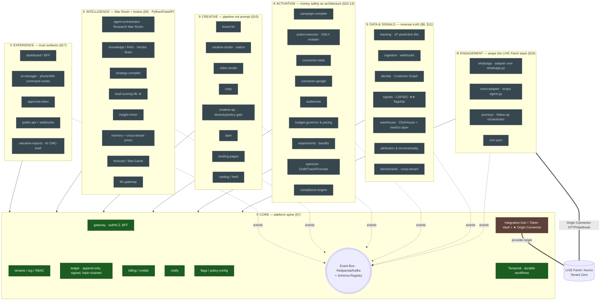

# 05 — Growth OS (the new microservices monorepo)

> **What this is.** `growth-os/` is a **NEW, standalone, multi-tenant, API-first "AI Marketing
> Department" product** — a contracts-first event-sourced microservices platform that runs Meta/Google
> ads autonomously off *ground-truth revenue signals*. It is **separate from the live Famit/Axcrio
> monolith**. The live platform is **Tenant Zero**: the first API consumer + the reused
> Engagement/Creative planes, reached **only** over the **Origin Platform Connector** — never the host.
>
> **Status (ground truth, read this first).** This is a **Phase-0 scaffold**. Only **two** of the
> ~30 named services have real code today: `services/core` (modular NestJS app) and
> `services/temporal-worker` (HelloSaga). Every other service is a **directory + README stub**; agents
> are **uv package stubs** (`__init__.py` only). The **contracts** (`/contracts`) are real and frozen,
> the **typed events package** (`packages/events`) is real, and the **Phase-0 demo** runs the loop
> in-memory. The full 6-container infra stack is written as files but **box-required to boot** (the build
> laptop is too small; DigitalOcean droplets are 3/3 full).
>
> **Source-of-truth files:** `growth-os/GROWTH-OS-BUILD-SPEC.md` (the bible, §-numbered),
> `growth-os/docs/architecture-phase0.md` (Phase-0 design + Origin Connector contract),
> `growth-os/SCAFFOLD_STATE.md` (what's built), `growth-os/contracts/**` (frozen schemas/OpenAPI/AsyncAPI).
> Every claim below is grounded in `file:line` from those.

---

## 1. The big picture — 7 planes over 1 event backbone

Growth OS is organized as **7 planes** (`GROWTH-OS-BUILD-SPEC.md:40-47`, principle list §2) sitting on a
single **event backbone** (Redpanda/Kafka). Every business fact is an immutable event on the bus; **no
service ever reads another service's database** (principle **P2**, `GROWTH-OS-BUILD-SPEC.md:28`). The
product's 4 moats — **signal quality**, **attribute-level creative learning**, **cross-channel
explainable autonomy**, **cross-tenant learning** (`GROWTH-OS-BUILD-SPEC.md:18-22`) — all live in how
these planes feed each other through the loop in §3 below.



**Legend:** green = real code today (`services/core` modules + `temporal-worker`); brown = partial
(Origin Connector = contract only, no live wiring yet); dashed grey = **contract + stub dir, code in a
later phase**. The plane membership is verbatim from `GROWTH-OS-BUILD-SPEC.md:40-47`; the directory list
is verified against `growth-os/services/*`, `growth-os/agents/*`, `growth-os/apps/*`.

---

## 2. The ~30 services — what each is, and is it built?

The repo holds the **full ~30-service skeleton as directories with contracts**, but only Phase-0
deployables get code (`docs/architecture-phase0.md:34-37`). Counts below are by directory.

### ⑦ CORE (the only plane with running code) — `services/core` = ONE modular NestJS app (decision **D1**, `architecture-phase0.md:21`)
| Module | Purpose (§7) | Built? | Evidence |
|---|---|---|---|
| `gateway` | edge auth (dev-JWT stub), tenant resolution, BFF | ✅ code | `services/core/src/modules/gateway/` |
| `tenants` | orgs/workspaces/members/roles; `GET /me/permissions` | ✅ code | `services/core/src/modules/tenants/` |
| `integration-hub` (+ **providers/origin**) | connections, token-vault, webhook-registry, **Origin Connector** | ⏳ contract only | `contracts/openapi/integration-hub.yaml` (no module dir in core yet) |
| `ledger` | append-only, **hash-chained, signed** ActionPlans | ✅ code | `services/core/src/modules/ledger/ledger.service.ts` |
| `flags` | per-tenant autopilot/thresholds/caps; changes = events | ✅ code | `services/core/src/modules/flags/` |
| `notify` | console sink Phase 0 (in-app/email/WA later) | ✅ code | `services/core/src/modules/notify/` |
| `billing` | **STUB** Phase 0 (`credit.consumed` sink); live Phase 3 | ✅ stub code | `services/core/src/modules/billing/` |
| `temporal-worker` | durable workflows; **HelloSaga** + compensation | ✅ code | `services/temporal-worker/src/workflows.ts` |
| Event Bus + Schema Registry | Redpanda/Kafka backbone | 📦 infra files | `infra/docker-compose.dev.yml:39` (redpanda) |

### Other 6 planes — directories + READMEs only (no service code yet)
- **① EXPERIENCE:** `dashboard`, `ai-manager`, `approval-inbox`, `public-api`, `narrative-reports`
- **② INTELLIGENCE** (Python/uv, `agents/`): `agent-orchestrator`, `knowledge`, `strategy-compiler`, `lead-scoring`, `insight-miner`, `memory`, `forecast`, `llm-gateway` — all are `pyproject.toml` + empty `__init__.py` stubs (e.g. `agents/lead-scoring/src/growth_os_lead_scoring/__init__.py`)
- **③ CREATIVE:** `brand-kit`, `creative-studio`, `video-studio`, `copy`, `creative-qa`, `dam`, `landing-pages`, `catalog`
- **④ ACTIVATION:** `campaign-compiler`, `executor`, `connector-meta`, `connector-google`, `audiences`, `budget-governor`, `experiments`, `optimizer`, `compliance-engine`
- **⑤ DATA & SIGNALS:** `tracking`, `ingestion`, `identity`, `signals`, `warehouse-api`, `attribution`, `benchmarks`
- **⑥ ENGAGEMENT** (adapters over LIVE Famit): `whatsapp`, `voice-adapter`, `journeys`, `crm-sync`

> Shared TS libraries (`packages/`, **all real**): `events` (the typed backbone ★), `sdk` (OpenAPI→typed
> client), `auth` (dev-JWT verifier interface, OIDC later), `metering` (INR-paise cost meters), `config`
> (zod-validated env/flags), `otel` (tracing), `ui` (tokens). Reference: `SCAFFOLD_STATE.md:12-31`.

---

## 3. The event backbone — the envelope, the topics, and the core loop

### 3.1 The envelope (every message on every channel)
Every event is the canonical **EventEnvelope** (`contracts/schemas/event-envelope.schema.json`,
spec §6.1). Required fields (`event-envelope.schema.json:9-20`):

| Field | Meaning |
|---|---|
| `event_id` | **UUIDv7** (time-ordered → natural bus + ClickHouse ordering) |
| `type` | dotted canonical type (`campaign.requested`) → selects the payload schema |
| `version` | semver of the *payload* schema (additive-only within a major) |
| `occurred_at` | when the *fact* happened (source-of-truth for the <15-min signal SLA) |
| `tenant_id` / `workspace_id` | **mandatory** isolation keys — **derived from the auth/connection TOKEN, never the body** (P6, `:46-55`) |
| `correlation_id` | **journey id** — minted ONCE at first touch, propagated through every event of that person's journey (§6.3, `:56-60`). This single rule makes deterministic ROI possible. |
| `causation_id` | the `event_id` that caused this one — the edge of the causal DAG |
| `actor` | `{kind: agent\|user\|system\|webhook, id}` — provenance for the Ledger |
| `idempotency_key` | exactly-once key (P3); for external events = the source system's own id |
| `payload` | type-specific body, validated by `<type>.schema.json` |
| `trace` | optional W3C `traceparent` so one trace spans publish→consume (P10) |

The runtime mints these via the single builder `createEnvelope()`
(`packages/events/src/create-envelope.ts:17`), which fills `event_id`(uuidv7), `version` (from the
registry), `occurred_at`, and the OTel `traceparent`.

### 3.2 Topics — `plane.entity.verb` (19 channels, Phase-0/1 backbone)
The topic map is canonical in `contracts/asyncapi/bus.yaml` and mirrored in code at
`packages/events/src/topics.ts:27-47`. Topics follow `plane.entity.verb` and are **frozen-after-merge,
additive-only** (D7). The 19 channels span 6 planes:

| Plane | Topic (channel address) | Event type |
|---|---|---|
| CAMPAIGN | `campaign.lifecycle.requested` | `campaign.requested` |
| CAMPAIGN | `campaign.research.completed` | `research.completed` |
| CAMPAIGN | `campaign.strategy.compiled` | `strategy.compiled` |
| CAMPAIGN | `campaign.lifecycle.compiled` | `campaign.compiled` |
| CAMPAIGN | `campaign.lifecycle.launched` | `campaign.launched` |
| CREATIVE | `creative.creative.generated` | `creative.generated` |
| CREATIVE | `creative.qa.evaluated` | `creative.qa.evaluated` |
| ACTIVATION | `activation.action_plan.created` | `action.plan.created` |
| ACTIVATION | `activation.action_plan.signed` | `action.plan.signed` ← the authorization gate (P4) |
| ACTIVATION | `activation.action_plan.executed` | `action.executed` |
| METRICS | `metrics.ad.snapshot` | `ad.metrics.snapshot` (4h) |
| METRICS | `metrics.optimization.decision` | `optimization.decision` |
| DATA | `data.lead.captured` | `lead.captured` |
| DATA | `data.lead.scored` | `lead.scored` ★ crown jewel |
| SIGNALS | `signals.signal.dispatched` | `signal.dispatched` ★★ flagship |
| ENGAGEMENT | `engagement.call.completed` | `call.completed` |
| ENGAGEMENT | `engagement.call.outcome` | `call.outcome` ★ moat feed |
| ENGAGEMENT | `engagement.wa.message.sent` | `wa.message.sent` |
| ENGAGEMENT | `engagement.wa.message.received` | `wa.message.received` ★ CTWA loop |

> The registry `contracts/registry/event-backbone.index.json` lists **25** frozen schemas (19 event types
> + envelope + 5 artifacts: `action_plan`, `campaign_intelligence_brief`, `media_plan`, `creative_dna`,
> `explanation`), each sha256-pinned. CI fails on drift (`pnpm contracts:drift`, `tools/codegen/drift.test.mjs`).

### 3.3 ★ THE CORE LOOP (memorize this) — `GROWTH-OS-BUILD-SPEC.md:49-50`, §3.1
The whole product is one self-improving loop: every cycle ends smarter than the last because the
optimizer wrote to **memory** and Meta/Google were fed a **better signal** than "conversation started".

```mermaid
sequenceDiagram
    autonumber
    participant U as Vendor / AI-Manager
    participant ORCH as agent-orchestrator<br/>(Research War Room)
    participant STR as strategy-compiler
    participant STU as creative-studio
    participant QA as creative-qa
    participant CMP as campaign-compiler
    participant LED as ledger (sign gate · P4)
    participant EXE as action-executor
    participant META as connector-meta
    participant DATA as tracking / ingestion / identity
    participant ENG as ENGAGEMENT (WA + voice, Tenant Zero)
    participant SCORE as lead-scoring ★
    participant SIG as signals ★★ (CAPI)
    participant OPT as experiments + optimizer
    participant MEM as memory
    participant REP as narrative-reports

    U->>ORCH: campaign.requested  (journey correlation_id minted)
    ORCH->>ORCH: research.completed → CIB (Campaign Intelligence Brief)
    ORCH->>STR: strategy.compiled → MediaPlan
    STR->>STU: creative.batch.generated (diversity matrix)
    STU->>QA: creative.qa.passed (policy + ≥8/10 diversity)
    QA->>CMP: creative.approved
    CMP->>LED: campaign.compiled (exact platform payloads + dry-run diff)
    LED->>LED: action.plan.signed  (the gate: signed + governor stamp + step-up)
    LED->>EXE: signed ActionPlan
    EXE->>META: action.executed → campaign.launched (live ads)
    META-->>DATA: ad.metrics.snapshot (every 4h)
    ENG-->>DATA: lead.captured + wa.message.* + call.completed/outcome
    DATA->>SCORE: lead.scored (quality 0-100, ≤15 min)
    SCORE->>SIG: signal.dispatched (CAPI w/ value = lead-quality-score)
    SIG->>OPT: experiment.evaluated
    OPT->>LED: optimization.decision (draft | trash | promote) → action.plan.signed
    LED->>EXE: action.executed
    OPT->>MEM: memory.updated (gene-level posteriors)
    MEM->>REP: report.briefed
    REP->>U: next campaign.requested (smarter)
```

**Why it's a moat (§11):** competitors stop at "lead submitted / conversation started". Growth OS feeds
the platforms the **ground-truth outcome** of every voice call + WhatsApp chat + booking + sale, with
`value = lead-quality score`, via CAPI. Meta/Google then optimize for *the vendor's definition of a good
customer*. The crown-jewel feed is `call.outcome` + `lead.captured`/`lead.scored` + the CTWA
`wa.message.received` (`bus.yaml:149,169,185`). KPIs: dedup ≥90%, Meta EMQ ≥8, signal latency p95 <15min.

### 3.4 The signed-ActionPlan gate (money safety as structure — P4/P5)
**No path increases spend or launches ads without a SIGNED ActionPlan.** Connectors accept mutations
**only** from the Action Executor, which only executes signed plans. The live enforcement is in
`services/core/src/modules/ledger/ledger.service.ts`:
- `propose()` (`:75`) hash-chains a `proposed` entry off the per-tenant chain head + emits `action.plan.created`.
- `sign()` (`:161`) is the **only legal mutation** (proposed→signed). It requires: a **step-up token** for
  spend/destructive plans (`:186`), `confirm_money:true` for spend (`:189`), and a **Budget Governor
  stamp** before a spend-changing plan can be signed (`:193`). Tenant is taken from the token, not the
  body (`:98`). The chain is tamper-evident via `verifyChain()` (`:300`).

This mirrors the **live Famit** `wallet.py` (INR paise, no-double-spend) + `firewall.py` (PIN + HS256
step-up) discipline — see `04-control-and-safety.md` / `02-backend-monolith.md` for the originals.

---

## 4. The bridge to the live platform — the Origin Connector (Tenant Zero)

Growth OS is **standalone**; it reuses the live Famit/Axcrio voice + WhatsApp + AI-Manager + AI-Asset
stack through **one seam**: the **Origin Platform Connector**, a first-class `provider: origin` *inside*
`integration-hub` (decision **D4**, `architecture-phase0.md:24`). It is **not** a separate deployable.

```mermaid
flowchart LR
    subgraph FAMIT["LIVE Famit / Axcrio  (Tenant Zero — see 02/03 docs)"]
        caller[caller.py monolith]
        wapy[whatsapp.py + whatsapp_builder]
        agent[agent.py · LiveKit/Vobiz voice]
        asset[AI Asset Service :8310]
        aim[AI Manager + firewall PIN]
    end
    subgraph GOS["GROWTH OS · integration-hub · provider:origin"]
        push[/POST /v1/origin/events  · PUSH door/]
        wh[/POST /v1/origin/webhook/{kind}/]
        pull[/GET /v1/origin/{campaigns,reports,leads,signals}  · PULL/]
        norm[verify token → normalize → §6.1 envelope]
        busg(((Event Bus)))
    end
    caller -- "campaign.requested / call.completed / call.outcome" --> push
    wapy  -- "wa.message.sent / received (incl CTWA ctwa_clid)" --> push
    agent -- "call.completed + transcript" --> wh
    asset -- "creative.generated (asset_id, DO-Spaces url, DNA)" --> push
    push --> norm
    wh --> norm
    norm --> busg
    busg -. "daily brief / lead score / signal health" .-> pull
    pull --> caller
    asset -. "gen-background step (direct call, reused)" .-> studio2[creative-studio]

    classDef f fill:#0d47a1,color:#fff;
    class caller,wapy,agent,asset,aim f;
```

**Contract (real today):** `contracts/openapi/integration-hub.yaml` defines PUSH `/v1/origin/events`
(`:175`, batch-capable), `/v1/origin/webhook/{kind}` (`:227`, kind ∈ call/wa/lead/campaign), and PULL
`/v1/origin/{campaigns,reports,leads,signals}` (`:265-329`). The provider enum includes `origin`
(`:353`). Design detail: `architecture-phase0.md:135-238`.

**Auth & isolation (`architecture-phase0.md:147-164`):** Famit authenticates with a per-connection
**`ORIGIN_SERVICE_TOKEN`** as `Authorization: Bearer` (clean surface — *not* the panel's `X-Auth`). The
token → resolves ONE connection → pins `tenant_id`+`workspace_id`. **Tenant from token, never the body**
(the load-bearing rule the live AIM/asset services already enforce). Pushes carry `Idempotency-Key`
(Famit's source event id) → exactly-once envelope emit. Reverse webhooks (Growth OS → Famit) are
HMAC-SHA256 signed (`X-GrowthOS-Signature`), fail-closed.

**The Origin Event Map** (`architecture-phase0.md:210-222`) translates existing Famit data → canonical
events: caller.py `/campaigns` → `campaign.requested`; dial-loop `_classify_outcome` → `call.completed`;
post-call intents → `call.outcome` ★; `whatsapp.py` send → `wa.message.sent`; inbound webhook (CTWA
referral) → `wa.message.received` ★; booking/payments modules → `booking.*`/`sale.recorded`; AI Asset
`/generate` → `creative.generated`.

**Decoupling guarantees:** Famit stays on **Hatchet** (Postgres-broker, own box); Growth OS owns its own
**Temporal** + **Redpanda** + **Postgres** + **ClickHouse** (decisions **D2/D3**, `architecture-phase0.md:22-23`;
reuse-vs-new table `:267-276`). They meet **only at the event envelope** — never a shared DB or workflow
engine (P2). Reused live assets: AI Asset Service for the creative gen-background step (direct call),
WhatsApp/voice/AI-Manager via the Engagement adapters.

---

## 5. Phase-0 / Phase-1 deployables & how to run it

**Phase-0 (now)** ships: the `core` modular NestJS app, `infra/docker-compose.dev.yml` (7 containers:
postgres16, redpanda+console, redis7, clickhouse, temporal+UI, minio — `infra/docker-compose.dev.yml:19-161`),
a Temporal **HelloSaga** worker, and the **demo** that proves the loop. Acceptance (§21 / `architecture-phase0.md:332`):
`pnpm dev` boots the stack → a demo publishes `campaign.requested` → a consumer handles it → a
hash-chained Ledger entry is written → the OTel trace is visible → the **contract-drift test fails** on an
intentional schema edit. The runnable proof is `tools/demo-phase0/run.ts` (in-memory bus, console OTel,
2 events → 2 chained ledger entries → tamper negative-control).

**The 6 Phase-0/1 deploy bundles** (`architecture-phase0.md:105-109`): `core` = services/core ·
`data` = ingestion+tracking+identity+signals · `activation` = campaign-compiler+executor+connector-meta+budget-governor+optimizer ·
`creative` = creative-studio+creative-qa+dam · `agents-core` = llm-gateway+orchestrator+knowledge+lead-scoring · `dashboard`.

**Phase-1 (next, the thin closed loop, Meta-only, real money with training wheels, §21):** implement the
Origin Connector wiring, tracking-lite + ingestion (leadgen + WABA incl CTWA), identity v1
(phone-deterministic), **signals v1** (CAPI Lead+QualifiedLead, value=score), **lead-scoring v1**
(heuristic), a mini war-room → CIB-lite, creative-studio statics + QA + DAM, compiler → executor →
connector-meta (sandbox first), budget-governor caps + anomaly sentinel, optimizer guardrails G1–G4,
approval-inbox, warehouse 4h snapshots, daily brief, minimal dashboard.

**Honest blockers (`SCAFFOLD_STATE.md:53-56`, `GROWTH-OS-BUILD-SPEC.md:205-206`):** the 6-container stack
needs a real box (DO droplets 3/3 full → limit raise / new box / managed Postgres+ClickHouse+Kafka-API+Temporal-Cloud);
live Phase-1 also needs Meta Marketing API access + a connected ad account + an approved WhatsApp template
+ a paid LLM budget. Phase 0–1 is built and dev-tested locally first.

---

## 6. New-teammate cheat sheet
- **Read first:** `growth-os/GROWTH-OS-BUILD-SPEC.md` (the bible) → `growth-os/docs/architecture-phase0.md`
  (Phase-0 + Origin Connector) → `growth-os/SCAFFOLD_STATE.md` (what's actually built).
- **Contracts are LAW (P1):** never write service code before its OpenAPI/AsyncAPI/JSON-Schema exists in
  `/contracts`. CI fails on drift. The envelope + 19 events + 5 artifacts are frozen.
- **Only `services/core` + `services/temporal-worker` have code.** Everything else is a stub dir; pick a
  phase (§21) and build inside its bounded context.
- **The loop is the product** (§3.3): `campaign.requested → … → signal.dispatched → optimization.decision
  → memory.updated → report.briefed → smarter next`. The moat is the *signal* (real call/WA/sale outcome
  fed to Meta/Google), not the creative or setup.
- **Money is sacred (P4):** every spend mutation goes through a **signed ActionPlan** (`ledger.service.ts`),
  gated by step-up + a Budget Governor stamp. The Executor is the *only* component allowed to call a
  connector mutation.
- **The live Famit platform is Tenant Zero**, reached only over the Origin Connector. Never couple Growth
  OS OLTP to the live Postgres.

