# 06 — End-to-End Flows & Data Model

> **Audience:** a new teammate (also on Claude Code) onboarding to Famit / Axcrio.
> **Scope:** the five load-bearing journeys as Mermaid **sequence diagrams**, plus the
> Postgres **data model** (per-module tables + RLS) as a Mermaid **erDiagram**.
> Every box/edge is grounded in real code (`file:line`). Diagrams render on GitHub.

**Ground-truth roots**
- Backend monolith: `caps/droplet_work/caller.py` (FastAPI, ~5,386 lines) + `agent.py` (LiveKit voice worker, ~874 lines) + per-module packages.
- Frontend: `caps/famit-panel` (Next.js). API base = `NEXT_PUBLIC_API_BASE || "/api"` → nginx → backend `:8209` (`famit-panel/lib/api.ts:2`).
- Future microservices monorepo (mostly scaffold today): `caps/growth-os` + `/contracts`.

**Live boxes**
| Box | priv IP | runs |
|---|---|---|
| backend `famit@168.144.153.145` | 10.122.0.4 | `famit-caller(:8209)`, `famit-agent` (voice), `famit-bridge`, `famit-aiasset(:8310)`, Postgres, LiveKit, Vobiz SIP |
| frontend `root@143.110.247.249` | 10.122.0.2 | `famit-panel(:3001)` + nginx |
| hatchet | 10.122.0.3 | `hatchet-lite` durable orchestration (F3) |

---

## 0. Service / box context map (who talks to whom)

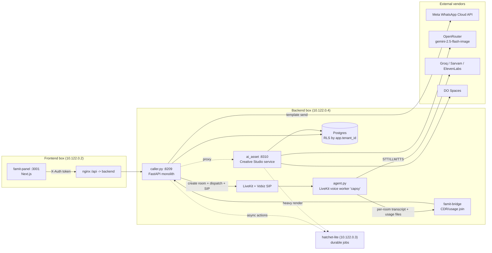

The platform is a **modular monolith**: `caller.py` is the FastAPI app; every module
(`ai_manager`, `ai_asset`, `crm`, `booking`, `funnels`, `forms_surveys`, `payments`,
`support`, `workforce`, `whatsapp_builder`, `ads_engine`, `workflow-studio`, `kb`,
`lifecycle_segmentation`) is an import-safe package with its **own standalone SQL schema**
applied via a lazy `ensure_schema()` — deliberately **off** the P1 Alembic `0001/0002`
keystone chain so a module's blast radius never touches the live core migration
(`crm/schema.sql:6-13`, `ai_manager/schema.sql:6-11`, `ai_asset/schema.sql:6-10`).

---

## 1. The closed revenue loop (Ad → Lead → AI voice call → WhatsApp → appointment → revenue)

This is the macro journey; sections 2–5 zoom into the heavy legs.

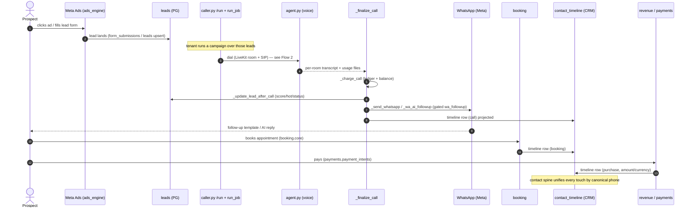

**Anchors:** `_finalize_call` orchestrates the post-call fan-out
(`caller.py:1872`): charge (`_charge_call`), lead update (`_update_lead_after_call`
`caller.py:1273`), WhatsApp follow-up (`_send_whatsapp` `:1351`, `_wa_ai_followup` `:1600`,
gated by per-campaign `wa_followup` flag `:1421`), suppression on opt-out, callback retry
enqueue, and `call.completed` / `lead.qualified` webhooks. The **CRM contact spine**
(`crm/schema.sql:25` `contacts`, `:87` `contact_timeline`) is a read-model projection that
stitches calls/WA/bookings/payments by canonical phone — it is the loop's single pane of glass.

---

## 2. Run-a-Campaign → dial → agent.py voice → transcript / billing

```mermaid
sequenceDiagram
    autonumber
    actor User as Tenant (famit-panel)
    participant API as caller.py POST /run
    participant Job as run_job (asyncio task)
    participant LK as LiveKit API
    participant SIP as Vobiz SIP trunk
    participant Agent as agent.py entrypoint
    participant Vend as Groq/Sarvam/ElevenLabs
    participant Files as var/transcripts + usage_events_raw
    participant Fin as _finalize_call
    participant PG as PG (calls, ledger, usage_events)

    User->>API: POST /run (campaign_id, leads/CSV/XLSX, RC2 selectors)
    API->>API: resolve_tenant + can(write)
    API->>API: caps gate — monthly minutes, prepaid balance, concurrency clamp
    API->>Job: JOBS[job_id]=queued; asyncio.create_task(run_job)
    API-->>User: {job_id, count, suppressed_count, breakdown}
    loop dial loop (per lead, honouring window/caps/suppression)
        Job->>LK: create_room(name=famit-<num>-<rand>)
        Job->>LK: create_dispatch(agent_name="capsy", metadata={campaign_id,lead_name,variant})
        Job->>SIP: create_sip_participant(trunk, sip_call_to=num)
        Job->>PG: record_call(status="calling", sip_call_id)
        SIP-->>Agent: call answered -> job assigned to room
        Agent->>Agent: load campaign brain (build_system_prompt) + recap (cross-call memory)
        loop conversation turns
            Vend-->>Agent: STT (Sarvam) -> LLM (Groq) -> TTS (ElevenLabs)
        end
        Agent->>Files: write var/transcripts/<room>.json + usage_events_raw/<room>.json
        Job->>LK: _phone_present(room)? -> false when hung up
        Job->>Fin: _finalize_call(it, tenant, campaign)
        Fin->>PG: _charge_call (ledger + balance), record_call(done), usage fold
        Fin->>PG: _update_lead_after_call (score/hot/status)
        Fin-->>User: WhatsApp follow-up + webhooks (Flow 1)
    end
```

**Anchors:** `POST /run` (`caller.py:3071`) — gates: monthly-minutes cap `:3097`, prepaid
balance 402 `:3102`, RC2 composable audience selectors `:3113`, concurrency clamp `:3140`.
`run_job` dial loop (`caller.py:1971`): per-lead window/cap/suppression gates `:2004-2040`,
`create_room`/`create_dispatch`/`create_sip_participant` `:2056-2062`, `record_call` `:2073`.
`agent.py entrypoint` (`agent.py:419`): metadata parse `:427`, `build_system_prompt` from
campaign fields `:443`, cross-call recap `:466`, per-call vendor usage counters `:489`
(ElevenLabs chars, Groq tokens, Sarvam STT seconds). **Bridge:** agent writes per-room files
that `caller.py` folds into `usage_events.json` by joining on `room`
(`caller.py:1806-1825`), then the Vobiz CDR is joined into `cost_ledger.json`
(`caller.py:4542`). Voice plugins: `elevenlabs, groq, sarvam, silero` (`agent.py:23`) with
per-call Groq(6)/Sarvam(5) key round-robin (`agent.py:95-127`).

---

## 3. AI Manager command → NLU → PIN → execute → result

The AI Manager is a **dedicated command brain** with a strict, code-decided state machine
(`ai_manager/state_machine.py:3-5`): **S0 CONNECT → S1 VERIFY → S2 AUTHENTICATE → S3 CONTEXT
→ S4 CAPTURE INTENT → S5 PERMISSION → S6 STEP-UP → S7 CONFIRM → S8 DELEGATE+EXECUTE → S9
REPORT**. Invariant: *the LLM only fills slots; it never authorizes* (`:5`).

```mermaid
sequenceDiagram
    autonumber
    actor Mgr as Authorized manager (voice/WA/dashboard)
    participant SM as CommandMachine (state_machine.py)
    participant ID as identity (caller-ID -> authorized_users)
    participant NLU as nlu / intent (slot fill)
    participant FW as firewall (PIN/OTP step-up)
    participant Del as delegate.execute
    participant Mod as target module (campaigns/ads/leads/wa/workflows)
    participant DB as ai_manager_* (PG, immutable audit)

    Mgr->>SM: S0 connect (channel=phone|whatsapp|dashboard)
    SM->>ID: S1 verify caller-ID (HINT only)
    SM->>FW: S2 authenticate human — fresh PIN/OTP (anti-spoof)
    FW-->>SM: ok (lockout after N fails, per number)
    SM->>Del: S3 read_context (read-only business state)
    loop S4..S9 command loop
        Mgr->>NLU: utterance
        NLU-->>SM: intent + slots (match)
        SM->>SM: S5 map_intent_to_action -> tool + risk; permits(role,grants,tool)?
        alt not permitted
            SM->>DB: command status=denied + audit(permission_denied)
        else permitted
            SM->>DB: create_command (vendor_id, idempotency_key UNIQUE)
            opt risky action (S6 STEP-UP, fresh + scoped)
                SM->>FW: per-action PIN; on fail -> cancel this command
            end
            SM->>Mgr: S7 CONFIRM (amount read back)
            Mgr-->>SM: "yes"
            SM->>DB: status=executing; create_action_run
            SM->>Del: S8 execute(action, step_up_token) — runner re-enforces caps/kill-switch
            Del->>Mod: side effect (campaigns.run / ads.set_budget / ...)
            Mod-->>Del: status="done" (ground truth)
            SM->>DB: finish_action_run + command succeeded/failed + immutable audit_log
            SM->>Mgr: S9 report result
        end
    end
```

**Anchors:** `CommandMachine.run` / `_run_inner` (`state_machine.py:122,139`); S1 verify
`:146-158`, S2 authenticate `:170-177`, S3 `read_context` `:178`. Command loop S5–S9
(`:205-300`): `map_intent_to_action` `:206`, `is_risky` `:209`, idempotency key + `create_command`
`:214-219`, `permits()` deny path `:221-230`, S6 step-up `:235-251`, S7 confirm-with-readback
`:253-267`, S8 `create_action_run` + `delegate.execute` + `executed = status=="done"` ground
truth `:270-297`. Persistence/security: 7 `ai_manager_*` tables (`ai_manager/schema.sql`),
`(vendor_id, idempotency_key)` UNIQUE = **no double-execute** (`:128`), `ai_manager_audit_logs`
**IMMUTABLE** via REVOKE UPDATE/DELETE (`:266-273`). Per-user PIN = Argon2id, never raw (`:61`).
Profile gates: `require_pin_for_level`, `daily/monthly_spend_limit`, calling-window
(`schema.sql:34-40`). HTTP surface = `ai_manager` router (`endpoints.py:343`, prefix
`/ai-manager`, **defined-not-mounted** — FE calls it directly per `_lib.ts:5-9`).

---

## 4. Creative Studio generate → AI Asset service → banner → Spaces

```mermaid
sequenceDiagram
    autonumber
    actor User as Tenant (Creative Studio UI)
    participant API as ai_asset POST /generate
    participant Sub as jobs.submit
    participant Wal as wallet (hold)
    participant Job as ai_asset_generation_jobs (PG)
    participant Run as jobs._run (inline or Hatchet)
    participant Pipe as pipeline.generate
    participant OR as OpenRouter (gemini-2.5-flash-image)
    participant Ver as ai_asset_versions + Spaces/box-fs
    participant Score as creative score

    User->>API: POST /generate (platform,type,count,instruction,model,campaign_id)
    API->>Sub: submit(vendor_id, context, spec, idempotency_key)
    Sub->>Job: insert job (idempotency UNIQUE -> retry = SAME job)
    Sub->>Wal: reserve hold (est_cost_minor); insufficient -> over_budget (no silent render)
    Sub->>Run: _enqueue (Hatchet if AIASSET_HATCHET_HOST_PORT else inline)
    Note over Run: phase: queued->reading_campaign->building_prompts->rendering->scoring->storing->done
    Run->>Pipe: generate(context, spec)
    Pipe->>Pipe: stage 1 build prompts (brand kit + campaign ctx)
    Pipe->>OR: stage 2 render each variant (router picks openrouter)
    OR-->>Pipe: banner bytes
    Run->>Ver: store immutable version (local | DO Spaces); URL + sha256 + dims
    Run->>Score: creative score per version (rule/llm)
    Run->>Wal: settle hold (actual_cost_minor) or release on fail
    Run->>Job: state=succeeded; n_succeeded
    User->>API: GET /jobs/{id}/stream (poll/SSE) -> assets in library
    User->>API: POST /assets/{id}/attach-whatsapp (-> ai_asset_usage)
```

**Anchors:** routes (`ai_asset/endpoints.py`): `/generate` `:107`, `/jobs/{id}` `:144`,
`/jobs/{id}/stream` `:154`, `/assets` `:181`, `/assets/{id}/raw` `:207`, `/edit` `:230`,
`/regenerate` `:234`, `/approve|reject` `:265-269`, `/attach-whatsapp` `:344`,
`/variation-from-upload` `:315`, `/brand-kits` `:349`. `jobs.submit` `:77` (idempotency
`:89`, hold/over_budget `:106`), `_enqueue` Hatchet-vs-inline `:152-161`, `_run` with
idempotent re-entry guard `:186-194`. `pipeline.generate` stage-1 prompts + stage-2
OpenRouter render `:39-150`. **Money lives in `wallet.py` (integer paise), never float**;
large binaries go to **box-fs / DO Spaces**, never PG — only URL + metadata persist
(`ai_asset/schema.sql:15-16`). 8 `ai_asset_*` tables; versions are immutable (regen/edit =
new version, original never overwritten — `schema.sql:133-159`).

---

## 5. Control Layer entitlement check (admin toggle → /me/entitlements → middleware HIDE/LOCK)

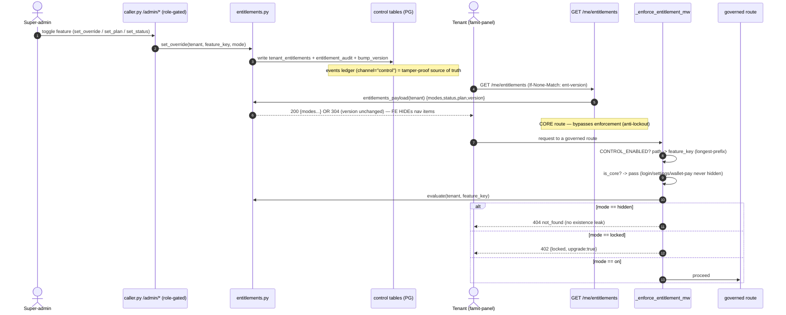

**Resolution layering** (`entitlements.resolve_modes` `:288`): per-tenant override
(`tenant_entitlements`) > plan (`plan_entitlements`) > global default
(`feature_registry.default_mode`), cached by `(tenant_id, ent_version)` and invalidated by
`bump_version` `:426` on any control write. **Anchors:** middleware `_enforce_entitlement_mw`
(`caller.py:366`): master gate off = byte-identical passthrough `:374`, path→key `:386`,
core floor `:392`, tenant from TOKEN `:401`, admin bypass `:412`, `evaluate` `:414`,
HIDDEN→404 `:422` / LOCKED→402 `:424`, **fail-closed** on post-key error `:418`.
`/me/entitlements` (`caller.py:3919`) is ETag/304 + a **core route that bypasses the
choke-point** (anti-lockout). DDL (`control/db/ddl_control.sql`): global catalog
`feature_registry/plans/plan_entitlements/plan_limits` (**no RLS**, admin-only writes),
tenant-scoped `tenant_entitlements` + `tenant_status` (**FORCE-RLS**), `entitlement_audit`
mirror of the immutable PG `events` leg.

---

## 6. The Postgres data model (RLS-isolated)

**Tenancy invariant.** `caller.py:resolve_tenant` (`:551`) resolves the tenant from the
**auth token, never the request body**. Every per-op DB session does
`SET LOCAL app.tenant_id = <tenant>` (and `app.is_admin='1'` for admin ops) via
`db/engine.py session()`. Every tenant-scoped table has the **same admin-GUC FORCE-RLS
policy**:
`USING (current_setting('app.is_admin')='1' OR <key> = current_setting('app.tenant_id'))`
(`db/ddl_wallet.sql:94-117`, `crm/schema.sql:46-53`, `ai_manager/schema.sql:197-258`, …).
`famit_app` is `NOSUPERUSER/NOBYPASSRLS`, so FORCE binds even the table owner. The tenant
key column is `org_id` in the P1 core + CRM and `tenant_id`/`vendor_id` in the standalone
modules — all bound to the **same** `app.tenant_id` GUC.

### 6a. Core OLTP + billing + audit (`db/models.py` — 17 RLS tables on the Alembic chain)

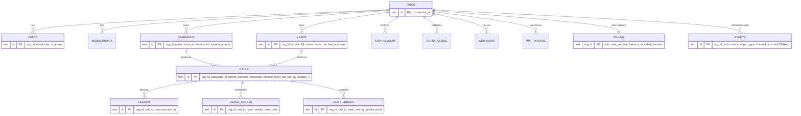

The 17 RLS tables list is the authoritative `RLS_TABLES` (`db/models.py:355-360`):
`orgs, users, memberships, campaigns, leads, calls, suppression, retry_queue, webhooks,
webhook_log, wa_log, wa_threads, billing, ledger, usage_events, cost_ledger, events`.
`events` is the **immutable cross-module audit ledger** (PG leg, not JSONL) — every module's
`audit.record(channel=...)` lands here.

### 6b. Money — wallet (integer paise, ACID) (`db/ddl_wallet.sql`)

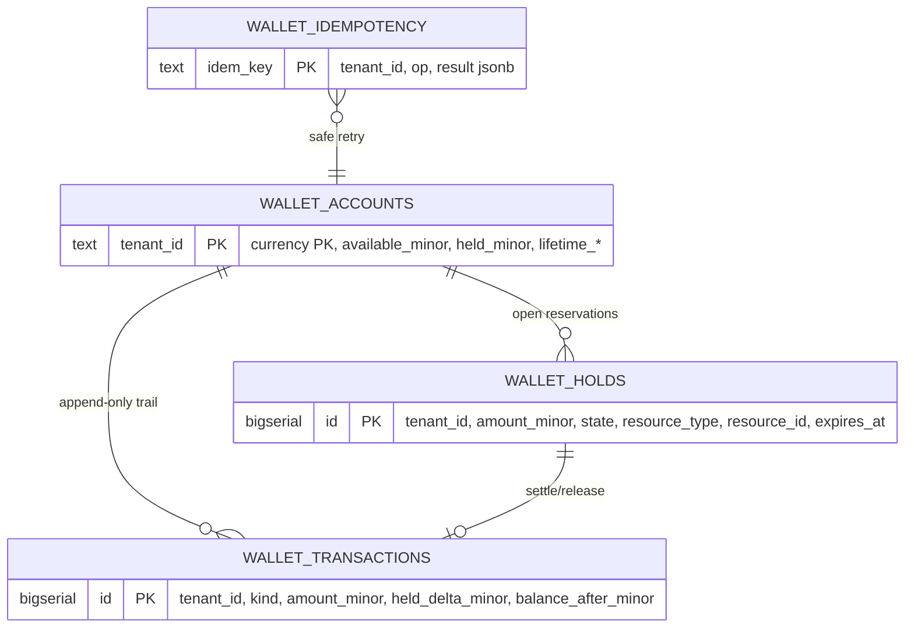

Money is **BIGINT minor units (paise), never float**. Invariant (proven in
`tests/test_wallet_concurrency.py`): `available_minor + held_minor == SUM(amount_minor)`
(`ddl_wallet.sql:46-50`). A `hold` is net-zero to total; `charge` removes spent amount.
This is the single wallet that the AI Asset job hold, WhatsApp-AI bundle hold, and ads-engine
hold all reserve against (note: prepaid `billing.balance` ≠ `wallet_accounts` — separate
balances by plan).

### 6c. AI Manager (`ai_manager/schema.sql` — 7 tables, vendor_id RLS)

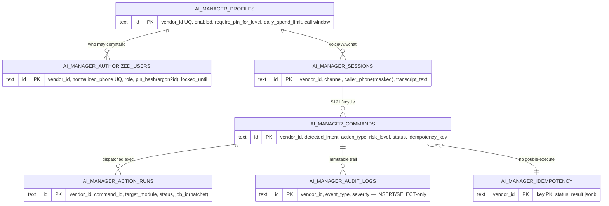

### 6d. Creative / AI Asset (`ai_asset/schema.sql` — 8 tables + registry)

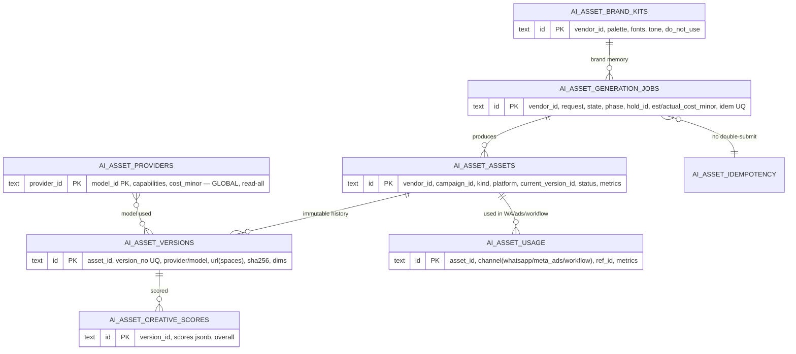

### 6e. AI WhatsApp builder (`whatsapp_builder/db/ddl_ai_wa.sql` — 4 tables, tenant_id RLS)

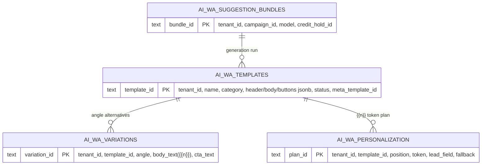

### 6f. Control / entitlements (`control/db/ddl_control.sql`)

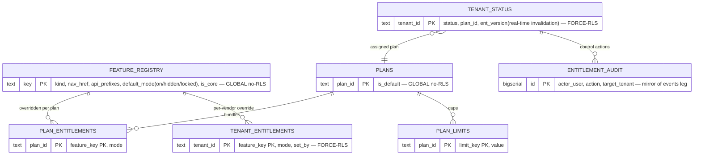

### 6g. CRM person-spine + the rest (per-module standalone schemas)

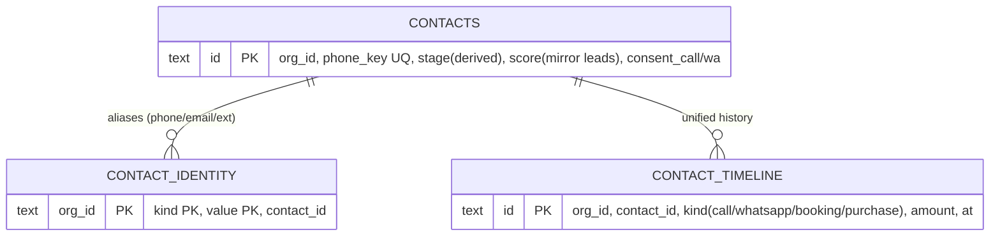

**Other module tables (all FORCE-RLS, standalone schemas, same admin-GUC policy):**

| Module | File | Tables |
|---|---|---|
| Booking | `booking/models.py` + `booking/rls.sql` | `booking_resources, bookings, booking_reminders, booking_reminder_fires, booking_events` |
| Funnels | `funnels/schema.sql` | `funnels` |
| Forms/Surveys | `forms-surveys/schema.sql` | `forms, form_submissions` |
| Payments | `payments/schema.sql` | `payment_intents, payment_events, payment_followups` |
| Support | `support/schema.sql` + `support/rls.sql` | `support_tickets, support_messages` |
| Ads Engine | `ads_engine/schema.sql` | `ads_campaigns` (provider meta/google, wallet_hold_id, daily/lifetime caps) |
| Workforce | `workforce/schema.sql` | `agent_runs, agent_steps, agent_approvals, agent_tool_grants, agent_roles` |
| Lifecycle / Segmentation | `lifecycle_segmentation/schema.sql` | `segments, segment_members, lifecycle_rules, lifecycle_fires` |
| Knowledge Base (RAG) | `kb/schema.sql` | `kb_sources, kb_documents, kb_chunks` |
| Workflow Studio | `workflow-studio/workflow/schema.sql` | `wf_definitions, wf_versions, wf_runs, wf_node_runs, wf_triggers, wf_schedules` |

The CRM `contacts` table is a **PG-native projection** (like `kb_chunks`/`wallet_accounts`),
not a JSON-mirror store — truth stays reconstructable from `leads + calls + wa_threads`
(`crm/schema.sql:16-18`). The `ads_campaigns.wallet_hold_id` and `ai_wa_*.credit_hold_id`
columns are the cross-module edges into the single **wallet** (6b).

---

## 7. How a request flows top-to-bottom (the choke points to remember)

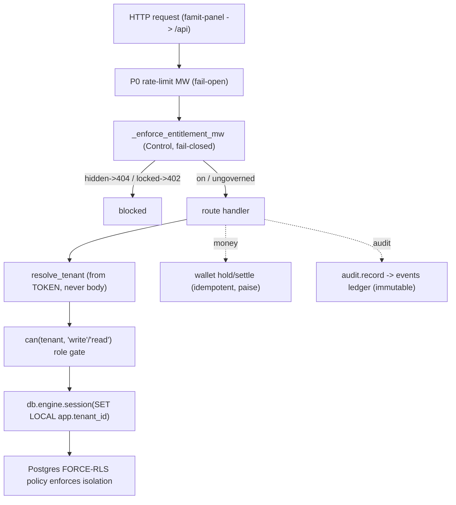

This is the spine every module rides: **rate-limit → entitlement → tenant-from-token →
role → RLS session → (wallet + immutable audit)**. New modules plug in by registering a
`feature_registry` key, exposing a router, applying a standalone `ensure_schema()`, and
reusing `wallet.py` / `audit.py` / `firewall.py` rather than re-implementing money, audit,
or step-up.
